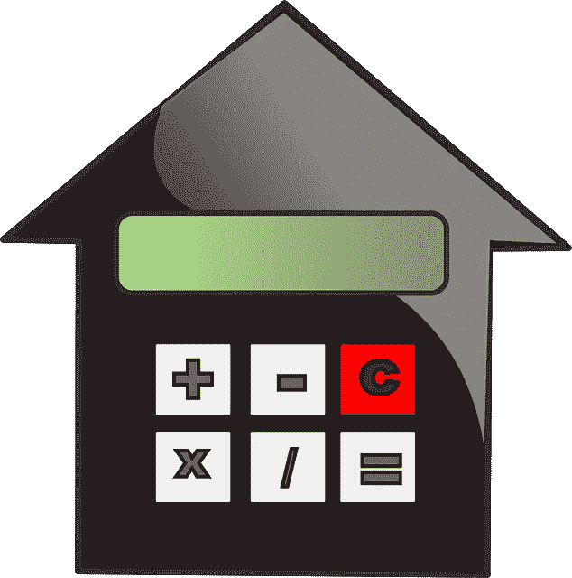
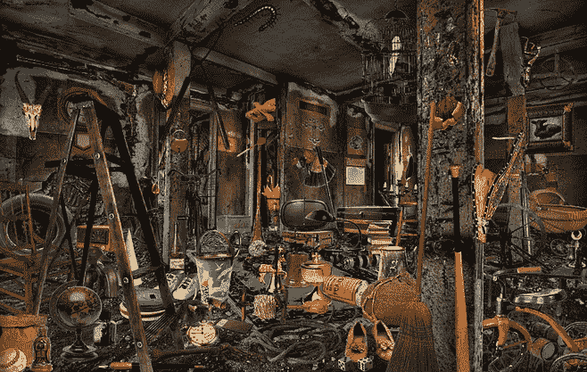
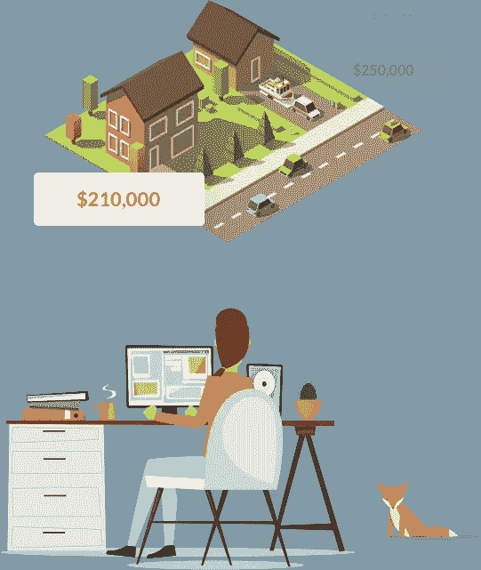
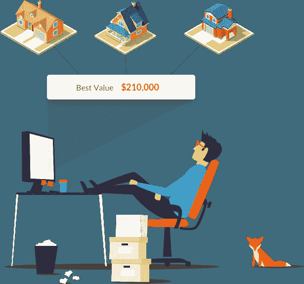

# 为什么房地产估价需要计算机视觉

> 原文：<https://towardsdatascience.com/why-real-estate-valuation-needs-computer-vision-56d653986ab2?source=collection_archive---------8----------------------->

在最近的一篇文章中，我介绍了一个[抵押贷款申请分析工具，它使用 AI](/what-can-we-learn-from-42-5-million-mortgage-loan-applications-990656750009) 来验证申请。读完那篇文章后，我们去年的一位客户([文·沃梅罗](https://medium.com/be-the-fox)、[福克西·艾](https://www.foxyai.com)的创始人)联系我，看我能否写一篇类似的文章，介绍我们为他们做的房地产估价工作。

我们去年研究的问题是一个令人惊讶的问题:房价估计很糟糕。房源一直被高估或低估，房屋的估价不仅对买方和卖方来说是一个关键因素，对以房屋为抵押的抵押贷款的承销商来说也是如此。金融机构经常使用自动估价模型(AVM)来做出从房屋净值贷款到信用卡限额的一切决策。不仅仅是房屋销售。理解房屋的价值对于减轻损失和信用风险管理至关重要。

What’s the best way to assess the value of a home?

我们生活在一个快速技术变革的世界，采用人工智能不再是一个选项。相反，这是竞争的需要。很快，没有一定人工智能水平的估值模型就会过时。

引用 Talla 的首席执行官兼联合创始人 Rob May 的话，“令我惊讶的是，一些公司在采用人工智能方面进展缓慢，因为他们不确定在哪里应用它，或者它将如何工作。我认为他们不明白，当这些事情被弄清楚的时候，他们会落后很多。”

Zillow 宣布他们已经将图像分析整合到他们的 Zestimate 中，强调了这一点。世界各地使用的反车辆地雷需要改进很多，因为它们到目前为止客观上一直很糟糕。人工智能在价格预测方面可以提高 15%的事实表明了传统模型迄今为止的表现有多差。

The condition of a home goes beyond the number of bedroom and bathrooms, and the square footage. A valuation model needs to SEE the listing.

为什么房屋估价不好？他们依赖旧数据、数字数据、人口普查数据、IRS 数据以及州/地区销售数据，这些数据可能无法反映房屋投资。即使将所有这些数据源结合在一起，有时也会给出一个不完整的画面。尽管传统的 AVM 模型快速而便宜，但如果不真正查看资产，它们就无法真正考虑资产的质量和状况，从而限制了金融服务业中一个关键工具的准确性。

为什么这是一个难题？传统的计算机算法喜欢用公式来处理数字，而不是房屋的图片。清单上没有“屋顶上的一块木瓦不见了”这一栏。为了做到这一点，人工智能模型必须查看图片，并理解图片如何影响价格。更具体地说，模型需要了解它正在查看的房间，理解纹理、颜色和室内/室外对象。把这个解决方案想象成一个约会网站创新，直到现在，没有人能看到人们的个人资料照片，相反，他们只能看到他们的身高、体重和其他生物医学数据。显然，一张图片胜过千言万语。

将图像数据整合到房屋估价中的问题非常适合人工智能解决方案。即使作为人工智能解决方案来实现，让一个回归模型理解关于一个清单的如此多的数据，并让它理解所有特殊情况和例外，也有点像噩梦。我将跳过建造 AVM 有多困难的技术解决方案细节，而是专注于福克西人工智能带来的新颖用例。

清单上的图片可以告诉我们一个关于房地产估价的故事，它可以通过与房地产清单相关联的传统数字、分类和文本数据来增强。例如，花岗岩柜台表明房子里放了钱。一些微妙的因素，比如墙上油漆的状况，会告诉我们很多关于上市的预期售价。用于训练 AVM 的数据集基本上是传统 AVM 所基于的正常类型的数据集，但增加了来自图片和其他来源的大量额外数据。

我们去年交付了一个初始原型。我们为福克西人工智能开发的原型现在已经变得更加成熟，并在一个真正令人惊叹的数据集上进行了训练。现在，由于算法和计算能力的进步，我们可以以一种前所未有的方式利用工具。了解数百万房产的质量梯度现在已经成为现实。

福克西人工智能研究院现在已经将这种新颖的 AVM 方法推向市场，结合计算机视觉和深度学习，来评估住宅房地产的质量和状况。整个系统通过 API 公开，这样你就可以把它放在你正在使用的其他东西上面。该产品使用先进的训练技术和一套内部预测模型对所提供的图像集的房间类型进行分类，并确定目标物业的质量和状况，以提高估价准确性。

API 展示了一些非常有趣的方法，比如将图像转换为矢量的端点，找到可比较属性的方法(代理喜欢这种东西)，以及检测对象、装饰、场景和其他东西的系统。因此，您可以决定使用 API 从现有列表中提取特性，或者只是使用 API 来获得更好的估价数据。

如果你依赖于传统的反车辆地雷，并且你已经接受了不准确的估价，这可能是一个非常有趣的技术解决方案。事实上，这关系到数十亿美元，因此，即使是很小的准确性提高也会影响降低贷款风险、提高贷款能力等方面的关键绩效指标(KPI)。如果你想亲自体验神奇， [**报名参加**](https://foxyai.com/#sign-up) 私测。

这里有一个在 medium 上的[到福克西](https://medium.com/be-the-fox)的链接，我希望你能明白为什么它这么酷。这项技术开辟了新的可能性，如模拟一个想象中的房子会卖多少钱，并以此作为承包商进行拆卸和建筑估价。有相当漂亮的计算器功能，只是到现在才存在。解决方案都包含在一个简单的 API 中:[https://www.foxyai.com/doc-api/#api-endpoints](https://www.foxyai.com/doc-api/#api-endpoints)

因此，总而言之，动静脉畸形正在被破坏，金融机构应该注意到这一点。

如果你喜欢这篇关于人工智能房地产估价的文章，那么按下关注按钮，拍拍这个东西，看看我过去读过的一些文章，比如“[如何为人工智能项目](https://medium.com/towards-data-science/how-to-price-an-ai-project-f7270cb630a4)定价”和“[如何聘请人工智能顾问](https://medium.com/towards-data-science/why-hire-an-ai-consultant-50e155e17b39)”另外，[看看福克西艾](https://www.foxyai.com)。除了与业务相关的文章，我还准备了一些关于寻求采用深度机器学习的公司所面临的其他问题的文章，如“[没有云和 API 的机器学习](https://medium.com/@lemaysolutions/locked-in-a-box-machine-learning-without-cloud-or-apis-76cc54e391c8)”

在下一篇文章中，我将介绍我们已经研究了很长时间的东西，它可以帮助企业在内部审计期间自动分析非结构化报告。

下次见！

丹尼尔

[daniel@lemay.ai](mailto:daniel@lemay.ai) ←打个招呼。
[LEMAY . AI](https://lemay.ai)
1(855)LEMAY-AI

您可能喜欢的其他文章:

*   [人工智能和不良数据](/artificial-intelligence-and-bad-data-fbf2564c541a)
*   [人工智能的图像数据集](/image-datasets-for-artificial-intelligence-bbb12615edd7)
*   [人工智能:让你的用户给你的数据贴上标签](https://medium.com/towards-data-science/artificial-intelligence-get-your-users-to-label-your-data-b5fa7c0c9e00)