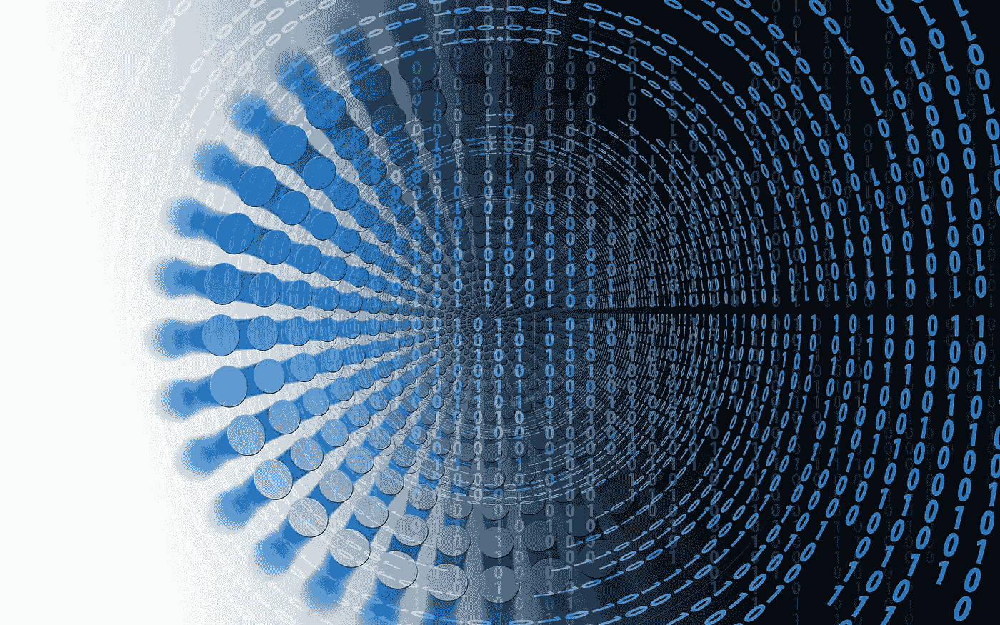

# 为什么小数据是人工智能的未来

> 原文：<https://towardsdatascience.com/why-small-data-is-the-future-of-ai-cb7d705b7f0a?source=collection_archive---------7----------------------->

在过去的 8 个月里，我一直在为人工智能解决方案出谋划策。我经常遇到一些商界人士，他们在过去十年里一直在学习数据的重要性。然而，这意味着我的服务经常与数据分析和大数据咨询混为一谈。从业务人员的角度来看，他们的问题很简单:“我们拥有所有这些大数据。你能进来给我们赚更多的钱吗？”

我觉得这令人沮丧，原因有二。首先，人工智能技术的潜力远远不止于分析大数据集。有很多成熟的技术来分析大数据集，也有很多成熟的顾问。第二，对于大多数存在的人工智能问题来说，*没有可供使用的大数据集*。

许多致力于真正新颖解决方案的人工智能公司不得不手动收集这些解决方案的数据集。对人工智能初创公司的资本投资中有很大一部分被投入到收集使他们的产品工作所需的数据集。

## 例子

让我们以一个不断增长的人工智能用例为例:基于人工智能的律师合同审查(例如 Blue Jay Legal、eBrevia、Kira Systems、Law Geex 等..).为了做到这一点，你所需要的是一个大的合同数据集，上面有律师反馈的注释。这可能包括指定看起来对一方或另一方不利的条款，对于这种类型的合同来说非常不寻常的条款，不寻常或不清楚的语言等等

然而，众所周知，律师的工作方式很守旧。如果你幸运的话，你可能会发现一些律师事务所保留了带有红线的合同草案，如果你的产品需要做的只是复制红线，这将会很有用。然而，如果你想在合同上得到更多的定性反馈，你就没那么幸运了。即使你设法从律师事务所过去的工作中积累了这个数据集，那也不会是大数据。最多，您可能能够获得 10000 或 20000 份经过审查的合同，这与人们今天谈论的“大数据”的规模相差甚远，后者通常具有数百万、数十亿和数万亿条目的规模。

为了实现这一点，人工智能合同审查初创公司必须让他们的技术与他们可以访问的数据集规模相适应。他们必须能够处理少量数据。

## 小数据为什么难？

人类能够从小数据集学习——为什么机器不能？答案很简单——人类实际上并没有从一个小数据集里学习。自从我们出生以来，我们就一直在从通过我们的五种感官不断输入的数据中学习。

当前最大的图像处理数据集 [Image-Net](http://www.image-net.org/) ，包含大约 1400 万张图像。如果我们保守估计，让我们假设一个人每 30 秒看到一次清晰的图像。当一个人在 25 岁左右开始职业生涯时，他们已经看到了:

= 25 年* 365.24 天/年*16 小时/天* 60 分钟/小时* 2 张图像/分钟

= 17，531，520 个不同的图像

当我们进入职业生涯时，我们每一个人都已经接触到了一个更大的视觉数据集，这是人工智能研究人员可以获得的最大数据集。除此之外，我们还有来自外部感官的声音、嗅觉、触觉和味觉数据。总之，人类有很多关于人类世界的背景。我们对人类的处境有一个常识性的理解。在分析数据集时，我们将数据本身与我们过去的知识相结合，以便得出分析结果。

典型的机器学习算法没有这些——它只有你向它显示的数据，而且这些数据必须是标准化的格式。如果数据中不存在某个模式，算法就无法学习它。信号必须大于噪声。

## 所有的活动都将在这里进行

对于人工智能社区来说，这可能是一个令人沮丧的事实。对于许多(如果不是大多数)专业工作来说，社区中没有可用的大数据集。收集一个大数据集来表示这项任务可能会非常昂贵。假设您试图收集一个数据集来自动对一个小企业进行会计审计。使用当前的最佳实践技术，可能需要几个数据集(这纯粹是推测):

*   对 50，000 份会计报表中的“危险信号”和“关注领域”进行了注释
*   与公司员工进行了 250，000 次对话，要求提供交易的支持文档
*   100，000 个案例，其中一份支持文件已针对给定交易的有效性进行了分析
*   50，000 份关于审计的最终报告

尽管这个数据集没有超过一百万个条目，你已经可以看到它变得多么昂贵。如果我们假设一个审计员每小时收费 150 美元，审计一个小企业需要 20 小时的时间，那么这个数据集将花费高达 1.5 亿美元。毫不奇怪，我们还没有看到任何[人工智能初创公司](https://www.electricbrain.io/blog/what-ai-startups-are-active-in-western-canada-in-2018)解决耗时的会计审计过程。构建人工智能审计器的唯一方法是以某种方式开发能够处理更小数据集的技术。事实上，我们试图自动化的绝大多数单调乏味的工作都有同样的基本问题。一旦低悬的 AI 果实被用完，我们如何向上移动到中间的果实？我们如何到达树顶的水果？我们如何破解小数据集？

## 输入迁移学习

不知何故，我们需要能够给我们的人工智能系统提供关于人类世界的通用知识——就像人类一样。迁移学习是一种新兴的技术，它允许我们将在一个数据集中学习的知识迁移到另一个数据集中。

直到最近随着[深度神经网络](https://www.techopedia.com/definition/32902/deep-neural-network)的兴起，迁移学习在机器学习社区中一直处于次要地位。与大多数其他机器学习技术相比，深度神经网络极其灵活。它们可以被训练、分解、修改、再训练，通常只是以各种方式被滥用。这导致了我们可以应用迁移学习的各种新情况。

*   在文本处理中，我们可以使用一个名为 word2vec 的浅层神经网络，通过从互联网上读取数百亿行文本，尝试将单词的*含义*编码为矢量。这些向量可以应用于更具体的任务
*   在图像分类中，我们可以在非常大的图像网络数据集上训练神经网络，然后在较小的数据集上重新训练它，对于较小的数据集，我们可能只有几千幅图像。

然而，最近更雄心勃勃的迁移学习的例子被证明是成功的。就在几个月前， [Google Brain 发布了对他们的多模型](https://research.googleblog.com/2017/06/multimodel-multi-task-machine-learning.html)的研究。在这项研究中，他们同时对 8 项不同的任务训练了同一个深度神经网络。在他们的研究中，他们发现系统性能在处理小数据集的任务时有所提高。虽然还处于早期，但这项研究提供了一个诱人的机会，让我们可以让我们的人工智能系统了解世界，让它们能够理解小数据集。

# 那么下一步是什么？

我认为大数据正接近其炒作的顶峰。随着越来越多的公司在收集和使用大数据集方面达到成熟，他们将开始问:“下一步是什么？”我相信越来越多的公司会将使用小型数据集的自动化作为其数据策略的下一阶段。

对于每个有 10 亿个条目的数据集，有 1，000 个有 100 万个条目的数据集，有 1，000，000 个只有 1，000 个条目的数据集。因此，一旦低挂的果实已经用尽，唯一可能的前进方式将是爬树，建立可以用越来越少的数据工作的系统。

*本文原载于*[*www . electric brain . io*](https://www.electricbrain.io/blog/why-small-data-is-the-future-of-ai)*。*