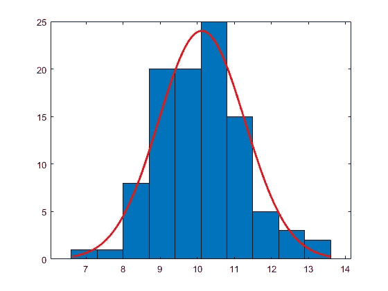
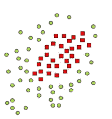

# 为什么要用机器学习代替传统统计学？

> 原文：<https://towardsdatascience.com/why-use-machine-learning-instead-of-traditional-statistics-334c2213700a?source=collection_archive---------6----------------------->

Image by Matan Segev on [pexels.com](https://www.pexels.com/photo/678307/)

当我为一家大型金融服务公司的分析师职位准备电话面试时，这个问题浮现在我的脑海中。当面试我的工程师问我:“你为什么选择在你的项目中使用学习方法，而不仅仅是回归和相关的统计数据？”时，我的好奇心变成了苦恼

我一开始不明白这个问题。对我来说，一个向学生推荐未来大学的算法没有机器学习就无法运行，这似乎是显而易见的。我如何在不对我们数据集的成千上万笔交易应用人工智能的情况下，识别出将增加电影院连锁爆米花销量的电影？采访之后，我开始思考这个问题。
**为什么简单回归不能用来识别影响因素及其相关系数？** 当我思考这个问题并做一些研究时，我意识到学科之间的界限[对许多人来说似乎很模糊](https://www.quora.com/What-is-the-difference-between-statistics-and-machine-learning)——以至于我们可以怀疑[机器学习是否不仅仅是美化了的统计学](/no-machine-learning-is-not-just-glorified-statistics-26d3952234e3)。
ML 真的和统计学不一样吗？这种差异会产生有意义的技术影响吗？还是说你做 ML 和 AI 只是好听？

在本文中，我将主要关注监督学习方法。首先，因为这是我的项目所依赖的，所以这是我必须给出答案的类别。其次，因为这通常是人们听到“机器学习”时的想法。

事实上，人们通常将最大似然与推断统计学联系在一起，即旨在理解特定人群中现象的潜在概率分布的学科。这也是我们在 ML 中想要做的，以便为一个新的总体元素生成一个预测。
推断统计依赖于假设:统计方法的第一步是选择一个具有未知参数的模型，用于管理观察到的特性的基本法则。然后相关性和其他统计工具帮助我们确定这个模型的参数值。因此，如果你对数据的假设是错误的，参数的计算将毫无意义，你的模型将永远不会以足够的精度拟合你的数据。

Trying to fit a Gaussian model by visualizing a histogram

因此，让我们选择更好的假设，并确保选择正确的模型！你可以认为。是的，但是有无限多的可能的分布族，却没有一个好的方法。通常，我们进行描述性分析来确定数据分布的形状。但是如果数据有两个以上的特征呢？我们如何将这些数据可视化以提出一个模型命题？如果我们不能识别模型的具体形状怎么办？如果两个系列的模型之间的细微差别不能被人眼分辨出来怎么办？事实上，模型化阶段是推断统计学方法中最困难的部分。

这是正确的！当我们确定数据中的关系是线性的，然后运行线性回归时，这也是我们在机器学习中所做的。但是 ML 并没有总结到这一点。让我们不要忘记，学习方法，对于深度学习来说更是如此，要在自然和人类的学习过程中找到它们的根源。

Photo by [Derek Thomson](https://unsplash.com/photos/a168At_RF6A?utm_source=unsplash&utm_medium=referral&utm_content=creditCopyText) on [Unsplash](https://unsplash.com/search/photos/real-estate?utm_source=unsplash&utm_medium=referral&utm_content=creditCopyText)

让我们看一个例子。就拿一个想转行做房地产经纪人的医生来说吧。起初，她对房地产市场及其运作方式一无所知。但是，当她观察到她参观过的房产正在成交时，她将对市场有更好的了解，并很快能够对房产价值进行良好的估计。当然，我们都有一个广泛的直觉，房子越小价格越低，但这并不意味着两倍小的房子会便宜两倍。此外，我们的新经纪人还没有得到一个包括房子所有特征的公式来计算正确的价格。那太容易了！相反，她用许多例子“喂养”她的大脑，并随着时间的推移建立了一个更准确的判断:她已经学会了！

总体而言，这正是机器学习、深度学习和人工智能的要点。这种学习方法使我们能够识别数据集中棘手的相关性，对于这些相关性，探索性分析无法正确确定潜在模型的形状。我们不想给出数据分布的明确公式，而是希望算法直接从数据中自己找出模式。学习方法使我们能够抛弃附在统计方法上的假设。

当然，对于一些真实世界的应用程序，回归和相关就足够了。有时我们只想知道一个变量相对于另一个变量的总体趋势。在这种情况下，简单的相关性将确定与该趋势相关的系数。但是，如何确定一个模型来对这些非线性可分离数据进行分类:

There is no straight line to separate these data points in 2D

没有简单的回归能够做到这一点。机器学习提出了 SVM(支持向量机)和内核技巧，将数据映射到更高维度，在那里它们是线性可分的:

SVM algorithm maps the points into 3D where they are separable by a plane (linear hyperplane in 3D)

ML 似乎不可避免的另一个例子。假设我们的数据有五个特征 X1、X2、X3、X4 和 Y，Y(我们希望能够预测的期望输出)和其他四个输入特征之间的基本关系就像:

ε(蓝色)是大多数真实世界现象固有的噪声。当然，回归在理论上是可行的。我们可以从四个输入中构建新的变量，方法是应用对数、平方根、指数、将这些特征提升到 2、3、4……的幂，对这些变量的一些和取对数。然后，我们将使用这些新特征作为线性回归的输入变量。想出正确的模型需要使用大量可能的变量，我们不太可能实现它——我不包括可以通过子集选择来选择的变量的不同组合。简单的多项式回归又一次为我们提供了一个对我们的目标足够精确的模型。但是如果我们寻找一个最小化的错误，学习方法是关键。
不要误会，没有 ML 方法会输出‘真实’的底层模型。相反，它将提供一个模型来表示与数据行为最接近的可能匹配。有时，这可以是一个全局函数或局部模型，例如，如果我们使用随机森林或 KNN。这些最后的算法甚至不提供我们计算新观察数据的输出的函数，而是将新观察分配给一组“旧”数据——训练数据——并且决定输出应该与该组的输出相似。

我们还可以提到这样一个事实，即机器学习是计算机科学和优化所固有的，它允许在巨大的数据集上进行快速学习，这不是统计学所关心的问题。我们看到，ML 的目标不是提出关于数据的知识(“这是真实的现象，这是它是如何工作的”)，而是提出一个可行的和可重复的模型，其误差容限由我们正在进行的项目决定。

事实上，学习方法是处理大量问题所必需的。他们忽略了我们对数据知识的缺乏，没有提示我们选择模型。当然，你必须决定使用哪种算法，但这是另一回事。毫无疑问，它们仍将是必不可少的，深度学习和 [NLP](https://medium.com/@datamonsters/artificial-neural-networks-in-natural-language-processing-bcf62aa9151a) 支持的疯狂应用证实了这一点。

你呢？为什么学习方法对你的项目至关重要？请在评论区告诉我😄