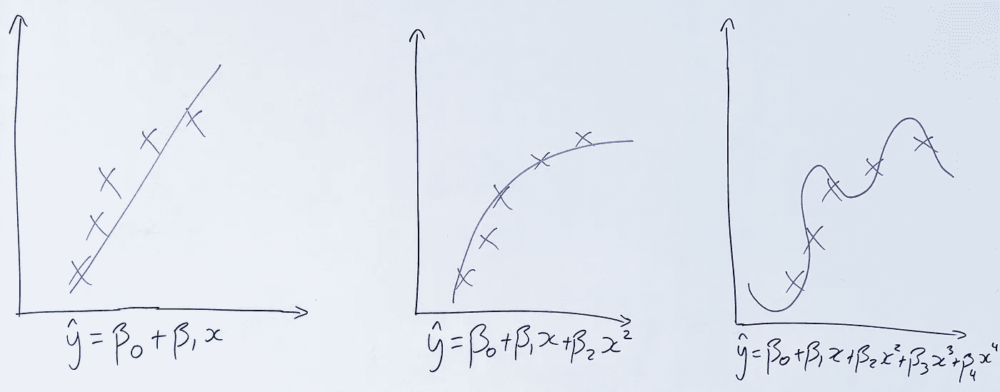
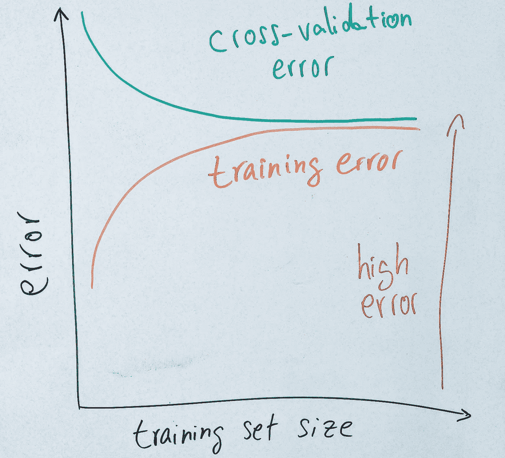
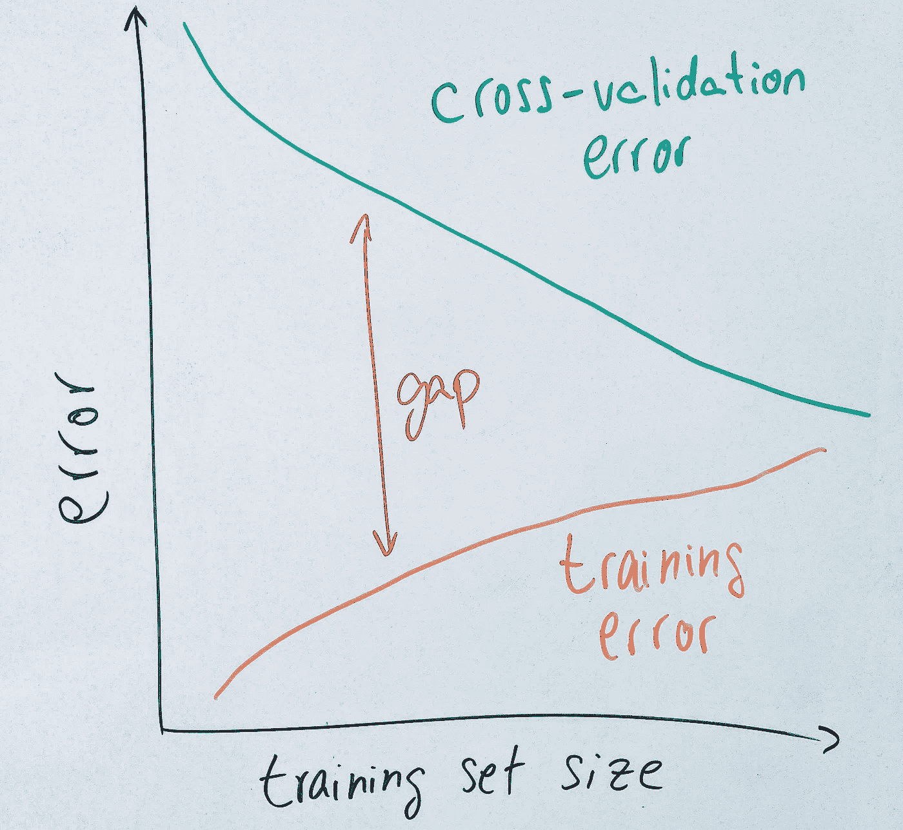
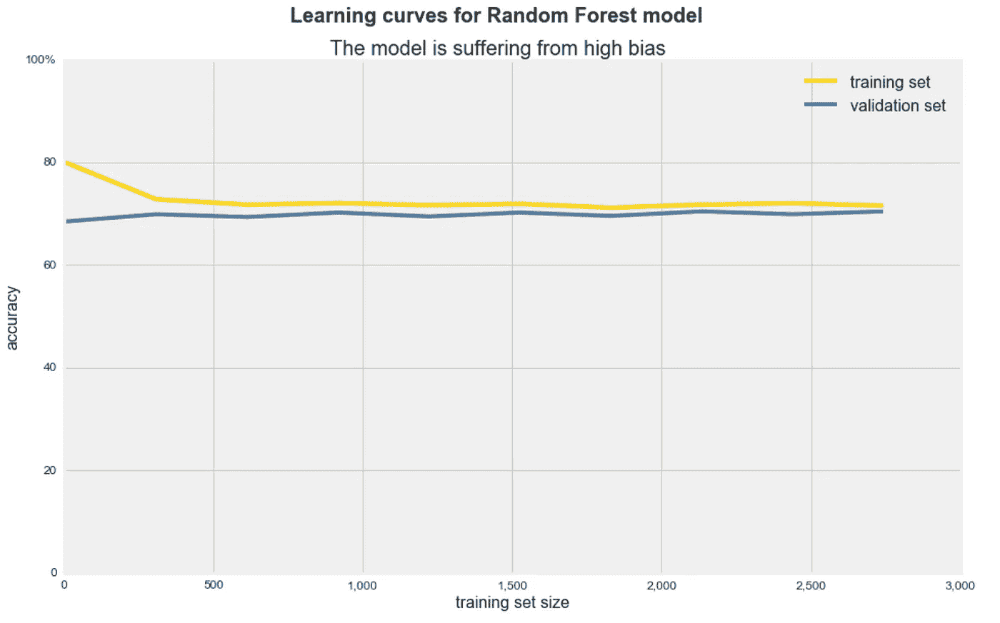

# 为什么你应该在下一个机器学习项目中绘制学习曲线

> 原文：<https://towardsdatascience.com/why-you-should-be-plotting-learning-curves-in-your-next-machine-learning-project-221bae60c53?source=collection_archive---------1----------------------->

## [入门](https://towardsdatascience.com/tagged/getting-started)

## 剧透:它们会帮助你理解你的模型是高方差还是高偏差——我会解释你能做些什么

Image by author

偏差-方差困境是机器学习领域中一个广为人知的问题。它的重要性是这样的，如果你没有得到正确的权衡，你在你的模型上花多少时间或多少钱都没有用。

在上图中，您可以感受到什么是偏差和方差，以及它们如何影响您的模型性能。第一个图表显示了一个模型(蓝线)，该模型对训练数据(红叉)拟合不足。这个模型是有偏差的，因为它“假定”自变量和因变量之间的关系是线性的，而事实并非如此。绘制数据散点图总是有帮助的，因为它将揭示变量之间的真实关系——二次函数将“恰好”符合数据(第二个图表)。第三个图表是过度拟合的明显例子。模型的高度复杂性使其能够非常精确地拟合数据——过于精确地拟合*。尽管该模型在训练数据上可能表现得非常好，但是它在测试数据(即，它从未见过的数据)上的表现会差得多。换句话说，这种模型存在高方差，这意味着它不擅长对从未见过的数据进行预测。因为建立机器学习模型的要点是能够准确地对新数据进行预测，所以你应该专注于确保它能够很好地推广到看不见的观察结果，而不是最大化它在训练集上的性能。*

## *如果你的模特表现不怎么样，你能怎么办？*

*您可以做几件事:*

*   *获取更多数据*
*   *尝试较小的功能集(降低模型复杂性)*
*   *尝试添加/创建更多功能(增加模型复杂性)*
*   *尝试降低正则化参数λ(增加模型复杂性)*
*   *尝试增加正则化参数λ(降低模型复杂性)*

*现在的问题是:“我如何知道这些事情中的哪一个应该首先尝试？”。答案是:“嗯，看情况。”。这基本上取决于你的模型是高偏差还是高方差。*

*你可能想知道，这里的问题是:“好吧，那么我的模型表现不如预期……但是我怎么知道它是有偏差问题还是有方差问题呢？!"。学习曲线！*

## *学习曲线*

*学习曲线显示了训练集大小和您选择的评估指标(如 RMSE、准确度等)之间的关系。)在您的训练集和验证集上。在诊断您的模型性能时，它们可能是一个非常有用的工具，因为它们可以告诉您您的模型是否存在偏差或差异。*

**

*Image by author*

*如果你的学习曲线是这样的，这意味着你的模型有很大的偏差。训练和验证(或交叉验证)的错误都很高，并且似乎不会随着更多的训练示例而改善。事实上，您的模型在训练集和验证集的表现都很差，这表明该模型对数据拟合不足，因此具有较高的偏差。*

**

*Image by author*

*另一方面，如果你的学习曲线看起来像这样，你的模型可能有一个高方差的问题。在此图表中，验证误差远远高于训练误差，这表明您对数据进行了过度拟合。*

## *如果你的模特表现不怎么样，你能怎么办？(pt。二)*

*很好，所以你现在已经确定了你的模型发生了什么，并且处于一个很好的位置来决定下一步做什么。*

*如果您的模型具有高偏差，您应该:*

*   *尝试添加/创建更多功能*
*   *尝试降低正则化参数λ*

*这两件事会增加模型的复杂性，因此有助于解决拟合不足的问题。*

*如果您的模型有很高的方差，您应该:*

*   *获取更多数据*
*   *尝试一组较小的功能*
*   *尝试增加正则化参数λ*

*当您的模型过度拟合训练数据时，您可以尝试降低其复杂性或获取更多数据。正如您在上面看到的，高方差模型的学习曲线图表明，有了足够的数据，验证和训练误差最终会彼此更接近。对此的一个直观解释是，如果你给你的模型更多的数据，你的模型的复杂度和你的数据中的底层复杂度之间的差距会越来越小。*

## *Python 实现和实际例子*

*我编写了这个函数来绘制模型的学习曲线。在自己的工作中可以随意使用！*

*我想我应该以展示一个学习曲线图的真实例子来结束这篇文章，这个例子是用上面的代码创建的:*

**

*Image by author*

*从图中可以非常清楚地看出，我的随机森林模型正遭受高偏差，因为训练曲线和验证曲线非常接近，并且在 70%左右的标记处精度不是很高。了解这一点有助于我决定我的下一步是什么，以提高我的模型性能。因为我有一个高度偏见的问题，我知道获得更多的训练数据本身不会有帮助，通过设计新的和更相关的功能来增加我的模型的复杂性可能会产生最大的影响。*

## *结论*

*下次你面前有一个表现不好的模型时，记得画出学习曲线，分析它们，找出你是否有偏差或方差问题。了解这一点将有助于你决定下一步应该做什么，它可以为你节省无数的头痛和浪费在对你的模型没有帮助的工作上的时间。*