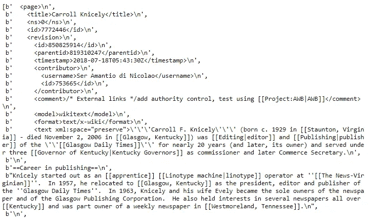
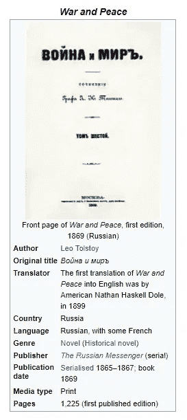
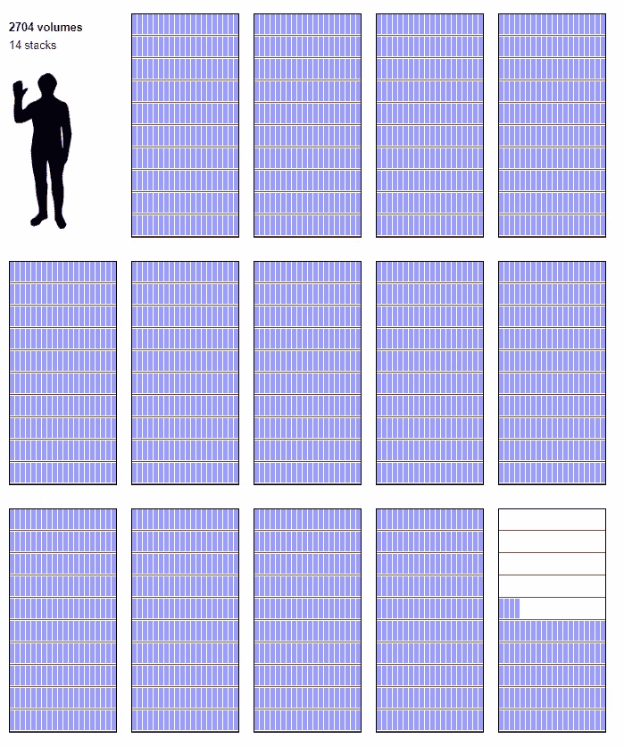

# 维基百科数据科学:与世界上最大的百科全书合作

> 原文：<https://towardsdatascience.com/wikipedia-data-science-working-with-the-worlds-largest-encyclopedia-c08efbac5f5c?source=collection_archive---------3----------------------->

## 如何以编程方式下载和解析维基百科


([Source](https://www.pexels.com/photo/library-university-books-students-12064/))

维基百科是现代人类最令人印象深刻的创造之一。谁会想到在短短几年内，匿名的免费贡献者可以创造出世界上前所未有的最大的在线知识来源？维基百科不仅是[获取写大学论文信息的最佳地方](https://www.nature.com/articles/438900a)，而且它还是一个极其丰富的数据来源，可以推动从自然语言处理到监督机器学习的众多数据科学项目。

维基百科的[规模使得它既是世界上最大的百科全书，也有点让人望而生畏。然而，使用合适的工具，大小不是问题*，在本文中，我们将介绍如何以编程方式下载并解析所有英语维基百科。*](https://en.wikipedia.org/wiki/Wikipedia:Size_of_Wikipedia)

在此过程中，我们将讨论数据科学中的许多有用主题:

1.  **从网络上查找并以编程方式下载数据**
2.  **使用 Python 库解析 web 数据(HTML、XML、MediaWiki)**
3.  **使用多处理/多线程并行运行操作**
4.  **寻找问题最优解的标杆方法**

这个项目最初的动力是收集维基百科上每一本书的信息，但我很快意识到所涉及的解决方案有更广泛的适用性。这里介绍的技术和随附的 Jupyter 笔记本将让您有效地处理维基百科上的任何文章，并且可以扩展到其他 web 数据源。

如果您想了解更多关于如何利用本文中的数据，我写了一篇[文章，使用神经网络嵌入构建了一个图书推荐系统](/building-a-recommendation-system-using-neural-network-embeddings-1ef92e5c80c9)。

包含本文 Python 代码的笔记本是 GitHub 上的[。这个项目的灵感来自 Douwe Osinga 的优秀的](https://github.com/WillKoehrsen/wikipedia-data-science/blob/master/notebooks/Downloading%20and%20Parsing%20Wikipedia%20Articles.ipynb)[深度学习食谱](http://shop.oreilly.com/product/0636920097471.do)，大部分代码都改编自这本书。这本书非常值得，你可以在 GitHub 上免费获得 Jupyter 笔记本。

# 以编程方式查找和下载数据

任何数据科学项目的第一步都是访问您的数据！虽然我们可以向维基百科页面发出个人请求，并抓取结果，但我们很快就会遇到速率限制，不必要地增加维基百科服务器的负担。相反，我们可以通过维基媒体在 dumps.wikimedia.org 的[访问所有维基百科](https://dumps.wikimedia.org)的[转储。(转储是指数据库的定期快照)。](https://meta.wikimedia.org/wiki/Data_dumps)

英文版在[dumps.wikimedia.org/enwiki](http://dumps.wikimedia.org/enwiki)。我们使用下面的代码查看数据库的可用版本。

```
import requests# Library for parsing HTML
from bs4 import BeautifulSoupbase_url = '[https://dumps.wikimedia.org/enwiki/'](https://dumps.wikimedia.org/enwiki/')
index = requests.get(base_url).text
soup_index = BeautifulSoup(index, 'html.parser')# Find the links on the page
dumps = [a['href'] for a in soup_index.find_all('a') if 
         a.has_attr('href')]
dumps**['../',
 '20180620/',
 '20180701/',
 '20180720/',
 '20180801/',
 '20180820/',
 '20180901/',
 '20180920/',
 'latest/']**
```

这段代码利用了`BeautifulSoup`库来解析 HTML。鉴于 HTML 是网页的标准标记语言，它是处理网络数据的无价库。

对于这个项目，我们将在 2018 年 9 月 1 日进行转储(一些转储不完整，因此请确保选择一个包含您需要的数据的转储)。为了在转储中找到所有可用的文件，我们使用以下代码:

```
dump_url = base_url + '20180901/'# Retrieve the html
dump_html = requests.get(dump_url).text# Convert to a soup
soup_dump = BeautifulSoup(dump_html, 'html.parser')# Find list elements with the class file
soup_dump.find_all('li', {'class': 'file'})[:3]**[<li class="file"><a href="/enwiki/20180901/enwiki-20180901-pages-articles-multistream.xml.bz2">enwiki-20180901-pages-articles-multistream.xml.bz2</a> 15.2 GB</li>,
 <li class="file"><a href="/enwiki/20180901/enwiki-20180901-pages-articles-multistream-index.txt.bz2">enwiki-20180901-pages-articles-multistream-index.txt.bz2</a> 195.6 MB</li>,
 <li class="file"><a href="/enwiki/20180901/enwiki-20180901-pages-meta-history1.xml-p10p2101.7z">enwiki-20180901-pages-meta-history1.xml-p10p2101.7z</a> 320.6 MB</li>]**
```

同样，我们使用`BeautifulSoup`解析网页来查找文件。我们可以去[https://dumps.wikimedia.org/enwiki/20180901/](https://dumps.wikimedia.org/enwiki/20180901/)手动寻找要下载的文件，但那样效率会很低。考虑到网络上有多少数据，知道如何解析 HTML 并在程序中与网站交互是一项非常有用的技能。学习一点网络搜集，大量新的数据来源变得容易获得。([这里有一个教程](https://www.dataquest.io/blog/web-scraping-tutorial-python/)让你入门)。

## 决定下载什么

上面的代码在转储中查找所有文件。这包括几个下载选项:只有文章的当前版本，文章和当前讨论，或者文章和*所有*过去的编辑和讨论。如果我们选择后者，我们会看到几**兆兆字节**的数据！对于这个项目，我们将只关注文章的*最新版本。[本页](https://en.wikipedia.org/wiki/Wikipedia:Database_download#English-language_Wikipedia)有助于根据您的需求确定要获取哪些文件。*

所有文章的当前版本都作为一个文件提供。然而，如果我们得到的是单个文件，那么当我们解析它时，我们将不得不按顺序浏览所有的文章——一次一篇——这是一种非常低效的方法。更好的选择是下载分区文件，每个文件包含文章的一个子集。然后，正如我们将看到的，我们可以通过并行化一次解析多个文件，从而大大加快这个过程。

> 当我处理文件时，我宁愿有许多小文件，而不是一个大文件，因为这样我可以对文件进行并行操作。

分区文件以 bz2 压缩 XML(扩展标记语言)的形式提供。每个分区的大小约为 300–400 MB，总压缩大小为 15.4 GB。我们不需要解压缩文件，但如果您选择这样做，整个大小约为 58 GB。对于人类的所有知识来说，这似乎并不算太大！(好吧，不是全部知识，但还是)。


Compressed Size of Wikipedia ([Source](https://en.wikipedia.org/wiki/Wikipedia:Modelling_Wikipedia%27s_growth#/media/File:Wikipedia_article_size_in_gigabytes.png)).

## 下载文件

要真正下载文件，Keras 实用程序`get_file`非常有用。这将在链接处下载一个文件，并将其保存到磁盘。

```
from keras.utils import get_filesaved_file_path = get_file(file, url)
```

文件保存在`~/.keras/datasets/`中，这是 Keras 的默认保存位置。一次下载一个文件[需要 2 个多小时](https://github.com/WillKoehrsen/wikipedia-data-science/blob/master/Download%20Only.ipynb)。(您可以尝试并行下载，但是当我尝试同时发出多个请求时，我遇到了速率限制。)

# 解析数据

看起来我们想做的第一件事就是解压文件。然而，事实证明我们实际上并不需要这样做来访问文章中的所有数据！相反，我们可以通过一次解压缩和处理一行*来迭代地处理文件。如果我们处理不适合内存的大型数据集，遍历文件通常是唯一的选择。*

要遍历一个`bz2`压缩文件，我们可以使用`bz2`库。不过在测试中，我发现一个更快的选择是用`subprocess` Python 模块调用[系统实用程序](http://www.qnx.com/developers/docs/6.5.0SP1.update/com.qnx.doc.neutrino_utilities/b/bzcat.html) `bzcat`。这说明了一个关键点:通常，一个问题有多种解决方案，找到最有效的解决方案的唯一方法是对选项进行基准测试。这可以像使用`%%timeit` [Jupyter 细胞魔法](https://ipython.readthedocs.io/en/stable/interactive/magics.html#magic-timeit)计时方法一样简单。

有关完整的细节，请参阅笔记本，但是迭代解压缩文件的基本格式是:

```
data_path = '~/.keras/datasets/enwiki-20180901-pages-articles15.xml-p7744803p9244803.bz2# Iterate through compressed file one line at a time
for line in subprocess.Popen(['bzcat'], 
                              stdin = open(data_path), 
                              stdout = subprocess.PIPE).stdout:
    # process line
```

如果我们简单地读入 XML 数据并将其附加到一个列表中，我们会得到如下所示的结果:



Raw XML from Wikipedia Article.

这显示了来自一篇维基百科文章的 XML。我们下载的文件包含数百万行这样的内容，每个文件中有数千篇文章。如果我们真的想让事情变得困难，我们可以使用正则表达式和字符串匹配来查找每篇文章。考虑到这是非常低效的，我们将采用一种更好的方法，使用定制的工具来解析 XML 和维基百科风格的文章。

# 解析方法

我们需要在两个层次上解析文件:

1.  **从 XML 中提取文章标题和文本**
2.  **从文章正文中提取相关信息**

幸运的是，在 Python 中这两种操作都有很好的选择。

## 解析 XML

为了解决定位文章的第一个问题，我们将使用 [SAX 解析器](https://docs.python.org/3/library/xml.sax.html#module-xml.sax)，它是“XML 的简单 API”`BeautifulSoup` 也可用于解析 XML，但这需要将整个文件加载到内存中，并构建文档对象模型(DOM)。另一方面，SAX 一次处理一行 XML，这非常适合我们的方法。

我们需要执行的基本思想是搜索 XML 并提取特定标签之间的信息(如果您需要 XML 的介绍，我建议从这里的[开始](https://www.w3schools.com/xml/default.asp))。例如，给定下面的 XML:

```
<title>Carroll F. Knicely</title>
<text xml:space="preserve">\'\'\'Carroll F. Knicely\'\'\' (born c. 1929 in [[Staunton, Virginia]] - died November 2, 2006 in [[Glasgow, Kentucky]]) was [[Editing|editor]] and [[Publishing|publisher]] of the \'\'[[Glasgow Daily Times]]\'\' for nearly 20 years (and later, its owner) and served under three [[Governor of Kentucky|Kentucky Governors]] as commissioner and later Commerce Secretary.\n'
</text>
```

我们想要选择标签`<title>`和`<text>`之间的内容。(标题简单来说就是维基百科页面标题，正文就是文章内容)。SAX 将让我们使用一个`parser`和一个`ContentHandler`来完成这项工作，T3 控制传递给解析器的信息是如何处理的。我们一次一行地将 XML 传递给解析器，内容处理程序让我们提取相关信息。

如果不亲自尝试，这有点难以理解，但其思想是内容处理程序寻找某些开始标记，当它找到一个时，它将字符添加到缓冲区，直到遇到相同的结束标记。然后，它将缓冲区内容保存到一个字典中，并将标签作为键。结果是我们得到一个字典，其中键是标签，值是标签之间的内容。然后我们可以将这个字典发送给另一个函数来解析字典中的值。

我们需要编写的 SAX 的唯一部分是内容处理程序。这一点完整地显示在下面:

Content Handler for SAX parser

在这段代码中，我们寻找标签`title`和`text`。每当解析器遇到其中的一个，它都会将字符保存到`buffer`中，直到遇到相同的结束标记(由`</tag>`标识)。此时，它会将缓冲区内容保存到一个字典— `self._values`。文章由`<page>`标签分隔，因此如果内容处理程序遇到结束`</page>`标签，那么它应该将`self._values`添加到文章列表中，`self._pages`。如果这有点令人困惑，那么也许看到它的运行会有所帮助。

下面的代码展示了我们如何使用它来搜索 XML 文件以找到文章。现在我们只是将它们保存到`handler._pages`属性，但是稍后我们会将文章发送到另一个函数进行解析。

```
# Object for handling xml
handler = WikiXmlHandler()# Parsing object
parser = xml.sax.make_parser()
parser.setContentHandler(handler)# Iteratively process file
for line in subprocess.Popen(['bzcat'], 
                              stdin = open(data_path), 
                              stdout = subprocess.PIPE).stdout:
    parser.feed(line)

    # Stop when 3 articles have been found
    if len(handler._pages) > 2:
        break
```

如果我们检查`handler._pages`，我们会看到一个列表，其中的每个元素都是一个元组，包含一篇文章的标题和文本:

```
handler._pages[0]**[('Carroll Knicely',
  "'''Carroll F. Knicely''' (born c. 1929 in [[Staunton, Virginia]] - died November 2, 2006 in [[Glasgow, Kentucky]]) was [[Editing|editor]] and [[Publishing|publisher]] ...)]**
```

至此，我们已经编写了可以成功识别 XML 中的文章的代码。这使我们完成了解析文件的一半过程，下一步是处理文章本身以找到特定的页面和信息。再一次，我们将转向为该任务而构建的工具。

## 解析维基百科文章

维基百科运行在一个名为 [MediaWiki](https://www.mediawiki.org/wiki/Differences_between_Wikipedia,_Wikimedia,_MediaWiki,_and_wiki) 的软件上。这意味着文章遵循[标准格式](https://www.mediawiki.org/wiki/Manual:What_is_MediaWiki%3F)，使得以编程方式访问其中的信息变得简单。虽然一篇文章的文本可能看起来只是一个字符串，但由于格式的原因，它编码了更多的信息。为了有效地获取这些信息，我们引入了强大的`mwparserfromhell`，一个为 MediaWiki 内容而构建的[库。](https://github.com/earwig/mwparserfromhell)

如果我们将一篇维基百科文章的文本传递给`mwparserfromhell`，我们会得到一个`Wikicode`对象，它带有许多对数据进行排序的方法。例如，下面的代码从一篇文章(关于 [KENZ FM](https://en.wikipedia.org/wiki/KENZ_(FM)) )创建一个 wikicode 对象，并在文章中检索`wikilinks()`。这些都是指向其他维基百科文章的链接:

```
import mwparserfromhell# Create the wiki article
wiki = mwparserfromhell.parse(handler._pages[6][1])# Find the wikilinks
wikilinks = [x.title for x in wiki.filter_wikilinks()]
wikilinks[:5]**['Provo, Utah', 'Wasatch Front', 'Megahertz', 'Contemporary hit radio', 'watt']**
```

有许多[有用的方法](https://mwparserfromhell.readthedocs.io/en/latest/)可以应用到`wikicode`中，比如查找评论或者搜索特定的关键词。如果您想获得一个干净的文章文本，请拨打:

```
wiki.strip_code().strip()**'KENZ (94.9 FM,  " Power 94.9 " ) is a top 40/CHR radio station broadcasting to Salt Lake City, Utah '**
```

既然我的最终目标是找到所有关于书籍的文章，那么问题就来了，是否有办法使用这个解析器来识别某个类别的文章？幸运的是，答案是肯定的，使用 [MediaWiki 模板](https://www.mediawiki.org/wiki/Help:Templates)。

## 文章模板

[模板](https://en.wikipedia.org/wiki/Wikipedia:Templates)是记录信息的标准方式。维基百科上有许多模板，但与我们的目的最相关的是`Infoboxes`。这些是为文章的摘要信息编码的模板。例如,《战争与和平》的信息框是:



维基百科上的每一类文章，如电影、书籍或电台，都有自己的信息框。以书籍为例，infobox 模板被方便地命名为`Infobox book`。同样有用的是，`wiki`对象有一个名为`filter_templates()`的方法，允许我们从文章中提取特定的模板。因此，如果我们想知道一篇文章是否是关于一本书的，我们可以为图书信息框过滤它。如下所示:

```
# Filter article for book template
wiki.filter_templates('Infobox book')
```

如果有匹配的，那我们就找到了一本书！要找到您感兴趣的文章类别的信息框模板，请参考[信息框列表](https://en.wikipedia.org/wiki/Wikipedia:List_of_infoboxes)。

我们如何将解析文章的`mwparserfromhell`与我们编写的 SAX 解析器结合起来？我们修改了内容处理程序中的`endElement`方法，将包含文章标题和文本的值字典发送给一个函数，该函数搜索指定模板的文章文本。如果该函数找到我们想要的文章，它从文章中提取信息，然后返回给`handler`。首先，我将展示更新后的`endElement`:

```
def endElement(self, name):
    """Closing tag of element"""
    if name == self._current_tag:
        self._values[name] = ' '.join(self._buffer) if name == 'page':
        self._article_count += 1
        # Send the page to the process article function
        book = process_article(**self._values, 
                               template = 'Infobox book')
        # If article is a book append to the list of books
        if book:
             self._books.append(book)
```

现在，一旦解析器到达文章的末尾，我们就将文章发送给函数`process_article`，如下所示:

Process Article Function

虽然我在找书，但是这个功能可以用来在维基百科上搜索**任何**类别的文章。只需将`template`替换为该类别的模板(例如`Infobox language`来查找语言)，它将只返回该类别中文章的信息。

我们可以在一个文件上测试这个函数和新的`ContentHandler`。

```
**Searched through 427481 articles.
Found 1426 books in 1055 seconds.**
```

让我们来看看一本书的输出:

```
books[10]**['War and Peace',
 {'name': 'War and Peace',
  'author': 'Leo Tolstoy',
  'language': 'Russian, with some French',
  'country': 'Russia',
  'genre': 'Novel (Historical novel)',
  'publisher': 'The Russian Messenger (serial)',
  'title_orig': 'Война и миръ',
  'orig_lang_code': 'ru',
  'translator': 'The first translation of War and Peace into English was by American Nathan Haskell Dole, in 1899',
  'image': 'Tolstoy - War and Peace - first edition, 1869.jpg',
  'caption': 'Front page of War and Peace, first edition, 1869 (Russian)',
  'release_date': 'Serialised 1865–1867; book 1869',
  'media_type': 'Print',
  'pages': '1,225 (first published edition)'},
 ['Leo Tolstoy',
  'Novel',
  'Historical novel',
  'The Russian Messenger',
  'Serial (publishing)',
  'Category:1869 Russian novels',
  'Category:Epic novels',
  'Category:Novels set in 19th-century Russia',
  'Category:Russian novels adapted into films',
  'Category:Russian philosophical novels'],
 ['https://books.google.com/?id=c4HEAN-ti1MC',
  'https://www.britannica.com/art/English-literature',
  'https://books.google.com/books?id=xf7umXHGDPcC',
  'https://books.google.com/?id=E5fotqsglPEC',
  'https://books.google.com/?id=9sHebfZIXFAC'],
 '2018-08-29T02:37:35Z']**
```

对于维基百科上的每一本书，我们都有来自作为字典的`Infobox`的信息、内部`wikilinks`、外部链接和最近编辑的时间戳。(我正专注于这些信息，为我的下一个项目建立一个图书推荐系统)。您可以修改`process_article`函数和`WikiXmlHandler`类来查找您需要的任何信息和文章！

如果你只看处理一个文件的时间，1055 秒，乘以 55，你得到超过 15 小时的所有文件的处理时间！当然，我们可以通宵运行，但如果没有必要，我不想浪费额外的时间。这就引出了我们将在本项目中涉及的最后一项技术:使用多处理和多线程的并行化。

# 并行运行操作

我们希望一次处理几个文件，而不是一次解析一个文件(这就是我们下载分区的原因)。我们可以通过多线程或多处理使用并行化来实现这一点。

## 多线程和多重处理

多线程和多处理是在一台或多台计算机上同时执行许多任务的方法。我们在磁盘上有许多文件，每个文件都需要以同样的方式进行解析。一种简单的方法是一次解析一个文件，但这并没有充分利用我们的资源。相反，我们使用多线程或多重处理来同时解析许多文件，大大加快了整个过程。

一般来说，对于输入/输出受限的任务，例如读入文件或发出请求，多线程工作得更好(更快)。多重处理对 cpu 受限的任务更有效(更快)([来源](https://timber.io/blog/multiprocessing-vs-multithreading-in-python-what-you-need-to-know/))。对于解析文章的过程，我不确定哪种方法是最佳的，所以我再次用不同的参数对它们进行了基准测试。

> 学习如何设置测试和寻找不同的方法来解决问题，将使你在数据科学或任何技术职业生涯中走得更远。

(测试多线程和多处理的代码出现在[笔记本](https://github.com/WillKoehrsen/wikipedia-data-science/blob/master/Downloading%20and%20Parsing%20Wikipedia%20Articles.ipynb)的最后)。当我运行测试时，我发现多处理快了近 10 倍，这表明这个过程可能是 CPU 受限的(有限的)。


Processing results (left) vs threading results (right).

学习多线程/多处理对于提高数据科学工作流的效率至关重要。我推荐[这篇文章](https://medium.com/@bfortuner/python-multithreading-vs-multiprocessing-73072ce5600b)来开始了解这些概念。(我们将坚持使用内置的`multiprocessing`库，但是您也可以使用 Dask 进行并行化，就像在[这个项目](https://medium.com/p/3db88aec33b7?source=your_stories_page---------------------------)中一样)。

在运行了大量测试后，我发现处理文件最快的方法是使用 16 个进程，每个进程对应我电脑的一个内核。这意味着我们可以一次处理 16 个文件，而不是 1 个！我鼓励任何人测试多处理/多线程的一些选项，并让我知道结果！我仍然不确定我用最好的方式做了事情，我总是愿意学习。

## 设置并行代码

要并行运行一个操作，我们需要一个`service`和一组`tasks`。服务只是一个函数，任务在一个 iterable 中——比如一个列表——每个任务我们都发送给函数。为了解析 XML 文件，每个任务都是一个文件，函数将接收文件，找到所有的书籍，并将它们保存到磁盘。该函数的伪代码如下:

```
def find_books(data_path, save = True):
    """Find and save all the book articles from a compressed 
       wikipedia XML file. """ # Parse file for books if save:
        # Save all books to a file based on the data path name
```

运行该函数的最终结果是从发送到该函数的文件中保存一个图书列表。这些文件被保存为`json`，这是一种机器可读的格式，用于编写嵌套信息，如列表和字典列表。我们要发送给这个函数的任务都是压缩文件。

```
# List of compressed files to process
partitions = [keras_home + file for file in os.listdir(keras_home) if 'xml-p' in file]
len(partitions), partitions[-1]**(55, '/home/ubuntu/.keras/datasets/enwiki-20180901-pages-articles17.xml-p11539268p13039268.bz2')**
```

对于每个文件，我们希望将其发送到`find_books`进行解析。

## 搜索整个维基百科

搜索维基百科上每篇文章的最终代码如下:

```
from multiprocessing import Pool# Create a pool of workers to execute processes
pool = Pool(processes = 16)# Map (service, tasks), applies function to each partition
results = pool.map(find_books, partitions)pool.close()
pool.join()
```

我们将每个任务`map`给服务，找到书籍的函数([映射](http://book.pythontips.com/en/latest/map_filter.html)是指将函数应用到 iterable 中的每一项)。16 个进程并行运行，我们可以在 3 小时内搜索所有维基百科！运行代码后，每个文件中的书籍都保存在磁盘上单独的 json 文件中。

## 用多线程读取和连接文件

为了练习编写并行代码，我们将使用多个进程读取单独的文件，这次使用线程。`multiprocessing.dummy`库提供了线程模块的包装器。这次服务是`read_data`，任务是保存在磁盘上的文件:

多线程代码的工作方式完全相同，`mapping`任务在一个 iterable 中运行。一旦我们有了列表的列表，我们就把它展平成一个列表。

```
print(f'Found {len(book_list)} books.')**Found 37861 books.**
```

根据我们的统计，维基百科有近 38，000 篇关于书籍的文章。包含所有图书信息的最终`json`文件的大小只有大约 55 MB，这意味着我们搜索了超过 50 GB(未压缩)的总文件，找到了 55 MB 的图书！鉴于我们只保留了图书信息的有限子集，这是有意义的。

我们现在有维基百科上每一本书的信息。您可以使用相同的代码来查找您选择的任何类别的文章，或者修改函数来搜索不同的信息。使用一些相当简单的 Python 代码，我们能够搜索数量惊人的信息。



Size of Wikipedia if printed in volumes ([Source](https://en.wikipedia.org/wiki/Wikipedia:Size_of_Wikipedia)).

# 结论

在本文中，我们看到了如何下载和解析维基百科的整个英文版本。拥有大量的数据是没有用的，除非我们能够理解它，因此我们开发了一套方法来有效地处理我们项目所需信息的所有文章。

在整个项目中，我们涵盖了许多重要的主题:

1.  以编程方式查找和下载数据
2.  以高效的方式解析数据
3.  并行运行操作以充分利用我们的硬件
4.  设置和运行基准测试以找到有效的解决方案

在这个项目中开发的技能非常适合维基百科数据，但也广泛适用于来自网络的任何信息。我鼓励你将这些方法应用到自己的项目中，或者尝试分析不同类别的文章。有足够的信息供每个人做自己的项目！(我正在利用神经网络中的[实体嵌入，用维基百科的文章制作一个图书推荐系统。)](https://github.com/DOsinga/deep_learning_cookbook/blob/master/04.2%20Build%20a%20recommender%20system%20based%20on%20outgoing%20Wikipedia%20links.ipynb)

维基百科是一个令人难以置信的人类策划的信息来源，我们现在知道如何通过编程访问和处理它来使用这一巨大的成就。我期待着写更多的维基百科数据科学。与此同时，这里介绍的技术具有广泛的适用性，所以走出去，找到一个问题来解决！

一如既往，我欢迎反馈和建设性的批评。可以通过推特 [@koehrsen_will](http://twitter.com/@koehrsen_will) 或者我的个人网站 [willk.online](https://willk.online) 找到我。