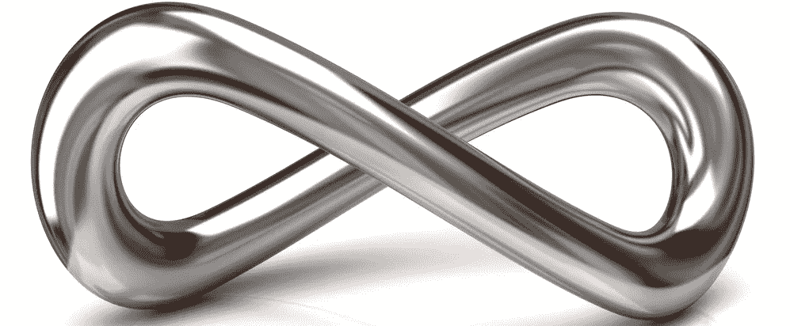

# 数据科学会消灭数据科学吗？

> 原文：<https://towardsdatascience.com/will-data-science-eliminate-data-science-2b9ea0024250?source=collection_archive---------6----------------------->

我的一个朋友问了我这个问题:**一个优质的 ML 即服务、数百名数据科学家思考的功能和越来越聪明的算法真的有市场吗**？或者**大数据甚至会接管我们的工作，因为更多的数据最终会胜过聪明的算法**？

简而言之:我们所做的事情中有一些是人工智能完成的。最终，人工通用智能将淘汰数据科学家**，但它不会马上到来**。

不过，我发现这是一个非常好的问题。这里有一些松散联系的想法来阐述我的简短回答。

1.  I)数据科学的喧嚣，ii)高等教育对这种突然需求的响应速度缓慢，iii)以 IT 为中心的行业中无限的现金流所引发的人才流失**这三者的结合给元数据科学家带来了巨大的压力，使她不得不自动化自己的工作**。我们处于正确的位置:**自动化是我们工作描述的核心**。因此，如果数据科学自动化(和标准化！)会比预测的进化得更快。
    出于同样的原因，**我确实相信横向 mlaa**(不像某些[数据科学](https://twitter.com/ylecun/status/838106399343316993?lang=en)和[创业](http://www.bradfordcross.com/blog/2017/3/3/five-ai-startup-predictions-for-2017)的大师们)。设计良好的 MLaaS 可以为中小型企业甚至大型非 IT 公司带来价值，这些公司负担不起或不想在内部构建数据科学生态系统。 [**自动化**](https://www.datarobot.com/) **和** [**众包 ML**](https://www.linkedin.com/pulse/open-innovation-crowdsourcing-machine-learning-getting-kazakci) 可能无法与谷歌或脸书等公司组建的顶级数据科学研发团队&竞争，但他们可以**让团队中的两名成员在 60 个小时的快速培训课程**后成为“数据科学家”。
2.  当然有些情况下**收集更多的数据是一个选择**。在这些情况下，我们可以估计*更多的数据会有多大的帮助(通过推断学习曲线)。在此范围内，误差主要由过度拟合引起，技巧(例如，丢失、正则化)与数据收集竞争，因此**(昂贵)** **数据科学时间可以与(便宜)贴标时间**竞争。*
3.  当然，在某些情况下，即使有更多的数据，也帮不上忙。在我们的 [HEP 异常挑战](http://www.ramp.studio/events/HEP_detector_anomalies_M2HECXMAP542_201617)中，我们几乎有无限的数据，但所有现成的预测器都卡住了。我们**被欠拟合**所支配:我们不能*用现成的技术足够好地表达*(或*近似*)正确的预测器。不适合的问题是设计问题，这是人类智慧(有见识的、知识驱动的模型搜索)可以帮助的地方。深度网络还解决了一个不足的问题，即数据量饱和的经典计算机视觉方法(见幻灯片 8 [此处](https://drive.google.com/file/d/0BzwKr6zuOkdRdjhtaHA0RjV6UVU/view?usp=sharing))。
4.  最后，当然有收集更多数据不可行的情况。很多时候分布是变化的，所以你在任何时候都只有有限的无偏数据。很多时候，数据与任务或类的数量成线性关系，所以每个任务的数据都是有限的。在这些情况下，我们**被困在小数据世界中，在那里过度拟合占主导地位**。通用的(自动化的，超适应的)正则化技术可能会把你带到一定的水平，但是这里没有什么比有见识的先验知识(又名领域知识)更有价值的了。无论何时你拥有领域知识，它都必须被吸收和转化，给数据科学家足够的工作保障。

当然，这只是一个关于这个话题的简短摘录。你怎么看？我们的数据科学工作有危险吗？

## 如果你喜欢你读的东西，就在[中](https://medium.com/@balazskegl)、 [LinkedIn](https://www.linkedin.com/in/balazskegl/) 、&Twitter 上关注我。