# 哈伯曼生存数据集上的 EDA(探索性数据分析)让你诊断癌症？

> 原文：<https://towardsdatascience.com/will-habermans-survival-data-set-make-you-diagnose-cancer-8f40b3449673?source=collection_archive---------1----------------------->

# 介绍

哈伯曼的数据集包含了芝加哥大学比林斯医院在 1958 年至 1970 年间对接受乳腺癌手术的患者进行的研究数据。来源:[*https://www.kaggle.com/gilsousa/habermans-survival-data-set*](https://www.kaggle.com/gilsousa/habermans-survival-data-set)

我想解释我对这个数据集所做的各种数据分析操作，以及如何推断或预测接受手术的患者的生存状态。

首先，对于任何数据分析任务或对数据执行操作，我们都应该具有良好的领域知识，以便我们能够关联数据特征，并给出准确的结论。因此，我想解释一下数据集的特征以及它如何影响其他特征。

该数据集中有 4 个属性，其中 3 个是特征，1 个是类属性，如下所示。此外，还有 306 个数据实例。

1.  腋窝淋巴结(淋巴结)数量
2.  年龄
3.  运营年度
4.  生存状态

**淋巴结**:淋巴结是微小的豆状器官，沿着淋巴液通道起过滤器的作用。随着淋巴液离开乳房并最终回到血液中，淋巴结试图在癌细胞到达身体其他部位之前捕捉并捕获它们。腋下淋巴结有癌细胞表明癌症扩散的风险增加。在我们的数据中，检测到腋窝淋巴结(0-52)


**Affected Lymph Nodes**

(来源:[*https://www.breastcancer.org/symptoms/diagnosis/lymph_nodes*](https://www.breastcancer.org/symptoms/diagnosis/lymph_nodes))

**年龄**:代表手术患者的年龄(30-83 岁)

**手术年份**:患者接受手术的年份(1958-1969)

**生存状态**:表示患者手术后是否存活 5 年以上或 5 年以下。这里，如果患者存活 5 年或更长时间，则表示为 1，存活少于 5 年的患者表示为 2。

因此，让我们开始处理数据集并得出结论。

# 操作

为此我使用了 python，因为它有丰富的机器学习库和数学运算。我将主要使用常见的软件包，如 ***Pandas、Numpy、Matplotlib*** *和****seaborn****，它们帮助我进行数学运算以及绘制、导入和导出文件。*

```
*import pandas as pd
import seaborn as sns
import matplotlib.pyplot as plt
import numpy as nphaberman= pd.read_csv(“haberman.csv”)*
```

*在上面的代码片段中使用函数*read _ csv*from***pandas***packages 您可以从 CSV 文件格式导入数据。因此，导入数据集后，您需要检查数据导入是否正确。下面的代码片段将显示数据的形状，即数据中存在的列数和行数。*

```
*print(haberman.shape)*
```

**

*Shape of data*

*在这里，您可以确信您想要的数据已成功导入，它显示了 306 个数据实例和 4 个属性，正如我们在前面的简介中看到的。您甚至可以使用下面的一行代码来查看列的标签。*

```
*print(haberman.columns)*
```

**

*Columns in data with type*

*这里，dtype 表示数据类型，它是数据中所有列的对象类型。同样，您也可以找到要素和类属性的 dtype，并可以通过下面简单的代码行找到属于一个类的数据点的数量以及属于其他类的数据点的数量。*

```
*haberman[“Survival_Status”].value_counts()*
```

**

*Number of data per classification*

*从上面这段代码你可以得出结论，306 个病人中有 225 个存活了 5 年以上，只有 81 个存活了不到 5 年*

*现在让我们绘制一些图表，这些图表给我们更多的数据说明，这样我们就可以很容易地得出结论。*

```
*haberman.plot(kind=’scatter’, x=’Axillary_Nodes’, y=’Age’) 
plt.grid()
plt.show()*
```

*上面的片段给了我散点图，x 轴是节点，y 轴是年龄。我们的 *matplotlib* 库函数 grid 和 show 帮助我在网格中绘制数据，并将其显示在控制台上。*

*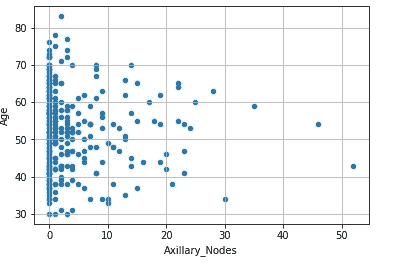*

*2D Scatter Plot*

*上面的散点图以重叠的方式显示了所有数据，并且颜色相同，因此我们无法区分数据，也有可能您会错过我的一些数据，从而导致错误的结论。因此，为了区分数据，我们可以使用 *seaborn* packages 函数，该函数通过为每个分类特征分配不同的颜色来直观地区分数据。*

```
*sns.set_style(‘whitegrid’)
sns.FacetGrid(haberman, hue=”Survival_Status”, size=4) \
 .map(plt.scatter, “Axillary_Nodes”, “Age”) \
 .add_legend();
plt.show();*
```

*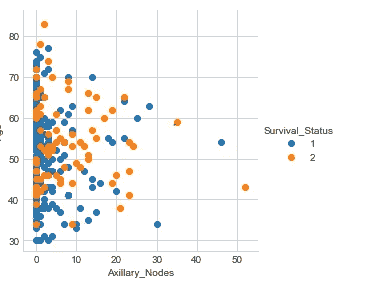*

*2D scatter plot with different colour polarity*

*在上面的代码片段中，我从 seaborn 库导入了函数，比如 *FacetGrid* ，这样我们就能够区分数据分类。这里蓝点代表存活超过 5 年，橙点代表存活少于 5 年。*

*由于有 3 个特征，我们可以从中得出我们的分类，所以我们如何从所有特征中选择任何特征，以便我们可以得到错误率更低的输出。为此，我们可以使用 seaborn 的 pairplots 到各种组合的 plots，从中我们可以为我们的进一步操作和最终结论选择最佳对。 *hue="Survival_Status"* 会给出你需要对哪些特征做分类。下图显示了 pairplots 组合的绘制及其代码片段。*

```
*plt.close();
sns.set_style(“whitegrid”);
sns.pairplot(haberman, hue=”Survival_Status”, size=3, vars=[‘Age’,’Operation_Age’, ‘Axillary_Nodes’])
plt.show()*
```

**

*Pair Plot*

*上图是数据中所有特征的组合图。这些类型的图被称为成对图。图 1、图 5 和图 9 是所有特征组合的直方图，通过考虑数据的不同特征来解释数据的密度。*

*现在，让我们一个接一个地绘制图 1，我将向您解释我将采用哪个数据特征来进行进一步的数据分析。我会选择这样一个数据，它比任何其他数据特征都更能显示出我与众不同的地方。因此，让我们开始分析除图 1，5，9 之外的每个图*，因为它是成对图中特征的直方图。**

***曲线图 2**:-在该曲线图中，您可以看到 X 轴上有操作年龄，Y 轴上有年龄，这些数据的曲线图大部分相互重叠，因此我们无法区分蓝点下方是否存在任何橙色点，反之亦然。因此，我拒绝这两个数据特征组合进行进一步分析。*

***图 3**:-在这个图中有一些点是可区分的，但它仍然比其他图更好，因为我们可以通过直方图和 CDF 提供更精确的结论，稍后你会了解到。在这个图中，点的重叠是存在的，但相比之下，它仍然比所有其他图好。所以我会选择这个 plot ie 的数据特征。年龄和腋窝淋巴结。*

***图 4** :-使用数据特征操作 Age 和 Age 绘制，该图显示了与图 2 相似的图类型，但只是旋转了 90 度。所以我也拒绝这个功能*

***图 6**:-它绘制了特征操作年龄和腋窝淋巴结，与图 2 有些相似，但与其他图相比，点的重叠在该图中似乎更多。所以，我也会拒绝这个组合*

***图 7** :-该图与图 3 相似，只是交换了轴，所以该图将旋转 90 度。此外，我会接受进一步的行动这一组合*

***地块 8** :-与地块 6 相同，唯一的特征是轴互换。*

*因此，我考虑在图 3 和图 7 中绘制特征年龄和腋淋巴结，用于所有进一步的数据操作*

***1D 散点图***

*让我们绘制 1D 散点图，看看我是否可以使用下面的代码片段区分数据。*

```
*import numpy as np
haberman_Long_Survive = haberman.loc[haberman[“Survival_Status”] == 1];
haberman_Short_Survive = haberman.loc[haberman[“Survival_Status”] == 2];
plt.plot(haberman_Long_Survive[“Axillary_Nodes”], np.zeros_like(haberman_Long_Survive[‘Axillary_Nodes’]), ‘o’)
plt.plot(haberman_Short_Survive[“Axillary_Nodes”], np.zeros_like(haberman_Short_Survive[‘Axillary_Nodes’]), ‘o’)
plt.show()*
```

*我使用了 *Numpy* 库函数为每个分类数据单独绘制 1D 散点图。下面您可以看到使用数据特征年龄和腋淋巴结的 1D 散点图*

*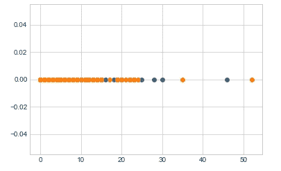*

*1D Scatter Plot*

*在这里，你可以观察到短期生存状态的数据大多与长期生存状态的数据重叠，因此你无法根据这些数据得出结论。*

*如果使用 PDF 或 CDF 格式的数据进行绘图，可以获得更好的清晰度。*

*让我解释一下你对 PDF 和 CDF 的概念。*

***PDF** 如果存在更多的数据，PDF 将是代表高峰的峰状结构，否则如果存在的数据较少，它将是平的/小峰。它是使用直方图边缘的平滑曲线图*

***CDF** *(累积分布函数)* :-表示 PDF ie 的累积数据。它将通过累积考虑每个数据点的 PDF 来绘制图表。*

*Seaborn library 将帮助您绘制任何数据的 PDF 和 CDF，以便您可以轻松地可视化特定点上的数据密度。下面的代码片段将绘制 PDF*

```
*sns.FacetGrid(haberman,hue=”Survival_Status”, size=8)\
.map(sns.distplot,”Axillary_Nodes”)\
.add_legend()*
```

*让我们试着画出每个数据特征的 PDF，看看哪个数据能给我们最高的精度。*

***时代 PDF***

*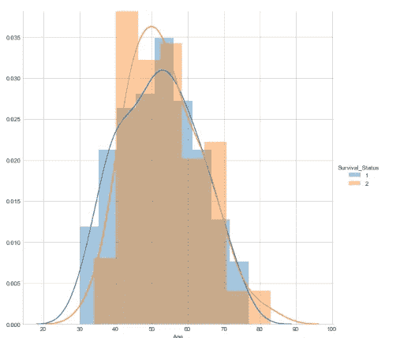*

*PDF for Age*

***观察:**在上面的图中，观察到在 30-75 岁的年龄范围内，存活和死亡的状态是相同的。因此，使用这个数据点我们无法预测任何事情*

***运营年龄 PDF***

*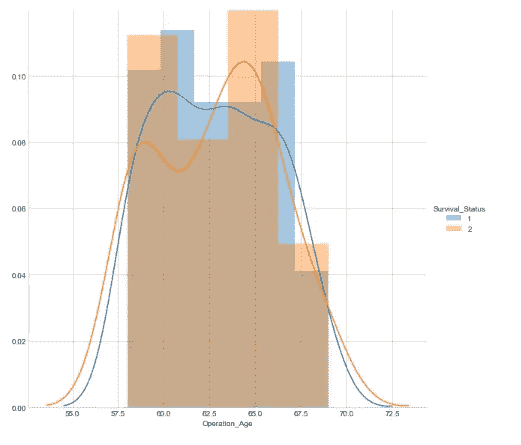*

*PDF for Operation Age*

***观察结果**:类似地，我们无法用这些直方图预测任何事情，因为每个数据点中的密度数量相同。甚至两种分类的 PDF 也相互重叠。*

***腋窝淋巴结的 PDF***

*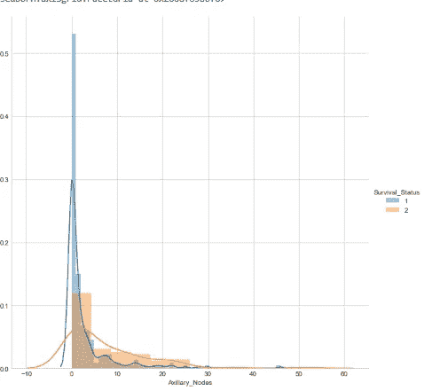*

*PDF for Axillary nodes*

***观察:**据观察，如果人们检测到的腋窝淋巴结较少，他们会活得更长，反之亦然，但仍然很难分类，但这是你可以从所有数据中选择的最佳数据。所以，我接受腋窝淋巴结的 PDF 并可以得出以下结果*

> *if(AxillaryNodes≤0)*
> 
> *患者=长期存活*
> 
> *else if(腋淋巴结≥0 &&腋淋巴结≤3.5(近似值))*
> 
> *患者=长期存活几率高*
> 
> *else if(腋淋巴结≥3.5)*
> 
> *患者=短期存活*

*因此，从上面的 PDF 我们可以说患者的生存状态，但我们不能确切地说，有百分之多少的患者将实际短期生存或长期生存。知道我们有另一个分布是 CDF。*

*CDF 将给出 PDF 的累积图，以便您可以计算患者存活状态的确切百分比*

*让我们为我们选择的特征绘制 CDF，它是腋淋巴结*

```
*counts, bin_edges = np.histogram(haberman_Long_Survive[‘Axillary_Nodes’], bins=10, 
 density = True)
pdf = counts/(sum(counts))
print(pdf);
print(bin_edges);
cdf = np.cumsum(pdf)
plt.plot(bin_edges[1:],pdf);
plt.plot(bin_edges[1:], cdf)*
```

*上面的代码会给我长期生存状态的 CDF。这里，我们仅使用来自 *Numpy* 的 *cumsum* 函数，该函数将累加该特征的 PDF。*

*具有长期生存状态的 CDF 将在图中以橙色显示。*

*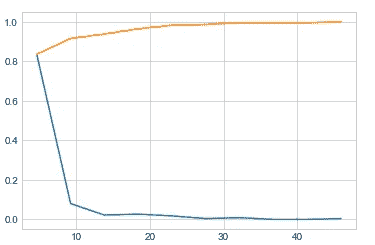*

*CDF for Long survival status*

*从上面的 CDF 图中，你可以观察到橙色线显示如果检测到的腋窝淋巴结数目为< 5\. Also you can see as number of axillary nodes increases survival chances also reduces means it is clearly observed that 80% — 85% of people have good chances of survival if they have less no of auxillary nodes detected and as nodes increases the survival status also decreases as a result 100% of people have less chances of survival if nodes increases > 40，有 85%的机会长期存活*

*让我们试着在一个图中画出这两个特征 CDF。为此，只需在为长期生存而编写的现有代码中添加以下代码*

```
*counts, bin_edges = np.histogram(haberman_Short_Survive['Axillary_Nodes'], bins=10, 
                                 density = True)
pdf = counts/(sum(counts))
print(pdf);
print(bin_edges)
cdf = np.cumsum(pdf)
plt.plot(bin_edges[1:],pdf)
plt.plot(bin_edges[1:], cdf)plt.show();*
```

*下图用红线显示了短期存活的 CDF*

*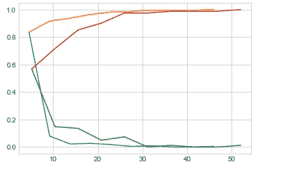*

*CDF for both Long and short survive*

*你可以在上面的综合 CDF 中观察到长期存活的观察结果是相同的，但是在短期存活中，近 55%的人的淋巴结小于 5，如果淋巴结> 40，则有近 100%的人短期存活*

*我们还可以通过应用数学公式(如标准差和平均值)来预测患者的状况。*

*平均值是所有数据的平均值，标准差是数据的分布，表示数据在数据集上分布的宽度。Python 有 *Numpy* 库，可以在一行中执行这个操作。*

```
*print(“Means:”)
print (np.mean(haberman_Long_Survive[“Axillary_Nodes”]))
print (np.mean(np.append(haberman_Long_Survive[“Axillary_Nodes”],50)))
print (np.mean(haberman_Short_Survive[“Axillary_Nodes”]))print(“\nStandard Deviation:”)
print(np.mean(haberman_Long_Survive[“Axillary_Nodes”]))
print(np.mean(haberman_Short_Survive[“Axillary_Nodes”]))*
```

*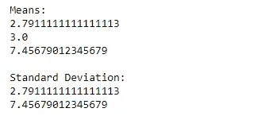*

*我们可以在第 3 行看到，我添加了异常值(与相应数据相比非常大或非常小的数据。这可能是收集数据时的错误或异常情况),即使数据的平均值没有受到太大影响。*

*您可以观察到，长期存活的平均值为 2.79，包括异常值在内，平均值为 3，几乎相同，但短期存活的平均值为 7.4，相对来说比长期存活的平均值高得多。所以短期存活的概率在数据集中更大。*

*如果观察标准差，长期存活者的标准差仅为 2.79，短期存活者的标准差为 7.45，这意味着短期存活者的数据分布更多。*

## *中位数、分位数和百分位数*

*你还可以做一些数学运算，比如中位数，分位数，百分位数*

```
*print(“Medians:”)
print(np.median(haberman_Long_Survive[“Axillary_Nodes”]))
print(np.median(np.append(haberman_Long_Survive[“Axillary_Nodes”],50)))
print(np.median(haberman_Short_Survive[“Axillary_Nodes”]))print(“\nQuantiles:”)
print(np.percentile(haberman_Long_Survive[“Axillary_Nodes”],np.arange(0,100,25)))
print(np.percentile(haberman_Short_Survive[“Axillary_Nodes”],np.arange(0,100,25)))print(“\n90th percentile:”)
print(np.percentile(haberman_Long_Survive[“Axillary_Nodes”],90))
print(np.percentile(haberman_Short_Survive[“Axillary_Nodes”],90))from statsmodels import robust
print (“\nMedian Absolute Deviation”)
print(robust.mad(haberman_Long_Survive[“Axillary_Nodes”]))
print(robust.mad(haberman_Short_Survive[“Axillary_Nodes”]))*
```

*上面的代码片段将给出中位数和第 n 个百分点*

*中位数是数据的中心值，分位数是第 n 个百分比 n= 25，50，75 的特定特征值，第 n 个百分位类似于分位数，但 n 可以是 1 到 100 之间的任何数字。*

*因此，对于我们的数据集，这些术语的值如下*

*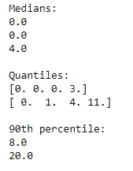*

***观察**:*

1.  *从以上观察可以清楚地看出，长期存活的平均腋窝淋巴结为 0，而短期存活的平均腋窝淋巴结为 4。也就是说，平均有 4 个辅助淋巴结的患者生存期短。*
2.  *分位数显示，在长期存活中，近 50%的腋窝淋巴结为 0，75%的患者淋巴结少于 3，即 25%的患者淋巴结多于 3。*
3.  *同样，在短期生存中，75%的患者至少检测到 11 个淋巴结。*
4.  *在 90%时，如果检测到的淋巴结> 8，那么它具有长期生存状态，如果淋巴结> 20，那么患者将具有短期生存状态*

## *盒图和胡须，小提琴图和等高线图*

*您还可以使用像盒图轮廓和更多的绘图分析数据，Seaborn 库有各种各样的数据绘图模块。让我们拿一些吧*

***盒子剧情和络腮胡子***

```
*sns.boxplot(x=”Survival_Status”,y=”Axillary_Nodes”, data=haberman)
plt.show()*
```

*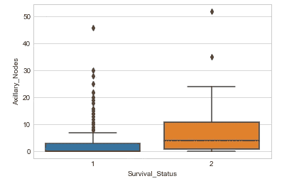*

*Box Plot and Whiskers*

*在这里，你可以通过观察它的高度和宽度以及 T 型结构来阅读这个图。方框高度代表第 25 个百分位数到第 75 个百分位数之间的所有数据，水平条代表该数据的最大范围，方框宽度代表该数据在数据集中的分布。此外，竖线上方小点是异常值*

***观察结果**:上图中，长命百分位数第 25 百分位和第 50 百分位几乎相同，阈值为 0 到 7。此外，对于短期存活，第 50 百分位节点几乎与长期存活的第 75 百分位相同。短期存活阈值为 0 至 25 个节点，75%为 12，25%为 1 或 2*

*所以，如果 0–7 之间的节点有出错的机会，因为短存活图也在其中。对于短期存活状态，这是 50%的误差*

*以上 12 点大部分在于生存时间短*

***小提琴剧情***

```
*sns.violinplot(x=”Survival_Status”, y=”Axillary_Nodes”,data=haberman)
plt.legend
plt.show()*
```

*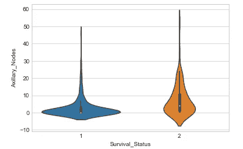*

*Violin Plot*

*它与盒须图相同，唯一的区别是用盒直方图代替盒直方图来表示数据的分布。*

***观察**:在上面的 violin 图中，我们观察到它的长期存活密度更接近 0 节点，而且它的晶须在 0-7 范围内，而在 violin 2 中，它显示的短期存活密度更接近 0-20 和阈值 0-12*

***等高线图***

*等高线图类似于密度图，意味着如果特定点上的数据数量更多，该区域将变得更暗，如果您将它可视化，它将形成类似小山的结构，其中山顶具有最大的点密度，密度随着山坡坡度的减小而减小。*

*您可以参考下图，了解等高线图在 3D 中的实际效果*

*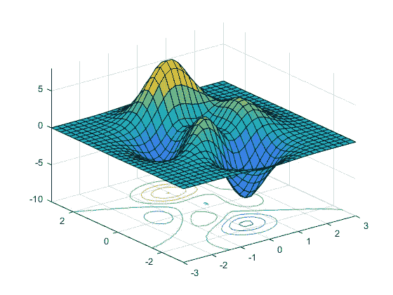*

*Source: [https://www.mathworks.com/help/matlab/ref/surfc.html](https://www.mathworks.com/help/matlab/ref/surfc.html)*

*在上图中，黄点的密度最大。*

*下面是我们数据集的等高线图*

```
*sns.jointplot(x=”Age”,y=”Axillary_Nodes”,data=haberman_Long_Survive,kind=”kde”)
plt.grid()
plt.show()*
```

*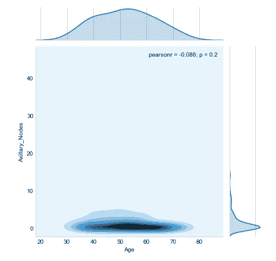*

*Contour Plot*

***观察**:以上是使用特征年龄和腋窝淋巴结的长期存活的 2D 密度图，观察到长期存活的点的密度更多来自 47-60 岁的年龄范围和 0-3 岁的腋窝淋巴结。黑暗区域具有主要密度，其在 3D 中是山顶，且密度随着图形变亮而变低。每个阴影代表一个等高线图。*

# *结论:*

*是的，您可以通过应用各种数据分析技术和使用各种 Python 库，使用哈伯曼的数据集来诊断癌症。*

# *参考资料:*

1.  *[https://www.mathworks.com/help/matlab/ref/surfc.html](https://www.mathworks.com/help/matlab/ref/surfc.html)*
2.  *[*https://www.breastcancer.org/symptoms/diagnosis/lymph_nodes*](https://www.breastcancer.org/symptoms/diagnosis/lymph_nodes)*
3.  *[*https://www.kaggle.com/gilsousa/habermans-survival-data-set*](https://www.kaggle.com/gilsousa/habermans-survival-data-set)*
4.  *[https://www.appliedaicourse.com](https://www.appliedaicourse.com/)*