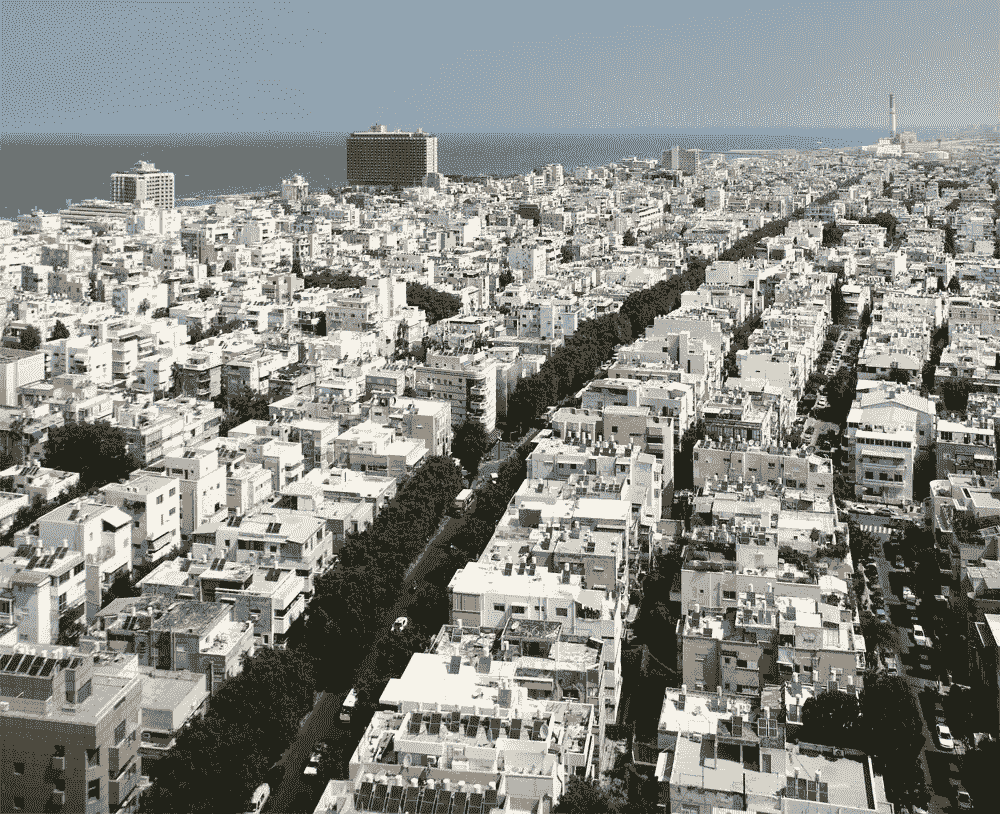
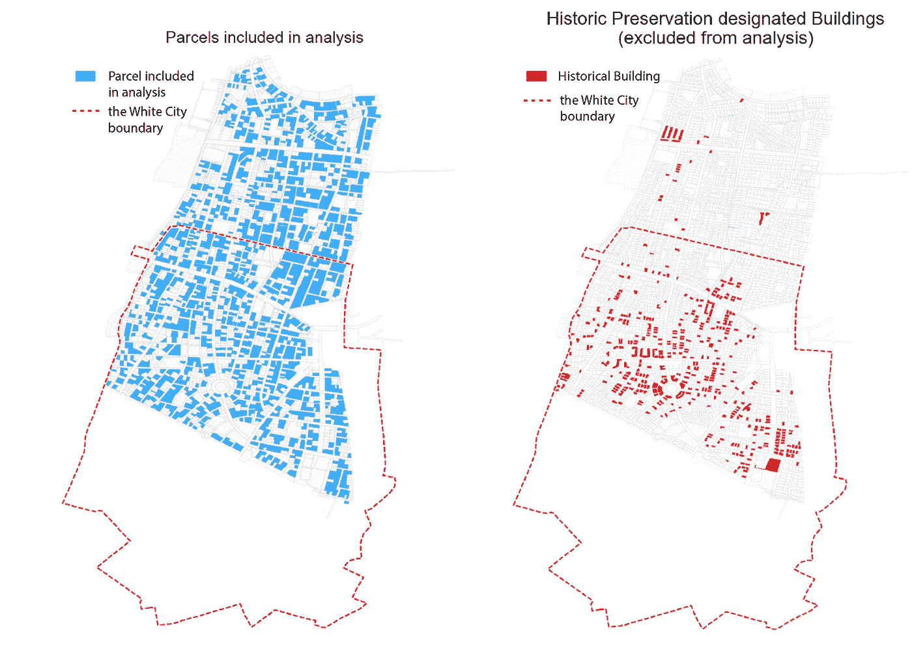
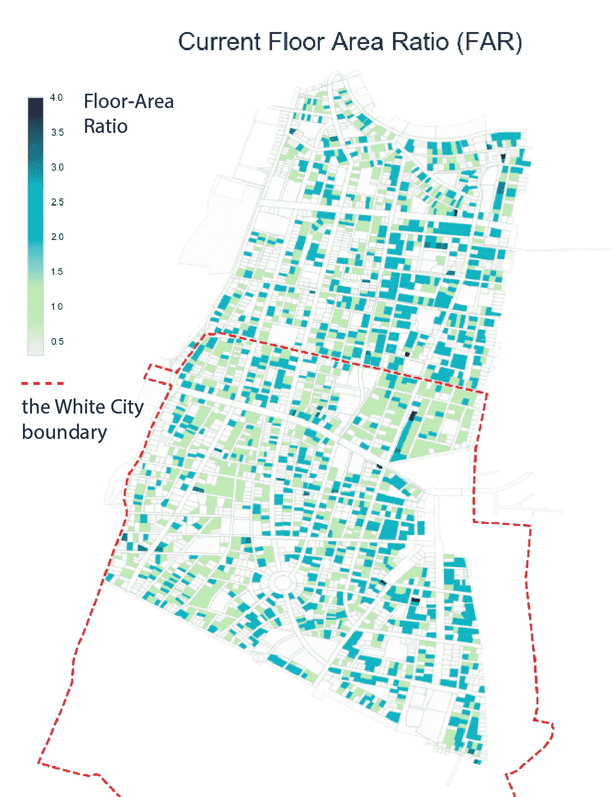
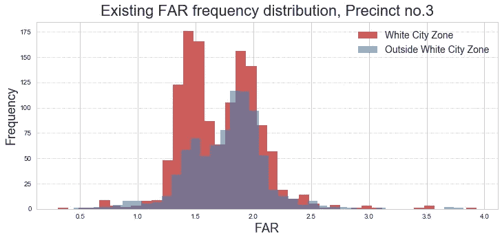
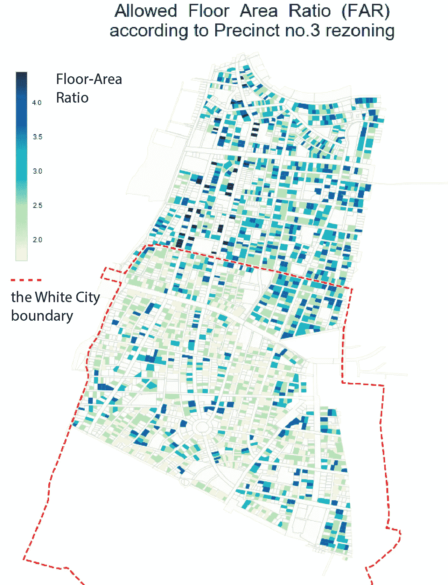
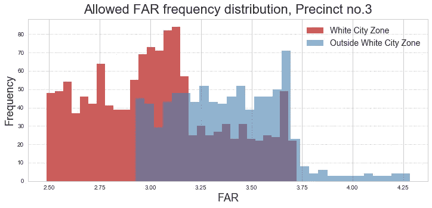
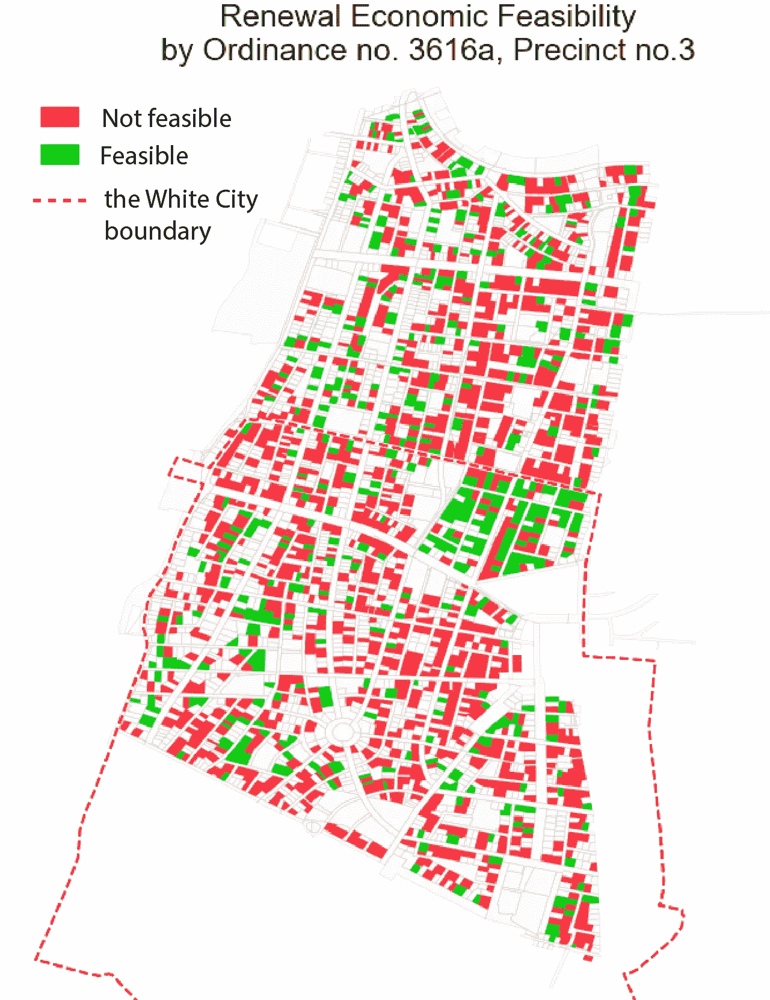
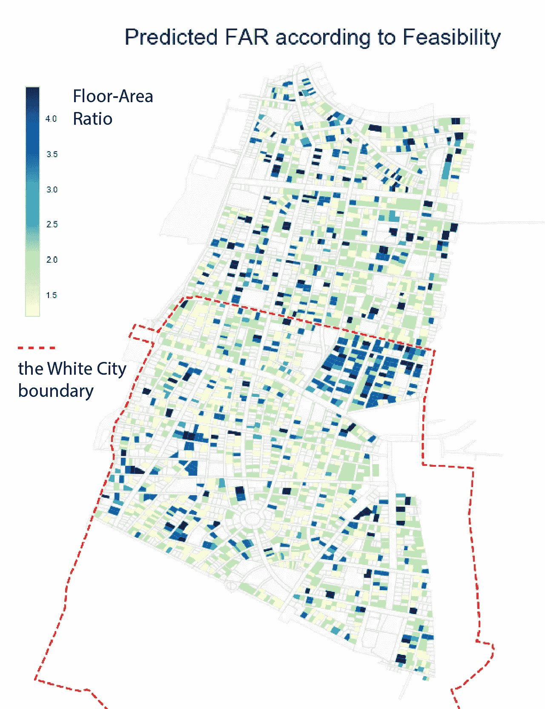

# 特拉维夫的市中心会更新吗？

> 原文：<https://towardsdatascience.com/will-tel-aviv-city-center-be-renewed-5aaf000c2428?source=collection_archive---------8----------------------->

## 或者:为什么规划者需要开始使用大数据

Tel-Aviv city center (source: [https://xnet.ynet.co.il/architecture/articles/0,14710,L-3099095,00.html](https://xnet.ynet.co.il/architecture/articles/0,14710,L-3099095,00.html))

*这项研究于 2018 年 7 月以“***”(希伯来文版)和*[*Haaretz.com*](https://haaretz.com/israel-news/.premium-tel-aviv-s-plans-for-affordable-housing-too-good-to-be-real-1.6240603)*(英文版)发表于以色列房地产出版社**

*特拉维夫市最近(2018 年 1 月)批准了一项新的分区条例，用于其最理想的地区之一，第三选区，也被称为“*旧北*”街区。该计划鼓励开发商通过提供额外的建筑面积来更新住宅建筑，以便升级非历史建筑，增加市中心的住房存量，同时保持其独特的城市景观质量。住户从免费更新中受益，并获得改善的/新的公寓。自第一阶段通过批准以来，该计划受到开发商、规划者和居民的公开批评，声称尽管该计划据称会增加土地供应，但在单个建筑层面上，它仍然过于严格，经济上不允许使用。*

*作为一名以特拉维夫为基地、专门从事城市更新住宅项目的建筑师，很容易感觉到，在宣布重新分区后，第 3 区的新项目需求急剧下降。将我最近获得的数据分析技能应用到重新分区的可行性问题上，对我来说是一个自然的选择；我使用了关于地块粒度的 GIS 数据，以确定新法令提供的额外建筑面积是否提供了足够强的激励来确保其建筑物的更新。我还评估了重新分区将产生的未来容积率(FAR ),以及根据规划的预期利用率，整个辖区将增加的住房单元数量。*

# *特拉维夫市中心建筑环境+分区快速回顾*

*3 区主要建于 20 世纪 30 年代，由英国在巴勒斯坦的委任统治支持，是特拉维夫市中心的四个区之一(3 区、4 区、5 区和 6 区)，以其包豪斯建筑和“花园城市”的城市景观而闻名。该区还包含了“白色城市”区的一个重要部分，2003 年被联合国教科文组织宣布为世界遗产。在这个宣言之后，城市的保护计划在 2008 年被批准，指定保护市中心的大约 1000 栋建筑，其中大部分位于“白色城市”内。*

**

****Fig.1*** *Precinct 3, Tel Aviv-Jaffa, Israel**

**

*Dizengoff street, 1960’s (source: Google)*

*占地 243.1 公顷(其中约 60%在“白色城市”区域内)，“*第 3 区规划*”，或其官方名称为*第 3616a 号法令，*是为特拉维夫市中心的四个区准备的四个规划之一，是第一个也是唯一一个在我进行这项研究时获得批准的规划。该法令对白城区内和白城区外的地块进行了区分，允许在历史遗址外增加一层，并要求对白城区内非常小的地块(< 500m2)的边界进行更严格的限制。*密度系数，*代表单元的平均大小，并根据它计算地块中允许的住房单元数量，商业街中的密度系数小于非商业街中的密度系数，允许主干道中有更多或更小的单元。**总的来说，除了目前已经存在的大约 36，000 套住房单元之外，该计划还将为该区域新增 16，000 套住房单元(预计利用率为 50%)。***

# *分析方法*

**用于生成此分析的 Python 代码可在我的*[*GitHub*](https://github.com/danachermesh/Tel-Aviv_RezoningFeasibility/blob/master/Tel-Aviv_RezoningEvaluation.ipynb)*上获得。**

*由于这项研究是在重新分区法令获得批准后几个月才进行的，因此其分析具有预测性，使用从[特拉维夫市地理信息系统](https://gisn.tel-aviv.gov.il/iview2js/index.aspx)获得的*3 区建筑物和地块的现有真实物理参数*，并且*根据新法令指南评估其未来特征*，因为它们出现在[分区法令第 3616a 号文件](http://mavat.moin.gov.il/MavatPS/Forms/SV4.aspx?tid=4&et=1&PL_ID=ppnCWTcsST9sCXNyHNoQFA4YXrcCUxceDk4O1Xa3nvDP/AwBOUtlpTtKqS6qvAeW1S7GYroEozyrrsmyUB8ulP1psIdjSx3vlcIC1JdQyKE=)(仅*希伯来文内容)*。为每个地块下载的属性是*地块 ID* 和*面积*(*m*)*地址*、*建筑占地面积* ( *m* )、*层数*和*建筑类型*。根据这些变量计算出*建筑面积*和*容积率(FAR)* 。*

*我假设所有 3 号区对土地的需求都一样高，这意味着在每个待建的重建项目中，允许的建筑面积都得到充分利用。*

*该研究仅考虑了住宅建筑，并评估了拆除+新建部分计划的经济可行性，排除了建筑改进和建筑扩建的可能性。本研究中未考虑宗地合并选项。指定用于历史保护的地块不在分析范围内，因为重新分区不适用于这些地块。此外，新建筑物(建于 1980 年后)不符合新的条例准则，也被排除在分析之外。总体而言， **2，161 个包裹**被发现对该分析有效，约占该辖区包裹的一半。*

**

****Fig.2*** *(left):* ***2,161 Potential to renewal parcels*** *according to rezoning ordinance; 1,307 (~60%) within the White City zone and 856 buildings outside its boundaries.* ***Fig.3*** *(right): buildings designated for historic preservation, excluded from the analysis.* ***17%*** *of the precinct’s buildings within the White Zone and* ***3%*** *of buildings outside of it.**

**经济可行性阈值*被定义为**当前建筑面积比允许建筑面积**少 50%,考虑到当前建筑面积对居住者的回馈。这一经验法则还考虑了拆迁成本、许可成本、建筑成本和临时疏散居民的住房成本，以及额外新建建筑面积的更高土地价值。此阈值的例外情况是大地块(定义为地块面积等于或大于 750 米)和小地块(500 米或小于 500 米)，分别允许/要求居民或开发商享有 55%的比例。*

# *结果*

# *1.当前(2018 年)建成环境*

*3 区的大多数建筑目前的建筑容积率在 1.3-2 之间，形成了特拉维夫连续连贯的城市景观，如图 4 所示。在“白城”区内外，当前 FAR 在辖区内的频率分布如图 5 所示，表明“白城”区内外的 FAR 分布没有显著差异:*

**

****Fig.4*** *Current FAR precinct 3**

**

****Fig.5*** *Frequency distribution of current FAR, precinct 3; Within and outside the “White City”. N*o significant difference between the two distribution is emerging*

# *2.根据重新分区允许的建筑空间*

*如前所述，根据重新分区所允许的**最大未来建筑空间是通过使用现有的空间测量值并将其应用于新条例的指导方针进行评估的。***

**允许的楼层数*取决于地块是在“白城”区之内还是之外，是否位于商业街上，以及对于“白城”区内的地块，其面积是大于还是小于 500 平方米。关于*允许的覆盖区*，地块边界所需的后退通常会导致覆盖区在地块面积的 42%-56%之间，看起来几乎是随机的。因此，对于此分析，小于 750 米的宗地的覆盖区百分比在此范围内随机选择。根据规划要求，该地块面积的最大 55%被分配给大于 750 米的地块。*允许占地面积*和*允许容积率*相应计算。*允许的住房单元*是通过将新建筑面积除以密度系数，然后减去 4 个单元来评估的，这是因为建筑物最高楼层对大单元的常见住房需求。*

*由此得出的未来 FAR 及其分布如图 6 和图 7 所示。该区独特的城市景观发生了戏剧性的变化，向更广阔的区域延伸，尤其是在“白色城市”区和外围之间。*

**

****Fig.6*** *Allowed FAR, rezoning fully utilized across the precinct. The northern part, outside the “White City” zone, gains significantly higher FAR**

**

****Fig.7*** *Frequency distribution of allowed FAR, if rezoning fully utilized across the precinct; FAR outside the “White City” zone (blue) show higher results, while the “White City” zone (red) stays relatively closer to current FAR’s. Overall, FAR distribution is widening.**

# *3.可行性结果和预测的建成环境*

***可行性结果惊人；根据导致我的分析的假设，只有 521 个地块(在分析的 2161 个地块中，占 24%)被发现有足够的利润来利用新的法令。***

*可行和不可行地块如图 8 所示:*

**

****Fig.8*** *Economic Feasibility for renewal by the new zoning ordinance.* ***1640 (76%) parcels were found to be not feasible*** *(red color). Only* ***521 parcels (24%) were found feasible*** *enough for utilizing their rezoning possibilities (green color).**

*考虑到辖区**内的 **471 块**被指定为历史保护区，因此不符合新规划**的条件，重新分区虽然旨在产生额外的建筑面积，但**却使辖区内约 80%的建筑** **恶化并倒塌**。图 9 根据可行性结果绘制了预期容积率，为被发现*可行*的地块绘制了*允许容积率*，为被发现*不可行*的地块绘制了*当前容积率*。图 10 按照相同的方法显示了整个辖区内预期 FAR 的频率分布。无论是地图还是柱状图都没有遵循任何城市结构的常识。*

**

****Fig.9*** *Anticipated FAR according to feasibility results. 521 parcels (24%) assumed to be renewed thus show their allowed FAR guided by the rezoning ordinance, while the rest 76% show their current FAR.**

**

****Fig.10*** *Frequency distribution of anticipated FAR, rezoning utilized only for parcels that were found feasible according to the new ordinance.**

*根据新条例，考虑到将要实施的项目的可行性阈值，预期的城市景观是许多旧建筑和相对少量的新建筑的混合物，与今天特拉维夫市中心的城市景观不一致且完全不同。根据这些结果，*区预计将增加 3390 套住房*，约为**计划宣布目标 8000 套**的 40%。*

# *讨论和含义*

*本研究评估了特拉维夫市中心 3 区的再分区条例，评估了每个地块的经济可行性，并根据其预期用途描绘了未来的建筑环境。**分析显示，超过 75%的 3 区建筑没有利用新条例的经济合理性，**这实际上使这个有意义的区域恶化，并改变了特拉维夫市中心城市景观的显著一致性。*

**

*A typical ‘Tel-Aviv building’; Will it renew before completely crumbling?*

*这些结果提出了关于新法令的目标的问题，以及该计划是否实际上引导城市及其城区朝着这些目标前进。**该计划的指导方针真的能保护特拉维夫市中心的景观质量吗**？考虑到该计划的激励措施足以让不到四分之一的辖区建筑得到利用，它真的是城市更新的杠杆吗？这两个问题，引导和激励我通过这项研究，应该通知当地的规划者，使他们重新评估这个计划和未来的条例，这些天在特拉维夫处于不同的规划阶段。*

## *最重要的是，这项研究应该提出一个关于总体规划和政策分析的讨论，以及大数据工具和技术应用于城市规划的方式，通过允许定性和粒度空间分析来利用它。*

# *未来的研究*

*为了解决其可行性问题，3 号区计划允许两个小地块(500 米或更小)的可选*地块联合*，利用它们的共享侧面在两个地块上建造一座建筑，为每个地块创造更高的占地面积。这种可能性使新条例在整体上更可行。考虑到这种可能性，需要进行进一步的研究，以评估预计重新开发的地块比例。*

*此外，一个类似的分区计划即将被批准用于第 4 选区(“T0”新的北部“T1”社区，位于第 3 选区的东部)，给予更高的奖励，主要是因为第 4 选区不包含“白色城市”区。这个计划被认为非常有利可图。由于这些邻近区域今天具有相似的、连续的城市景观，考虑到它们的经济可行性和预期用途，评估由不同条例产生的未来城市景观将是有趣的。*

**在“市场、设计和城市”课程中，作为一个全课程项目进行的完整研究(由 Alain Bertaud 教授负责；NYU 瓦格纳 2018 春)，此处可用***。***

***特别感谢 Roy Lavian，他是特拉维夫的一名开发商，也是我的同事，我曾就新条例指导下的经济可行性阈值的定义向他咨询过。***