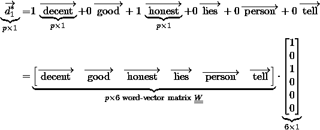
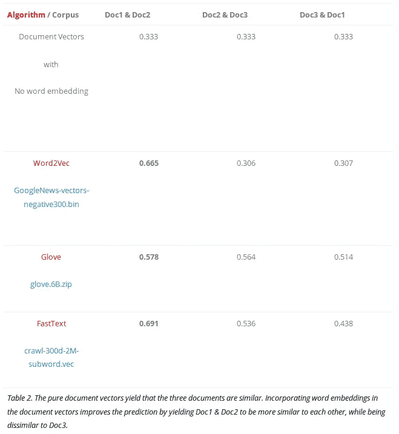

# 单词嵌入和文档向量:第 1 部分。类似

> 原文：<https://towardsdatascience.com/word-embeddings-and-document-vectors-part-1-similarity-1cd82737cf58?source=collection_archive---------22----------------------->

分类取决于相似性的概念。这种相似性可以是简单的分类特征值，例如我们正在分类的对象的颜色或形状，或者是这些对象拥有的所有分类和/或连续特征值的更复杂的函数。文档也可以使用其可量化的属性进行分类，如大小、文件扩展名等…简单！但不幸的是，文档中包含的文本的含义/意义是我们通常对分类感兴趣的。

文本的成分是单词(还包括标点符号),文本片段的*含义*不是这些成分的确定性函数。我们知道，相同的一组单词，但顺序不同，或者只是用不同的标点符号，可以传达不同的意思。这种理解文本的复杂程度是迄今为止算法无法达到的。除此之外，还有一些方法可以对文本进行处理，使其易于被算法分析。文档和单词需要被转换成数字/向量，希望*和*能够保留和反映我们所知道的原始单词和文档之间的关系。这肯定是一个艰巨的任务，但从几十年前的[向量空间模型](https://pdfs.semanticscholar.org/4008/d78a584102086f2641bcb0dab51aff0d353b.pdf) (VSM)方法开始，以及这十年来一些基于[单词嵌入](https://en.wikipedia.org/wiki/Word_embedding)方法的令人兴奋的新参与者，这方面已经取得了良好的进展。VSM 方法将*文档*转化为数字向量，而单词嵌入方法将*单个* *单词*转化为数字向量。

在这篇文章中，我们比较和对比了使用有和没有单词嵌入的文档向量来测量相似性。我们为使用单词嵌入(预先训练的或定制的)进行文本分类打下了基础，这将在下一篇文章中讨论。让我们从快速概述文档和单词向量以及关于它们如何度量和保存(或不保存)的动机示例开始。)我们所理解的相似性的概念。

# 1.文档向量和相似性

在 VSM 方法中，文档被表示为单词空间中的向量。向量中的一个元素是一个度量(简单频率计数、归一化计数、tf-idf 等..)对应单词对于该文档的重要性。在我们之前的帖子中，我们已经非常详细地讨论了这种机制以及这种方法使之成为可能的丰富分析，这些帖子包括[成堆的文档和一袋袋的单词](http://xplordat.com/2018/01/23/stacks-of-documents-and-bags-of-words/)以及[文档的简化模型](http://xplordat.com/2018/06/18/reduced-order-models-for-documents/)。

如果两个文档包含几乎相同的单词分布，它们在单词空间中产生的向量将比其他情况下更加平行。所以两个向量之间的余弦值更接近 1。假设具有相似单词分布的两个文档是相似的(我们知道这是不精确的说法！)VSM 方法采用文档向量的余弦作为它们相似性的度量。显然，在这个模型中，没有共享很多单词的文档将被认为是不相似的——这又是一个不精确的结论。让我们看几个例子，这样我们就清楚了。

# 1.1 示例 1(文档向量)

在一个 7 维的单词空间中取下面三个文档:

*   单词空间:['避免'，'首都'，'法国'，'日本'，'字母'，'巴黎'，'东京']
*   Doc1:东京是日本的首都=> d_1 = [0，1，0，1，0，0，1]
*   Doc2:巴黎是法国的首都=> d_2 = [0，1，1，0，0，1，0]
*   Doc3:避免大写字母=> d_3 = [1，1，0，0，1，0，0]

上面也显示了每个文档的简单的基于计数的 VSM 向量表示。这些向量的任何一对之间的余弦相似度等于(0+1 * 1+0+0+0+0)/(3^0.5* 3^0.5)= 1/3.0。数学都是正确的，但我们希望在文档 1 和文档 2 之间获得更高的相似性，以便我们可以将它们放在一个地理桶中，而将第三个放在其他地方。但是这就是[对文档](http://xplordat.com/2018/06/18/reduced-order-models-for-documents/)的词汇袋方法的本质。让我们接着看另一个例子。

# 1.2.示例 2(文档向量)

以另一个由 6 维单词空间跨越的三个文档为例:

*   单词空间:['正派'，'善良'，'诚实'，'谎言'，'人'，'告诉']
*   Doc1:诚实得体=> d_1 = [1，0，1，0，0，0]
*   Doc2:做个好人=> d_2 = [0，1，0，0，1，0]
*   Doc3:说谎=> d_3 = [0，0，0，1，0，1]

这些文档不共享任何单词，因此它们的点积都是零，这表明它们都不相似。但是，我们还是希望让 Doc1 和 Doc2 更相似，而不是更像 Doc3。

从这里的例子得出的结论是，用于评估相似性的基于单词包的文档向量及其分类可能是误导的。

# 2.词向量和相似度

在过去五年左右的时间里，出现了一股为*的单个单词*生成数字向量(任意长度 *p* = 50、200、300 等等)的热潮。原因集中在更便宜和更快的计算机的可用性，以及将最近流行的&竞争性深度神经网络应用于 NLP 任务的愿望。[基于单词嵌入](https://en.wikipedia.org/wiki/Word_embedding)的方法已经产生了诸如 [Word2Vec](https://arxiv.org/abs/1301.3781) 、 [Glove](https://nlp.stanford.edu/projects/glove/) 和 [FastText](https://fasttext.cc/) 之类的工具，它们现在被广泛使用。

通过针对文本数据的语料库训练算法来获得单词向量。在训练结束时，语料库中的每个单词学习为在训练时选择的长度为 *p* 的数值向量。这个 *p* 远远小于语料库中唯一词的总数 *n* ，即 *p < < n* 。因此，该向量表示从原始的*n*-长 1-热词向量到更小的*p*-长密集向量在*p*-维*假词空间中的线性映射/投影。*我们说*假*的原因是这些 *p* 维度没有任何可解释的物理意义。它们只是一个数学概念。有点像奇异值分解，但不完全是。有人可能认为增加 *p* 可能会在低维流形中产生更好质量的单词表示。不太不幸。所以，我们开始了——一点巫术和所谓的炼金术在起作用。

这些工具的作者已经将它们应用于大量的文本，如谷歌新闻、维基百科转储、通用抓取等，以得出他们在这些语料库中找到的单词的数字向量版本。为什么大量的文本？这个想法是，这些单词向量有望成为通用的。我们这样说是什么意思？这样，我们可以用*他们*发布的数字向量来替换*我们的*文档中的单词。也就是说，他们希望他们的单词向量具有普遍的有效性——也就是说，无论该单词出现在任何文档的什么地方和什么上下文中，该单词都可以被他们发布的向量替换

> 通过将算法暴露于大量文本，他们希望每个单词都经历了足够多的上下文变化，其数字向量因此在某种平均意义上吸收了单词的含义及其在优化过程中与其他单词的关系

**这些词汇有多普遍？**

然而，必须清楚地理解这些*通用*单词嵌入的含义和局限性。

*   首先，为一个单词获得的数字向量是算法和应用该算法来导出该向量的文本语料库的函数。
*   第二，不要混淆不同算法的向量——即使它们是在同一个语料库上训练的。也就是说，不要在文档中对某些单词使用 Glove 向量，而对其他单词使用 Word2Vec 向量。这些向量是不同的，并且不以相同的方式嵌入它们学习的关系。
*   第三，不要在语料库中混淆这些向量——即使使用相同的算法。也就是说，在你的文档中，不要对一个单词使用通过训练比如电影评论获得的向量，而对另一个单词使用通过训练比如政治新闻故事获得的向量。

下表总结了上述评估。考虑两个词——‘好的*’和‘体面的*’。每个都有一个由 Word2Vec(在 Google News 上训练过)、Glove(在 Wikipedia 上训练过)和 FastText(在 common-crawl 上训练过)发布的预训练数字向量。此外，我通过对二十个新闻组数据集训练相同的算法来定制向量，该数据集可通过编程从 [SciKit](http://scikit-learn.org/stable/datasets/twenty_newsgroups.html) 页面获得。使用 [Gensim](https://radimrehurek.com/gensim/index.html) 包完成培训。

表中的值(原始出版物的截屏)显示了以五种不同方式获得的这两个词向量之间的余弦相似性。假设单词是相似的，如果单词向量是完全通用的，我们会期望分数更接近于 1。但是我们看到，只有当两个向量都是使用针对相同文本语料库训练的相同算法导出时，才会出现这种情况。

这里的重点是，在文本语料库上训练算法得到的词向量是一个包。这些向量嵌入了它们在训练时遇到的单词之间的关系。*总的来说*这些向量松散地反映了由算法训练和教导的语料库中包含的单词之间的关系。当然，我们并不强制使用这些预先训练好的向量，因为有像 [Gensim](https://radimrehurek.com/gensim/index.html) 这样的软件包可以为手头的任何文本语料库生成定制的词向量。

# 3.嵌入单词的文档向量

一般来说，给定文档中唯一单词的数量是语料库中唯一单词总数的很小一部分。所以文档向量是稀疏的，零比非零多得多。这是一个问题，特别是对于神经网络，其中输入层神经元的数量是输入向量的大小。这就是嵌入式单词向量流行的原因。

经过训练的单词向量 *p* 的长度通常比语料库单词空间的大小小得多。因此，用低维向量替换单词的文档向量要短得多，从而提供了计算优势。例如，twenty-news 文档库中有超过 60，000 个独特的单词。如果我们对每个单词使用 300 维的单词向量(即 *p* = 300)，我们可以将输入神经元的数量减少 200 倍，使其在大型 NLP 任务中更具竞争力。

# 3.1 从稀疏到密集的文档向量

如果文档中的每个单词在相同的 *p-* 维空间中具有已知的表示，那么单词袋文档向量可以表示为相同的 *p-* 维空间中的向量。我们只是简单地将单词袋方法与单词嵌入相结合，以得到低维、密集的文档表示。让我们以前面的例子 1.2 为例，我们现在也有一个向量表示法，用于组成语料库词汇的六个词*‘正派’、‘善良’、‘诚实’、‘谎言’、‘人’、‘告诉’*。原来的 6 维文档向量*D1*可以在 *p* 空间中重写为 *p* x *1* 向量 *d^*_1*

对于带有 *m* 单据和 *n* 字的一般情况，我们可以直接扩展上述内容。首先，我们为这些 *n* 个单词中的每一个获得单词向量，从而给我们 *p* x *n* 单词向量矩阵 *W* 。在标准 *n* 单词空间中具有向量表示 *d_i* 的 *i^th* 文档被转换为在伪 *p* 单词空间中的向量 d^*_i，其具有:

(1)

虽然拥有更短的文档向量是一种计算优势，但我们需要确保文档在这个过程中没有失去它们的意义和关系。让我们用这些单词来重写例子 1.1 和 1.2，看看我们得到了什么。

# 3.2 示例 1.1(具有单词嵌入的文档向量)

下面的表 2 示出了示例 1.1 中的相同文档的相似性，但是现在使用具有单词嵌入的文档向量来计算。

*   Doc1:东京是日本的首都=> d_1 = [0，1，0，1，0，0，1]
*   Doc2:巴黎是法国的首都=> d_2 = [0，1，1，0，0，1，0]
*   Doc3:避免大写字母=> d_3 = [1，1，0，0，1，0，0]

虽然结果并不完美，但在 Doc1 和 Doc2 之间的相似性得分上有一些改进。具有负采样的基于跳过文法的 Word2Vec 算法( [SGNS](http://mccormickml.com/2016/04/19/word2vec-tutorial-the-skip-gram-model/) )实际上在文档 2 &文档 3 和文档 3 &文档 1 之间产生了较低的相似性(与纯基于文档向量的相似性相比)。但是我们不应该因为一个测试就对它做过多的解读。让我们看看另一个例子。

# 3.3 示例 1.2(具有单词嵌入的文档向量)

表 3 对示例 1.2 中的文档重复上述练习，其中基于纯文档向量的方法在 3 对文档之间产生零相似性。

*   Doc1:诚实得体=> d_1 = [1，0，1，0，0，0]
*   Doc2:做个好人=> d_2 = [0，1，0，0，1，0]
*   Doc3:说谎=> d_3 = [0，0，0，1，0，1]

同样，虽然结果并不完美，但确实有所改善。与文档 2 和文档 3 以及文档 3 和文档 1 之间获得的相似性相比，文档 1 和文档 2 在每个方案中显示出高得多的相似性。

# 4.结论

我们以此结束这篇文章。如引言中所述，我们已经为结合基于 VSM 的文档向量应用单词嵌入奠定了基础。具体来说，我们有:

*   计算文档的相似度，作为通过词袋方法获得的数值向量
*   计算单词之间的相似度，作为通过不同的单词嵌入算法获得的数字向量，这两种算法都是预先训练的和在定制文本语料库上训练的
*   检验单词嵌入普遍性的局限性
*   计算具有单词嵌入的文档向量之间的相似度

所有这些都是为了在分类练习中使用这些降阶的、嵌入单词的文档向量做准备。我们将在下一篇文章中继续讨论。

*原载于 2018 年 9 月 27 日*[*【xplordat.com】*](http://xplordat.com/2018/09/27/word-embeddings-and-document-vectors-part-1-similarity/)*。*