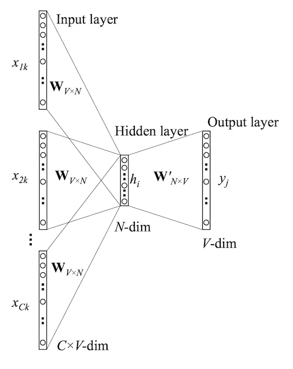
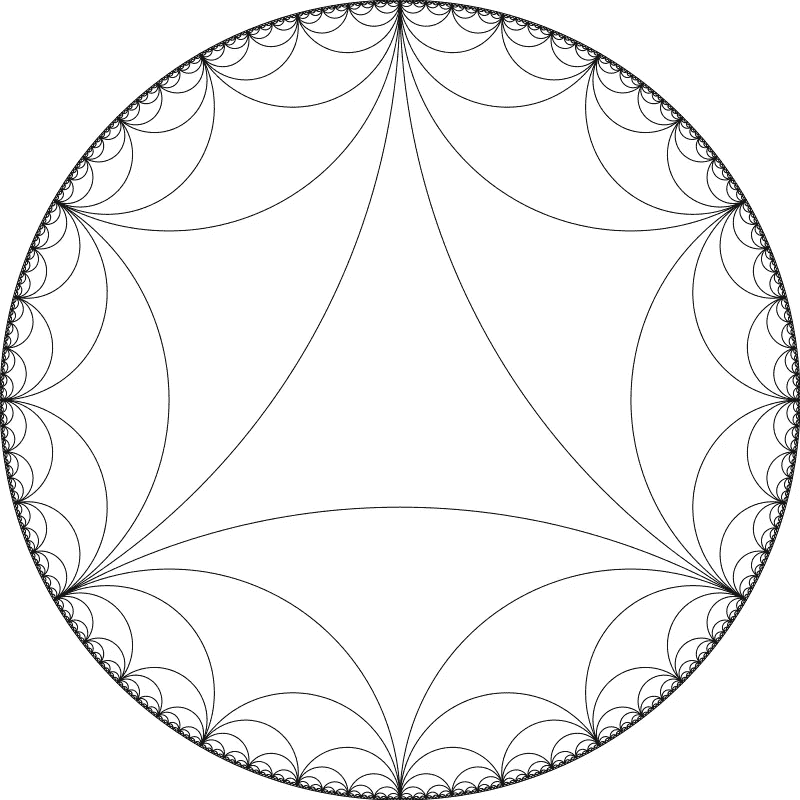

# 单词嵌入:探索、解释和利用(带 Python 代码)

> 原文：<https://towardsdatascience.com/word-embeddings-exploration-explanation-and-exploitation-with-code-in-python-5dac99d5d795?source=collection_archive---------0----------------------->


单词嵌入讨论是每个自然语言处理科学家谈论了很多很多年的话题，所以不要期望我告诉你一些引人注目的新东西或者“睁开你的眼睛”看看单词向量的世界。我在这里讲述一些关于单词嵌入的基本知识，并描述最常见的单词嵌入技术，附带公式解释和代码片段。

因此，正如每本流行的数据科学书籍或博客文章在介绍部分之后应该说的那样，让我们开始吧！

## 非正式定义

维基百科会指出，单词嵌入是

> 自然语言处理(NLP)中一组语言建模和特征学习技术的统称，其中词汇表中的单词或短语被映射到实数向量。

严格来说，这个定义是绝对正确的，但是如果阅读它的人从未接触过自然语言处理或机器学习技术，那么它就没有太多的洞察力。更非正式的说法是，我可以说单词嵌入是

> 向量，其在形态学方面反映单词的结构([用子单词信息丰富单词向量](https://arxiv.org/pdf/1607.04606.pdf) ) /单词上下文表示( [word2vec 参数学习解释](https://arxiv.org/pdf/1411.2738.pdf) ) /全局语料库统计([手套:单词表示的全局向量](https://nlp.stanford.edu/pubs/glove.pdf) ) /在 WordNet 术语方面的单词层级([用于学习层级表示的庞加莱嵌入](https://arxiv.org/pdf/1705.08039) ) /一组文档和它们包含的术语之间的关系([潜在语义索引](https://nlp.stanford.edu/IR-book/html/htmledition/latent-semantic-indexing-1.html) ) /等等。

所有单词嵌入背后的想法是用它们捕获尽可能多的语义/形态/上下文/层次等。信息，但是在实践中，对于特定的任务，一种方法肯定比另一种更好(例如，当在低维空间中工作以分析来自与已经被处理并放入术语-文档矩阵中的文档相同的域区域的输入文档时，LSA 是非常有效的)。为特定项目选择最佳嵌入的问题总是“尝试-失败法”的问题，因此了解为什么在特定情况下一个模型比另一个模型更好在实际工作中有足够的帮助。

事实上，用实数向量进行可靠的单词表示是我们试图达到的目标。听起来很容易，不是吗？

## 一键编码(计数矢量化)

将单词转换成向量的最基本和最简单的方法是统计每个单词在每个文档中的出现次数，不是吗？这种方法被称为计数矢量化或一键编码(取决于文献)。

这个想法是收集一组文档(它们可以是单词、句子、段落甚至文章)并统计其中每个单词的出现次数。严格来说，得到的矩阵的列是单词，行是文档。

附加的代码片段是基本的 sklearn 实现，完整的文档可以在[这里](http://scikit-learn.org/stable/modules/generated/sklearn.feature_extraction.text.CountVectorizer.html#sklearn.feature_extraction.text.CountVectorizer)找到。

```
**from** **sklearn.feature_extraction.text** **import** CountVectorizer
# create CountVectorizer object
vectorizer = CountVectorizer()corpus = [
          'Text of first document.',
          'Text of the second document made longer.',
          'Number three.',
          'This is number four.',
]
# learn the vocabulary and store CountVectorizer sparse matrix in X
X = vectorizer.fit_transform(corpus)# columns of X correspond to the result of this method
vectorizer.get_feature_names() == (
    ['document', 'first', 'four', 'is', 'longer',
     'made', 'number', 'of', 'second', 'text',
     'the', 'this', 'three'])# retrieving the matrix in the numpy form
X.toarray()# transforming a new document according to learn vocabulary
vectorizer.transform(['A new document.']).toarray()
```

例如，给定示例中的单词“第一”对应于向量 *[1，0，0，0]* ，它是矩阵 *X* 的第 2 列。有时这种方法的输出被称为‘稀疏矩阵’,只要 *X* 的大部分元素为零，并且以稀疏性为特征。

## TF-IDF 转型

这种方法背后的思想是通过利用被称为 *tf-idf* 的有用统计度量来进行术语加权。拥有大量文档，如“a”、“the”、“is”等。非常频繁地出现，但是它们没有携带很多信息。使用一键编码方法，我们看到这些词的向量不是那么稀疏，声称这些词很重要，如果在这么多的文档中，它们会携带很多信息。解决这个问题的方法之一是停用词过滤，但是这个解决方案是离散的，并且对于我们正在处理的领域区域不灵活。

停用词问题的一个本地解决方案是使用统计数量，如下所示:


它的第一部分是 *tf* ，意思是‘词频’。我们所说的简单意思是这个词在文档中出现的次数除以文档中的总字数:


第二部分是 *idf* ，代表“逆文档频率”，解释为文档的逆数量，其中出现了我们感兴趣的术语。我们也取这个分量的对数:


我们已经完成了公式，但是我们如何使用它呢？在我们之前检查的方法中，我们将 word 作为列 *j* 在文档中出现 *n* 次，作为行 *i* 。我们采用之前计算的相同 CountVectorizer 矩阵，并用本术语和本文档的 tf-idf 得分替换其中的每个单元格。

```
**from** **sklearn.feature_extraction.text** **import** TfidfTransformer# create tf-idf object
transformer = TfidfTransformer(smooth_idf=**False**)# X can be obtained as X.toarray() from the previous snippet
X = [[3, 0, 1],
     [5, 0, 0],
     [3, 0, 0],
     [1, 0, 0],
     [3, 2, 0],
     [3, 0, 4]]# learn the vocabulary and store tf-idf sparse matrix in tfidf
tfidf = transformer.fit_transform(counts)# retrieving matrix in numpy form as we did it before
tfidf.toarray() 
```

关于这个 sklearn 类的完整文档可以在[这里](http://scikit-learn.org/stable/modules/generated/sklearn.feature_extraction.text.TfidfTransformer.html#sklearn.feature_extraction.text.TfidfTransformer)找到，那里有许多有趣的参数可以使用。

## Word2Vec ( [word2vec 参数学习讲解](https://arxiv.org/pdf/1411.2738.pdf))

正如我要说的，有趣的事情开始了！Word2Vec 是第一个神经嵌入模型(或者至少是第一个，它在 2013 年获得了它的普及)，并且仍然是被大多数研究人员使用的模型。它的孩子 Doc2Vec 也是最流行的段落表示模型，灵感来自 Word2Vec。事实上，我们将在后面讨论的许多概念都是基于 Word2Vec 的先决条件，所以一定要对这种嵌入类型给予足够的重视。

有 3 种不同类型的 Word2Vec 参数学习，并且它们都基于神经网络模型，所以这一段将在假设您知道它是什么的情况下创建。

**一个单词的上下文** 其背后的直觉是，我们在每一个上下文中考虑一个单词(我们在给定一个单词的情况下预测一个单词)；这种方法通常被称为 CBOW 模型。我们的神经网络的架构是，我们有一个独热编码向量作为大小为 *V×1* 的输入，大小为 *V×N* 的输入→隐藏层权重矩阵 *W* ，大小为 *N×V* 的隐藏层→输出层权重矩阵*W’*，以及作为最终激活步骤的 softmax 函数。我们的目标是计算下面的概率分布，它是索引为 *I 的单词的向量表示:*


我们假设我们调用我们的输入向量 *x* ，其中全是 0，只有一个 1 在位置 *k* 。隐藏层 *h* 计算如下:


说到这个符号，我们可以认为 *h* 是单词 *x* 的“输入向量”。我们词汇中的每个单词都有输入和输出表示；形式上，权重矩阵 *W* 的行 *i* 是单词 *i* 的“输入”向量表示，因此我们使用冒号符号来避免误解。

作为神经网络的下一步，我们取向量 *h* 并进行以下计算:


我们的*v’*是索引为 *j* 的字 *w* 的输出向量，并且对于索引为 *j* 的每个条目 *u* 我们都执行这个乘法运算。

正如我们之前说过的，激活步骤是用标准 softmax 计算的(欢迎使用负采样或分层 softmax 技术):


该方法上的图表捕获了所描述的所有步骤。


**多词上下文**
这个模型与单词上下文没有任何区别，除了我们想要获得的概率分布类型和我们拥有的隐藏层类型。多词上下文的解释是这样的事实，即我们希望预测多项式分布，给定的不仅是一个上下文词，而是许多上下文词，以存储关于我们的目标词与语料库中其他词的关系的信息。

我们的概率分布现在是这样的:


为了获得它，我们将隐藏层函数改为:


这就是我们从 1 到 T5 到 T6 的上下文向量的平均值。成本函数现在采取以下形式:


该架构的所有其他组件都是相同的。



**Skip-gram 模型**
想象与 CBOW 多词模型相反的情况:我们希望预测输入中有一个目标词的 *c* 上下文词。然后，我们试图达到的目标发生了巨大的变化:


*-c* 和 *c* 是我们上下文窗口的限制，索引为 *t* 的单词是我们正在处理的语料库中的每个单词。

我们要做的第一步是获得隐藏层，这与前两种情况相同:


我们的输出层(未激活)计算如下:


在输出层，我们正在计算 c 多项式分布；每个输出面板共享来自隐藏层→输出层权重矩阵*W’*的相同权重。作为输出的激活，我们也使用 softmax，并根据 T21 面板稍微改变了符号，而不是像我们之前那样使用一个输出面板:


跳跃图计算中的图示复制了所有执行的阶段。


Word2Vec 模型的基本实现可以用 gensim 进行；完整文档在[这里](https://radimrehurek.com/gensim/models/word2vec.html)。

```
from gensim.models import word2veccorpus = [
          'Text of the first document.',
          'Text of the second document made longer.',
          'Number three.',
          'This is number four.',
]
# we need to pass splitted sentences to the model
tokenized_sentences = [sentence.split() for sentence in corpus]model = word2vec.Word2Vec(tokenized_sentences, min_count=1)
```

## GloVe ( [Glove:单词表示的全局向量](https://nlp.stanford.edu/pubs/glove.pdf))

全局单词表示法用于捕获嵌入整个观察语料库结构中的一个单词的意思；词频和共现计数是大多数无监督算法所基于的主要度量。GloVe 模型对单词的全局共现计数进行训练，并通过最小化最小二乘误差来充分利用统计，从而产生具有有意义的子结构的单词向量空间。这样的轮廓充分保留了单词与向量距离的相似性。

为了存储该信息，我们使用共现矩阵 *X* ，其每个条目对应于单词 *j* 在单词 *i* 的上下文中出现的次数。结果是:


是索引为 *j* 的单词出现在单词 *i* 的上下文中的概率。

同现概率的比率是开始单词嵌入学习的适当起点。我们首先将函数 *F* 定义为:


其依赖于具有索引 *i* 和 *j* 的 2 个单词向量以及具有索引 *k* 的独立上下文向量。f 编码信息，以比率表示；以矢量形式表示这种差异的最直观方式是用一个矢量减去另一个矢量:


在这个等式中，左边是矢量，右边是标量。为了避免这种情况，我们可以计算两项的乘积(乘积运算仍然允许我们获取我们需要的信息):


只要在单词-单词共现矩阵中，上下文单词和标准单词之间的区别是任意的，我们就可以用以下来代替概率比:


解这个方程:


如果我们假设 *F* 函数是 *exp()* ，那么解就变成了:


该等式不保持对称性，因此我们将其中两项纳入偏差:


现在，我们试图最小化的损失函数是经过一些修改的线性回归函数:


其中 *f* 为加权函数，手动定义。

GloVe 也是用 gensim 库实现的，它在标准语料库上训练的基本功能用下面的代码片段描述

```
import itertools
from gensim.models.word2vec import Text8Corpus
from glove import Corpus, Glove# sentences and corpus from standard library
sentences = list(itertools.islice(Text8Corpus('text8'),None))
corpus = Corpus()# fitting the corpus with sentences and creating Glove object
corpus.fit(sentences, window=10)
glove = Glove(no_components=100, learning_rate=0.05)# fitting to the corpus and adding standard dictionary to the object
glove.fit(corpus.matrix, epochs=30, no_threads=4, verbose=True)
glove.add_dictionary(corpus.dictionary)
```

## FastText ( [用子词信息丰富词向量](https://arxiv.org/pdf/1607.04606.pdf)

如果我们想考虑单词的形态学呢？要做到这一点，我们仍然可以使用跳格模型(记得我告诉过你，跳格基线在许多其他相关工作中使用)和负抽样目标。

让我们考虑给我们一个得分函数，它将(单词，上下文)对映射到实值得分。预测上下文单词的问题可以被视为一系列二元分类任务(预测上下文单词的存在或不存在)。对于位置为 *t* 的单词，我们将所有上下文单词视为正例，并从字典中随机抽取负例。

现在我们的负抽样目标是:


FastText 模型考虑单词的内部结构，将单词拆分成一个字符 n 元语法包，并添加一个完整的单词作为最终特征。如果我们将 n-gram 向量表示为 *z* 并且将 *v* 表示为单词 w(上下文单词)的输出向量表示:


我们可以选择任何大小的 n-grams，但实际上大小从 3 到 6 是最合适的。

所有关于脸书图书馆快速文本实现的文档和例子都可以在[这里](https://github.com/facebookresearch/fastText)找到。

## 庞加莱嵌入([用于学习分层表示的庞加莱嵌入](https://arxiv.org/pdf/1705.08039)

庞加莱嵌入是自然语言处理社区的最新趋势，基于这样一个事实，即我们正在使用双曲几何来捕捉我们无法在欧几里得空间中直接捕捉的单词的层次属性。我们需要使用这种几何图形和庞加莱球来捕捉这样一个事实，即从树根到树叶的距离随着每一个新生的孩子呈指数增长，而双曲几何能够表现这一特性。

**关于双曲几何的注记** 双曲几何研究的是常负曲率的非欧空间。它的两个主要定理是:

*   对于每一条直线 l 和不在 l 上的每一个点 P，至少有两条不同的平行线穿过 P。此外，从 l 到 P 有无限多的平行线；
*   所有三角形的角和小于 180 度。

对于二维双曲空间，我们看到面积 *s* 和长度 *l* 都以指数形式增长，公式如下:


双曲几何的设计方式是，我们可以使用我们创建的嵌入空间中的距离来反映单词的语义相似性。

我们感兴趣的双曲几何模型是庞加莱球模型，表述如下:


我们使用的范数是标准的欧几里德范数。庞加莱球模型可以被绘制成圆盘，其中直线由圆盘内包含的与圆盘边界正交的所有圆段加上圆盘的所有直径组成。



**庞加莱嵌入基线**
考虑我们的任务是对一棵树建模，这样我们在度量空间中进行建模，并且它的结构反映在嵌入中；我们知道，树中孩子的数量随着离根的距离成指数增长。

具有分支因子 *b* 的规则树可以在二维双曲几何中建模，使得根下面的节点 *l* 级位于半径为 *l = r* 的球体上，并且根下面少于 *l* 级的节点位于该球体内。双曲空间可以被认为是树的连续版本，而树可以被认为是离散的双曲空间。

我们在双曲空间中定义的两个嵌入之间的距离度量为:


这使我们不仅能够有效地捕捉嵌入之间的相似性(通过它们的距离),而且能够保留它们的层次结构(通过它们的规范),这是我们从 WordNet 分类法中获得的。

我们正在最小化关于θ的损失函数(来自庞加莱球的元素，它的范数应该不大于 1):


其中 *D* 是所有观察到的上下位关系的集合， *N(u)* 是 *u* 的反例集合。

**培训详情**

*   *从均匀分布中随机初始化所有嵌入；*
*   *学习 D 中所有符号的嵌入，使得相关对象在嵌入空间中接近。*

## 结论

我认为这篇文章是对单词嵌入的简短介绍，简要描述了最常见的自然语言处理技术、它们的特性和理论基础。关于每种方法的更多细节，每篇原始论文的链接附后；大部分的公式都指出来了，但是更多的关于记谱法的解释可以在同一个地方找到。

我还没有提到一些基本的单词嵌入矩阵分解方法，如潜在语义索引，也没有关注每种方法的实际应用，只要它们都取决于任务和给定的语料库；例如，GloVe 的创建者声称，他们的方法在 CoNNL 数据集上的命名实体识别任务中工作得很好，但这并不意味着它在来自不同领域区域的非结构化数据的情况下工作得最好。

还有，段落嵌入在这篇文章里没有被淡化，但这是另一个故事了……值得讲吗？