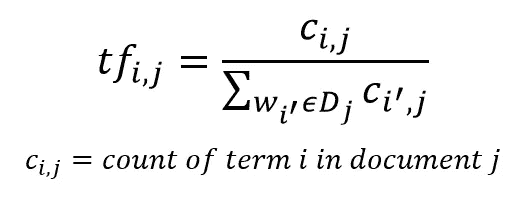
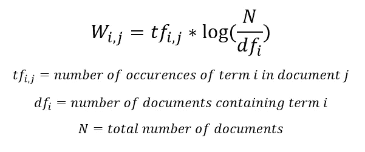
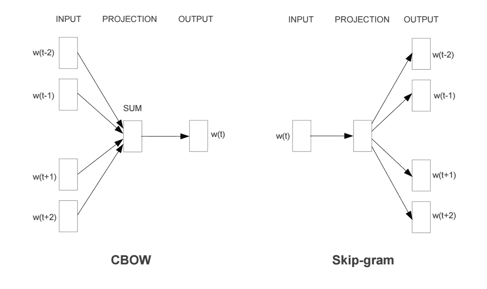
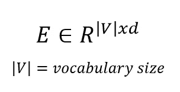
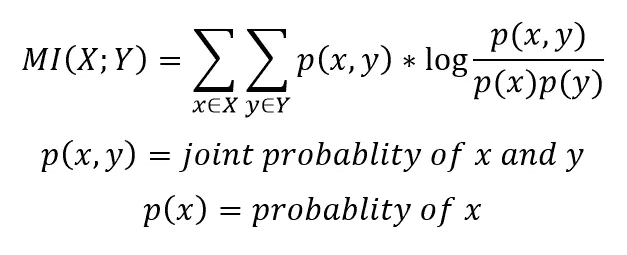
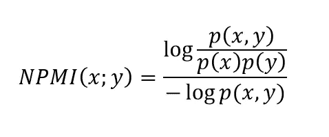

# Word2Vec For Phrases —学习多个单词的嵌入

> 原文：<https://towardsdatascience.com/word2vec-for-phrases-learning-embeddings-for-more-than-one-word-727b6cf723cf?source=collection_archive---------2----------------------->


Photo by [Alexandra](https://unsplash.com/@alex_tsl?utm_source=medium&utm_medium=referral) on [Unsplash](https://unsplash.com?utm_source=medium&utm_medium=referral)

# 如何使用 Word2Vec 在给定的无监督语料库中学习相似术语

说到语义，我们都知道并喜欢著名的 Word2Vec [1]算法，该算法在许多自然语言处理应用中通过分布式语义表示来创建单词嵌入，如 NER、语义分析、文本分类等等。

然而，Word2Vec 算法当前实现的局限性是其**单字自然行为**。在 Word2Vec 中，我们试图根据上下文预测给定的单词(CBOW)，或者根据给定的单词预测周围的上下文(Skip-Gram)。但是如果我们想把“美国航空公司”这个词作为一个整体嵌入进去呢？在这篇文章中，我将解释如何使用无监督的文本语料库为多个单词创建嵌入。如果你熟悉 Word2Vec 算法和单词嵌入，你可以跳过这篇文章的第一部分。

具体来说，我们将涵盖:

1.  自然语言处理任务中的词汇表征。
2.  分布假设[2]和 Word2Vec 算法。
3.  从无监督文本中学习短语。
4.  如何提取与给定短语相似的短语？

# 背景

我现在工作的公司，[舒适分析](https://www.amenityanalytics.com/)，正在开发文本分析产品，同时专注于金融领域。它帮助企业获得大规模的可操作的见解。最近，我们发布了一个基于弹性搜索的新搜索引擎，以帮助我们的客户获得更精确、更集中的数据视图。在搜索引擎中查看用户的查询后，我们注意到许多客户正在搜索金融术语，而天真地使用查询执行全文搜索是不够的。例如，在用户搜索中出现多次的一个术语是“拐点”。

在 [Investopedia](https://www.investopedia.com/) 中寻找“拐点”的定义:

“拐点是指导致公司、行业、部门、经济或地缘政治形势发生重大变化的事件，可被视为一个转折点，在此之后，预期会出现具有积极或消极结果的巨大变化”

我们的客户希望看到他们所关注的公司的重大事件，因此，我们需要搜索更多与“拐点”具有相同含义的术语，如“转折点”、“引爆点”等。

# 从离散符号到连续向量

**文字表述**

语言中最细粒度的对象是字符，它构成了单词或记号。单词(和字符)是离散的和象征性的。仅仅从单词本身，或者从组成单词的字符来看，是无法分辨出“拉布拉多”和“狗”之间有什么联系的。

**包话(鞠躬)**

自然语言处理任务中最常见的特征提取是词袋(BOW)方法。在词袋中，我们查看给定语料库中词出现的直方图，而不考虑顺序。通常，我们寻找的不仅仅是一个单词，还包括双字母(“我想要”)，三字母(“我想要”)，或者一般情况下的 n 字母。标准化每个单词的计数是一种常见的方法，因为文档的长度可能不同(在大多数情况下)。



Normalized BOW.

BOW 表示的一个主要缺点是它是离散的，不能捕捉单词之间的语义关系。

**词频—文档逆频(TF-IDF)**

BOW 表示法的一个结果是，它为多次出现的单词打分，但其中许多单词没有给出任何有意义的信息，如“to”和“from”。我们希望区分多次出现的单词和出现多次但给出特定文档信息的单词。对船首向量进行加权是一种常见的做法，最常用的加权方法之一是 TF-IDF (Manning 等人，2008)。



TF-IDF weighting formula. There are many variations for TF-IDF, one can read more about it [here](https://en.wikipedia.org/wiki/Tf%E2%80%93idf).

然而，BOW 和 TF-IDF 都不能捕获单词的语义，因为它们以离散的方式表示单词或 n 元语法。

# 从上下文中学习单词

## “告诉我你的朋友是谁，我就知道你是谁。”

**分布假说**认为出现在相同语境中的单词往往有相似的意思。这是文本语义分析的基础。这个假设背后的想法是，我们可以通过观察单词出现的上下文来学习单词的意思。人们可以很容易地看出“男孩喜欢在外面玩”这句话中的“play”和“The play was fantastic”这句话中的“play”有不同的意思。一般来说，离目标词近的词信息量更大，但在某些情况下，目标词和“远”的词在句子中有很长的依存关系。这些年来，已经开发了许多从上下文学习 word 的方法，其中包括著名的 Word2Vec，因为它在学术界和工业界都非常流行，所以本文将讨论它。

**Word2Vec**

分布假设是 Word2Vec 背后的主要思想。在 Word2Vec 中，我们有一个大型的无监督语料库，对于语料库中的每个单词，我们试图通过其给定的上下文(CBOW)来预测它，或者试图预测给定特定单词的上下文(Skip-Gram)。Word2Vec 是一个(浅层)神经网络，具有一个隐藏层(维度为 d)和负采样或分层 Softmax 的优化功能(可以阅读这篇[论文](https://arxiv.org/pdf/1310.4546)了解更多详细信息)。在训练阶段，我们遍历语料库中的标记(目标单词)并查看大小为 k 的窗口(目标单词的每一边有 k 个单词，值通常在 2-10 之间)。



Image [source](https://arxiv.org/pdf/1301.3781.pdf)

在训练结束时，我们将从网络中获得以下嵌入矩阵:



Emdedding matrix after Word2Vec training

现在，每个单词将不会用一个离散的、稀疏的向量来表示，而是用一个 d 维的连续向量来表示，每个单词的含义将通过它与其他单词的关系来捕捉[5]。这背后的原因是，在训练时间，如果两个目标词共享某个上下文，直观上这两个目标词的网络权重将彼此接近，从而它们的匹配向量也接近。因此，与基于计数的方法(如 BOW 和 TF-IDF)相比，我们获得了语料库中每个词的分布表示。由于分布行为，向量中的特定维度不会给出任何有价值的信息，但是将(分布)向量作为一个整体来看，可以执行许多相似性任务。比如我们得到 V(“国王”)-V(“男人”)+V(“女人”)~= V(“女王”)、V(“巴黎”)-V(“法国”)+V(“西班牙”)~= V(“马德里”)。此外，我们可以在向量之间执行相似性度量，如余弦相似性，并得到单词“总统”的向量将接近“奥巴马”、“特朗普”、“首席执行官”、“主席”等。

如上所述，我们可以使用 Word2Vec 对单词执行许多相似性任务。但是，正如我们上面提到的，我们想对不止一个单词做同样的事情。

# 从无监督文本中学习短语(搭配提取)

我们可以很容易地用无监督语料库创建二元模型，并将其作为 Word2Vec 的输入。例如，句子“我今天步行去公园”将被转换为“我今天步行去公园”,并且在 Word2Vec 训练短语中，每个双词将被视为单词。这是可行的，但是这种方法存在一些问题:

1.  它将只学习二元模型的嵌入**和**，而这个二元模型中的许多并不真正有意义(例如，“walked_today”)，我们将错过单元模型的嵌入，如“walked”和“today”。
2.  只处理二元语法会创建一个非常稀疏的语料库。想想上面的句子“我今天去了公园”。假设目标词是“walked_today”，这个词在语料库中不是很常见，我们没有很多上下文示例来学习这个词的代表性向量。

那么，我们如何克服这个问题呢？如果单词的互信息足够强，我们如何只提取有意义的术语，同时保持单词是一元的？一如既往，答案就在问题里面— **互信息**。

**互信息**

两个随机变量 X 和 Y 之间的互信息是 X 和 Y 之间相关性的度量。形式上:



Mutual Information (MI) of random variables X and Y.

在我们的例子中，X 和 Y 表示语料库中的所有二元语法，因此 Y 紧跟在 X 之后。

**点态互信息**

PMI 是对 y 的 x 的具体事件之间的相关性的度量。例如:x =已走，y =今天。形式上:


PMI of concrete occurrences of x and y.

很容易看出，当两个词 x 和 y 一起出现很多次，但不是单独出现时，PMI(x；y)将具有高值，而如果 x 和 y 完全独立，则它将具有 0 值。

**归一化逐点互信息(NPMI)**

虽然 PMI 是对 x 和 y 出现的相关性的度量，但我们没有其值的上限[3]。我们需要一个可以在所有二元模型之间进行比较的度量，因此我们可以只选择高于某个阈值的二元模型。我们希望 PMI 度量在完全相关的单词 x 和 y 上具有最大值 1。形式上:



Normalized Pointwise Mutual Information of x and y.

**数据驱动的方法**

从文本中提取短语的另一种方法是使用下一个公式[4],该公式考虑了单字和双字的计数以及用于防止创建过于罕见的单词的双字的折扣系数。形式上:


Read this [article](https://arxiv.org/pdf/1310.4546.pdf) for more details.

# 提取相似的短语

既然我们有办法从大型无监督语料库中提取有意义的二元语法，我们可以用高于某个阈值的 NPMI 将二元语法替换为一个元语法，例如:“拐点”将被转换为“拐点”。通过将转换后的语料库与二元语法一起使用，并再次运行形成三元语法的过程(使用较低的阈值),可以很容易地创建三元语法。类似地，我们可以用递减的阈值对 n 元文法继续这个过程。

我们的语料库由大约 6000 万个句子组成，总共包含 16 亿个单词。使用数据驱动的方法，我们花了 1 个小时构建二元模型。阈值为 7 且最小术语数为 5 时获得最佳结果。

我们使用评估集来衡量结果，该评估集包含我们想要识别的重要二元模型，如财务术语、人名(主要是 CEO 和 CFO)、城市、国家等。我们使用的度量是一个简单的回忆:从我们提取的二元模型中，评估测试的覆盖率是多少。在这个特定的任务中，我们更关心回忆而不是精度，所以我们允许自己在提取二元模型时使用相对较小的阈值。我们确实考虑到，当降低阈值时，我们的精度可能会变得更差，反过来，我们可能会提取不太有价值的二元模型，但这比在执行查询扩展任务时丢失重要的二元模型要好。

**示例代码**

以一种记忆高效的方法逐行阅读语料库(我们假设每行包含一个句子):

```
def get_sentences(input_file_pointer):
    while True:
        line = input_file_pointer.readline()
        if not line:
            break

        yield line
```

通过修剪前导空格和尾随空格、小写字母、删除标点符号、删除不必要的字符并将重复的空格减少为一个空格来清理句子(请注意，这并不是真正必要的，因为我们稍后将通过空格字符来标记我们的句子):

```
import redef clean_sentence(sentence):
    sentence = sentence.lower().strip()
    sentence = re.sub(r’[^a-z0-9\s]’, '’, sentence)
    return re.sub(r’\s{2,}’, ' ', sentence)
```

用一个简单的空格定界符来标记每一行(有更高级的标记化技术，但是用一个简单的空格来标记给我们很好的结果，并且在实践中效果很好)，并删除停用词。去除停用词是任务相关的，在一些 NLP 任务中，保留停用词会产生更好的结果。人们应该评估这两种方法。对于这个任务，我们使用了 Spacy 的停用词集。

```
from spacy.lang.en.stop_words import STOP_WORDSdef tokenize(sentence):
    return [token for token in sentence.split() if token not in STOP_WORDS]
```

现在，我们已经用一个二维矩阵表示了我们的句子，我们可以构建二元模型了。我们将使用真正推荐用于 NLP 语义任务的 [Gensim](https://radimrehurek.com/gensim/) 库。幸运的是，Genim 有一个短语提取的实现，既有 NPMI，也有上面 Mikolov 等人的数据驱动方法。人们可以很容易地控制超参数，如确定最小术语数、阈值和得分(数据驱动方法的“默认”和 NPMI 的“npmi”)。请注意，这两种方法的值是不同的，需要考虑到这一点。

```
from gensim.models.phrases import Phrases, Phraserdef build_phrases(sentences):
    phrases = Phrases(sentences,
                      min_count=5,
                      threshold=7,
                      progress_per=1000)
    return Phraser(phrases)
```

构建完短语模型后，我们可以轻松地保存它并在以后加载它:

```
phrases_model.save('phrases_model.txt')phrases_model= Phraser.load('phrases_model.txt')
```

现在我们有了一个短语模型，我们可以用它来提取给定句子的二元语法:

```
def sentence_to_bi_grams(phrases_model, sentence):
    return ' '.join(phrases_model[sentence])
```

我们希望基于我们的语料库创建一个新的语料库，将有意义的二元语法连接在一起供以后使用:

```
def sentences_to_bi_grams(n_grams, input_file_name, output_file_name):
    with open(input_file_name, 'r') as input_file_pointer:
        with open(output_file_name, 'w+') as out_file:
            for sentence in get_sentences(input_file_pointer):
                cleaned_sentence = clean_sentence(sentence)
                tokenized_sentence = tokenize(cleaned_sentence)
                parsed_sentence = sentence_to_bi_grams(n_grams, tokenized_sentence)
                out_file.write(parsed_sentence + '\n')
```

# **学习相似的短语**

在上述短语之后，我们的语料库包含短语，我们可以使用它作为 Word2Vec 训练的输入(可能需要更改超参数)，与之前一样。训练短语会将“拐点”视为一个单词，并将学习一个分布式 d 维向量，该向量将接近于“临界点”或“拐点”等术语的向量，这是我们的目标！

在我们的 16 亿单词语料库上，我们花了 1 个小时来构建二元模型，又花了 2 个小时在使用 AWS Sagemaker 服务的具有 16 个 CPU 和 64 个 ram 的机器上训练 Word2Vec(具有批处理 Skip-Gram、300 个维度、10 个时期、k=5 的上下文、5 的负采样、0.01 的学习率和 5 的最小单词计数)。关于如何使用 AWS Sagemaker 服务来训练 Word2Vec 的一个很好的笔记本例子可以在[这里](https://github.com/awslabs/amazon-sagemaker-examples/blob/master/introduction_to_amazon_algorithms/blazingtext_word2vec_text8/blazingtext_word2vec_text8.ipynb)找到。

人们也可以使用 Gensim 库来训练 Word2Vec 模型，例如这里的。

例如，当给出术语“拐点”时，我们得到以下相关术语，按照它们来自它们表示的向量和“拐点”向量的余弦相似性分数排序:

```
"terms": [
        {
          "term": "inflection",
          "score": 0.741
        },
        {
          "term": "tipping_point",
          "score": 0.667
        },
        {
          "term": "inflexion_point",
          "score": 0.637
        },
        {
          "term": "hit_inflection",
          "score": 0.624
        },
        {
          "term": "inflection_points",
          "score": 0.606
        },
        {
          "term": "reached_inflection",
          "score": 0.583
        },
        {
          "term": "cusp",
          "score": 0.567
        },
        {
          "term": "reaching_inflection",
          "score": 0.546
        },
        {
          "term": "reached_tipping",
          "score": 0.518
        },
        {
          "term": "hitting_inflection",
          "score": 0.501
        }
      ]
```

我们的一些客户希望看到黑色星期五对公司销售的影响，所以当给出术语“黑色星期五”时，我们得到:

```
"terms": [
        {
          "term": "cyber_monday",
          "score": 0.815
        },
        {
          "term": "thanksgiving_weekend",
          "score": 0.679
        },
        {
          "term": "holiday_season",
          "score": 0.645
        },
        {
          "term": "thanksgiving_holiday",
          "score": 0.643
        },
        {
          "term": "valentine_day",
          "score": 0.628
        },
        {
          "term": "mother_day",
          "score": 0.628
        },
        {
          "term": "christmas",
          "score": 0.627
        },
        {
          "term": "shopping_cyber",
          "score": 0.612
        },
        {
          "term": "holiday_shopping",
          "score": 0.608
        },
        {
          "term": "holiday",
          "score": 0.605
        }
      ]
```

很酷，不是吗？

# 结论

在这篇文章中，我们介绍了 NLP 任务中单词表示的不同方法(BOW、TF-IDF 和单词嵌入)，学习了如何使用 Word2Vec 从上下文中学习单词表示，了解了如何从给定的语料库中提取有意义的短语(NPMI 和数据驱动方法)，以及如何转换给定的语料库，以便使用 Word2Vec 算法为每个提取的术语/单词学习相似的术语/单词。这个过程的结果可以用于下游任务，如信息提取任务中的查询扩展、文档分类、聚类、问答等等。

感谢阅读！

# 参考

[1] Mikolov，t .，Chen，k .，Corrado，G.S .，& Dean，J. (2013 年)。向量空间中单词表示的有效估计。 *CoRR，abs/1301.3781* 。

[2]哈里斯，Z. (1954 年)。分配结构。 *Word* ，10(23):146–162。

[3]布马，G. (2009 年)。搭配抽取中的归一化(逐点)互信息。

[4]t . miko lov，Sutskever，I .，Chen，k .，Corrado，G.S .，& Dean，J. (2013 年)。词和短语的分布式表示及其组合性。*辊隙*。

[5]戈德堡、赫斯特、刘、张(2017)。自然语言处理的神经网络方法。*计算语言学，44* ，193–195。