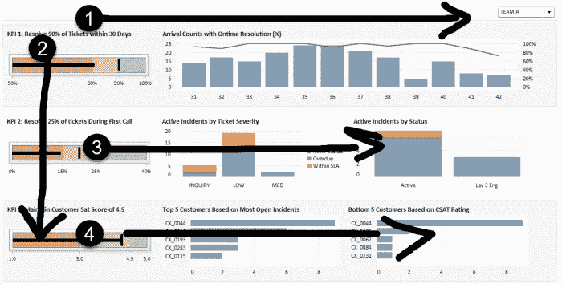

# 处理您的仪表板布局？

> 原文：<https://towardsdatascience.com/working-on-your-dashboard-layout-9b7c38d7b61e?source=collection_archive---------2----------------------->

Photo by [Dawid Małecki](https://unsplash.com/@djmalecki?utm_source=medium&utm_medium=referral) on [Unsplash](https://unsplash.com?utm_source=medium&utm_medium=referral)

## 以下是让你开始的五个建议

也许创建仪表板的最大障碍是布局。它必须是有用信息和吸引力的正确结合。大多数仪表板都显示在网页上。因此，在创建仪表板时使用网页设计原则是有意义的。

# 提示 1:你的大脑将物体理解为群体

很多设计师在讨论布局时都会参考[格式塔原则。20 世纪 20 年代，德国心理学家描述了人类如何组织视觉信息。这些发现被称为格式塔原理。](http://sixrevisions.com/web_design/gestalt-principles-applied-in-design)

这些原则讨论了大脑如何试图理解一组对象——例如页面上的图表。注意下图；你的眼睛受过训练。即使你看到了物体，你的大脑会添加一些额外的信息，你也会看到另一个形状。

当您违反这些原则时，您的用户会感到困惑，不想与您的仪表板交互。设计布局时，考虑用户将如何看到数据对象一起工作。

或许大小和接近度相似的条形图会被视为一个对象，或者被认为是关于同一主题的。

# 提示 2: F 模式布局支持您的扫描用户

当你看一个网页时，你的眼睛倾向于以一种特定的模式来浏览它。[你浏览页面，向下浏览页面，然后在某个时候再次浏览页面。](http://webdesign.tutsplus.com/articles/understanding-the-f-layout-in-web-design--webdesign-687)这是一个 F 或 e 的模型。这是一个有趣的科学发现，但这和你的仪表板有什么关系呢？

您可以利用这种模式来提高仪表板的可用性。设计用户期望找到东西的布局。在下面的排列中，控件被放置在页面的顶部，在页面的中央，有更多的控件。是 E 型还是 F 型，对吧？

注意，除了告诉你模式之外，我还使用了单词*扫描*。当用户第一次访问您的仪表板时，他们很可能不会先阅读所有文本。他们将浏览以了解哪些内容可以搭配在一起，并学习使用仪表板的最快方式。

# 技巧 3:考虑工具内的交互性

如果数据可视化工具是交互式的(如 [SAS Visual Analytics](http://www.sas.com) )，或者您打算添加编程来帮助实现交互性，那么请确定如何使用它。用户将如何识别路径或了解更多可用信息。在某些情况下，这是显而易见。页面上可能有下拉列表、按钮或滑块等控件。用户理解这些对象控制其他对象。请仔细考虑这些项目在页面上的位置。

在以下示例中，趋势图表控制其下方的图表。对于趋势图上的每一点，用户都可以点击查看当月的销售额。用户还可以按地区或产品区域进行探索。

想象一下，如果设计中用条形图来控制一切，将会很难使用。很可能如果有人点击了这个栏，它周围的一切都变了，这就没有意义了。

# 提示 4:我们用传统的方法设计版面——铅笔和纸

你可能有很多布局思路。开始在纸上勾画你的想法。强迫自己想出三种或三种以上的布局。最后，你可能最喜欢你的第一个设计，但是你会从每次迭代中学习。

> 你很想跳过这一步，但是不要这样做。

这一步迫使你思考测量方法和你想要传达的内容。

这是整理 KPI 和其他指标的时候了。您希望将数据放入逻辑分组和支持这些分组的度量中。

这是应用你的格式塔原则的机会！这也是思考每个指标试图表达什么的时候了。趋势图效果更好还是树形图对用户帮助更大？在纸上尝试一下。

# 技巧 5:线框帮助你从用户的角度看问题

画完草图后，你可以使用像 MS Visio 这样的工具来绘制线框。线框有助于你的客户(或老板)理解你计划如何展示所有的信息。使用箭头来显示你希望用户如何在各部分之间移动，以及交互的位置。在这个阶段，更容易解决无效的设计，并从最终用户那里获得反馈。

这是一个确定了信息路径的仪表板布局示例。请注意，我的主仪表板会引导用户了解更多信息。对于 KPI 1，重点是产品。高级经理可能只对第 1 页感兴趣，但直线经理可能需要更多信息来了解是什么导致了这种趋势。

该布局帮助用户理解仪表板的显著之处。它通过使用适当的设计技术和深思熟虑的途径来支持数据。

# 你的外卖

一个功能完善的设计好的仪表盘不是偶然！这是精心规划和遵守适当的网页设计技术的结果。