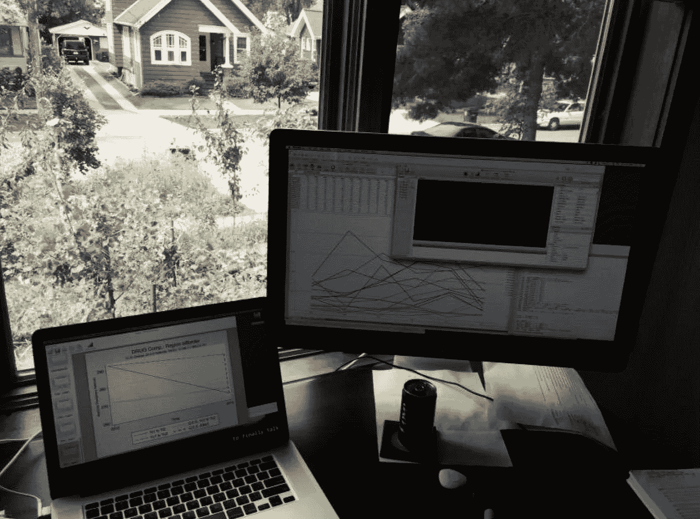

# 工作远程备忘单

> 原文：<https://towardsdatascience.com/working-remote-cheat-sheet-868dd536fe4f?source=collection_archive---------18----------------------->

## 最近有人问我，您如何确保在远程工作时保持高效工作？这个小抄是我想出来的。

Image Credit: “Author’s Photo” — [More on attributions](https://adamrossnelson.medium.com/image-credit-attributions-a24efcc730ad).

远程工作是一件喜忧参半的事情。我不是来讨论它的利弊的。我在这里分发一份有用的小抄。

随着时间的推移，我远程工作的使用案例发生了变化和发展。简而言之，我曾以兼职教授、研究员、数据科学家和独立顾问的身份远程工作。在这篇文章的最后，我进一步阐述了我的用例。

关于语义学的一个注释。

有时远程工作被称为“在家工作”或行话“wfh”在我看来，wfh 是一个误称。远程工作、远程工作或外出工作是我的首选。外出工作是我的最爱。外出工作是最简单也是最具包容性的说法。不是每个远程工作的人都在家工作。

这种区别很重要。我观察到一个大型组织的一个分支机构实施了一个“在家工作”的策略。其他分支机构抱怨说“在家工作”的政策并不是人人都能平等享受的。与此同时，同一组织中的另一个分支机构实施了“离开工作”策略。这两项政策实质上是一样的。在高层管理人员的压力下，他们觉得“在家工作”政策并不顺利，“外出工作”政策保留了下来，而“在家工作”政策结束了。

**关于职业精神的一个注解。**

从许多角度来看，在办公室环境中，在外工作对员工的要求比在同一家公司工作的同一名员工可能需要的更多。我发现外出工作需要更多的专业精神，更多的交流，更多的奉献，更多的动力，更多的技能，更多的更多。

**警告。**

外出工作并不能保证提高生产率或员工满意度。生产力和员工满意度最深层的核心驱动力不是工作场所。工作场所很重要，但其他因素更重要。生产率和员工满意度最深层的核心驱动因素是专业精神、沟通、奉献、激励或技能。

也就是说，如果没有相应的专业精神、沟通、奉献、动力和技能，从办公室环境转换到远程环境不会提高生产力或工作满意度。

如果你确实在外地工作，以下策略让我能够利用我的专业精神、沟通、奉献、动力和技能。

**设定目标。**

我经常设定高而远大的目标。高目标让我保持动力。我写下我的目标。我与家人、朋友、主管和其他同事分享我的目标。我定期回顾目标。如果你需要帮助来写你的目标(专业建议:在网上搜索“智能目标”)。

当我足够幸运地赢得了他人的信任，让他们与我分享他们的目标时，我会查看他们做得如何。当别人为我做同样的事情时，我会很感激。

提前计划一周。

在每周的开始。对我来说，一周的开始是星期天。我花时间(有时一个小时或更多)来计划我的一周。计划我的一周包括列清单，回顾我的日历，调整日历，决定我可以把什么东西搬到车上，这样当我需要它的时候它就在那里。我也打包我的运动包，计划我的饮食。

这一评估确保我在两次承诺之间有足够的旅行时间。这个过程有助于我确保自己不会过度投入——我有时间工作。

提前计划有助于我更有策略。例如，我可能会决定周二上午在市中心的共享办公空间工作是有意义的，因为我和邻居有两个会议。

另一个例子可能是，我在星期四有一个会议，就在城市的另一端。在周日看到这一点有助于我决定是否可以将会议转移到一个更方便的地点。或者我能不能把会议推迟一天。

周日每一分钟的计划时间，我都认为我在一周中节省了 5-10 分钟。

**共享您的日历。**

与您信任的人以及依赖您的人共享您的日历。因为你没有与同事共享的工作空间，他们无法亲自看到你进出办公室。共享您的日历可以建立信任。

共享您的日历也有助于那些依赖您的人在需要时找到您。我让那些依赖或依赖我的人直接编辑我的日历。节省我们双方的时间，不必协调会议时间。

**把你的日历当成日记。**

在一天结束的时候，或者一周结束的时候，我会调整我的日历，这样它就能准确地反映出我做了什么。如果一个会议被取消或推迟，我会用显示“取消”或“推迟”的注释编辑它的标题这样我就有了我应该如何度过时间的记录。在它旁边，我将添加一个事件，描述我实际上是如何度过时间的。

在你的日历上记日记再次建立信任并促进透明度。当你需要记录你的工作时,《华尔街日报》会帮你的。

保存实验书籍。

我是科学家。实验室书籍是科学家最好的朋友(对许多科学家来说，实验室书籍是可怕的伙伴)。我把实验书变成了我的朋友。实验书实际上就是你用来记笔记的笔记本。

我用纸质实验书。最近，我用速记本。斯特诺的书很小，很容易写。我为每个重大项目都做了速记本。我在每一页的顶部都注明了日期，这样我就可以回头看笔记，并很容易地与我的日志日历相互参照。

做实验记录有助于你记住你做了什么，怎么做的，为什么做。每当我缺少灵感或动力的时候，我都会回头看看我的实验书。毫无疑问，回顾我的实验书是刷新和更新我的任务清单的最好方法之一。

如果我对下一步缺少想法，实验书会拯救我。

灵感来临时抓住它。

如果是凌晨 3 点，工作的灵感来了，我会起床，走到电脑前，或笔记本前，把想法写下来。我在半夜一次写了好几页。我写了几百行代码。相反，我在半夜重构了数百行代码。

灵感是珍贵的，抓住它。同样，如果我下午 1 点下班回来，灵感不在，我会去散步，重温我的笔记本，或者读一本与我当前项目相关的书。换句话说，我不强求。

**打造专属工作空间。**

这个建议在关于外出工作的文章中很常见。对我来说，我的建议与许多人认为的外出工作的最大好处(你可以在你喜欢的地方工作)背道而驰。我放弃了在我喜欢的任何地方工作的选择，而选择了一个我可以完成大部分工作的专用工作空间。

对我来说，我的专用工作区必须具备的决定性特征(工具)是一个大白板。如果我可以的话，每一面墙都将是一块巨大的白板。

白板是记笔记、画图表、发展想法、列清单等的地方。这对我很有效，因为我是一个视觉学习者。把我的想法写在白板上让我可以看到这些想法。当我能在一个无界、无限制的空间里看到想法时，我能更清晰地思考。

因此，留出一个专用的工作空间(有一两个你最常用的权威工具)是有益的策略，可以改善你的工作体验。对一些人来说，专用工作空间可以是一个背包。

**花时间在新的地方工作。**

我建议花时间在新的地方工作。对我来说，我知道我需要一个专用的工作空间。然而，我也受益于探索和寻找新的工作场所。有时那会是一家咖啡店。其他时候，这将是一个共同的工作空间。一些联合工作区是免费使用的(某些条件适用)。

保持专用工作区的整洁。

经常清洁专用工作区。确保文件存档(或扫描并保存在云中)。保持该工作区的表面可见。如果有成堆的纸张、书籍或其他物品，把它们收起来。我发现当工作场所整洁有序时，开始工作会更容易。

**把自己的手机分享给大家。**

正如我让我的日历对我信任的人和依赖我的人开放一样，我几乎和所有人分享我的手机。当我教书的时候，我把它放在我的教学大纲上。几乎没有人再给我打电话了。但是，拥有我的手机号码可以帮助其他人感受到联系。

通过视频向他人展示自己。

随着电话使用的减少，视频聊天服务的可用性和使用激发了远程通信的复兴。我使用平板电脑、旧手机或备用笔记本电脑来保持一条开放的视频线路，这样可信任的同事可以随时拨打。就好像他们可以在我的办公桌前停下来一样。

**自动回复器的广泛使用。**

我在电子邮件中大量使用自动回复功能。这有助于其他人知道我在哪里，我在做什么。例如，可能一天就要结束了，现在是晚上 7 点左右。我会在邮件里放一封自动回复邮件，解释:

“嗨，谢谢你的邮件。今天晚上 7 点我离开了我的工作场所。我不在的时候会留意邮件的。如果你现在需要我，请打我的手机(608–555–5555)。否则，我会在明天早上 6 点回到办公室后尽快回复。”

**休息一下。**

为了避免一直工作…总会有工作的。当你的专用工作空间离你只有几步之遥时，你很容易告诉自己“我会再发一封邮件。”或者，“我会让自己在这个清单上再做两件事。”

为了确保休息，我离开家去吃午饭。午餐时使用健身房。下午三点左右绕着街区散散步。

**关于我的用例的更多信息。**

我一直在努力扮演多种角色。这意味着我有多个用例。

教学是我最常使用的案例之一。对于多个 semseters，我教过大学生。有时候这些课程是基于教室的，其他的是在线的。教书的时候，我在外面工作，而不是在学校提供给我的办公室里工作。虽然我的专用工作空间在家里，但我逃离家的地方通常是图书馆。

我还在一个涉及进行研究和拓展的岗位上工作。我大约一半的工作是处理数据。我工作的另一半是计划和发表演讲或进行培训。对于这个双重/分离用例，我的雇主提供了一间办公室，但是我主要在办公室之外工作(在图书馆、家里、咖啡店、会议酒店等。).

在研究生院，我创建并经营了一家精品咨询公司(现已关闭)。在这些用例中，我使用了上述大部分策略。

这些策略对我很有用，我希望其他人也会觉得有用。

 [## 加入我的介绍链接媒体-亚当罗斯纳尔逊

### 作为一个媒体会员，你的会员费的一部分会给你阅读的作家，你可以完全接触到每一个故事…

adamrossnelson.medium.com](https://adamrossnelson.medium.com/membership) 

# 感谢阅读

把你的想法和主意发给我。你可以写信只是为了说声嗨。如果你真的需要告诉我是怎么错的，我期待着尽快和你聊天。推特:[@ adamrossnelson](https://twitter.com/adamrossnelson)LinkedIn:[亚当·罗斯·尼尔森在推特](https://www.linkedin.com/in/arnelson)和脸书:[亚当·罗斯·尼尔森在脸书](https://www.facebook.com/adamrossnelson)。

为清晰起见，2020 年 11 月进行了适度的编辑更新。