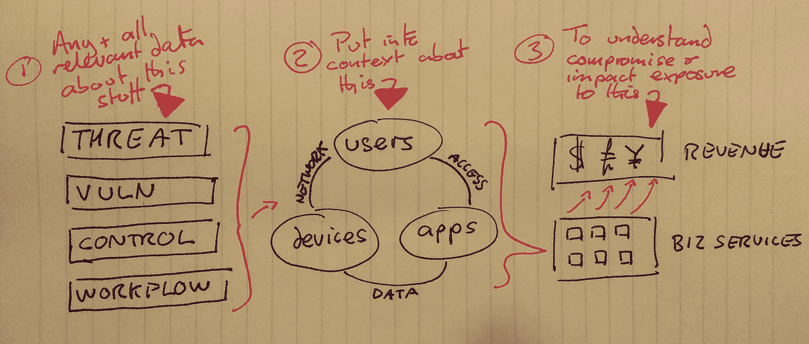

# #网络安全 WTF 是敏捷风险分析？

> 原文：<https://towardsdatascience.com/wtf-is-agile-risk-analytics-65acc1a08a73?source=collection_archive---------12----------------------->

注意:“风险”这个词有很多解释。因此，为了清楚起见，我们在这里将“风险”定义为以下两种情况之一:a)暴露于可信的威胁参与者对企业非常关心的东西的危害；或 b)已确认的危害，使业务面临不可接受的影响。]

**TL；DR —** ARA(我们将简称为 ARA)是**从各种各样且不断扩大的安全相关数据源中获得越来越有意义且及时的风险洞察的能力。**

在“运营/流程术语”中，这意味着能够:

*   轻松快速地接收、建模、探索、丰富和关联企业规模的数据集
*   将您的分析建立在支持关键业务服务和创收的运营“实体”(如用户、计算机、应用程序)的环境中
*   将结果放在业务和 IT 流程的背景下，(如果您想识别那些只有在分析长期趋势时才会出现的讨厌的系统问题，请比较“现在”和“时间的开始”)
*   “雷达扫描”风险(在 [Panaseer](https://www.panaseer.com) 我们称之为“风险搜寻”)，通过使用任何分析技术以任何频率对任何数据进行数字处理
*   根据网络安全 100 个移动部分的数据，不断地(或根据你的需要频繁地)重新安排活动的优先级

他们说一幅画描绘了 1000 个单词(…虽然这幅画主要是单词，所以我不确定它是否有资格作为一幅画…)

在“实际示例术语”中，这意味着:

> **“我想把我们的#n 千个客户，我们的#n 千个设备，我们的谁知道有多少#n 个用户/开发人员，等等等等。我想获取收入和关键业务服务所依赖的所有实体的数据；我想对所有这些进行参照完整性检查；数据库、流源、来自业务和 IT 工作流程的数字废气；来自安全控制的数据；我们所有的日志。**
> 
> **无论我选择什么频率，我都想处理这些数据以了解:** -我的环境中有什么？有什么新的，它连接到什么，它合法吗？
> -我的环境是否得到了预期的管理？
> -流程是被遵循还是被颠覆？
> -是否存在需要弥合的技术或流程方面的控制差距？
> -工作流程和控制是否一切正常，但有些东西我只能在日志中检测到，我需要我的 SOC 的狙击手瞄准镜在上面划区域？
> -相对于需要立即提升到董事会级别的内容，我可以在日志中忽略哪些我不关心的内容？
> 
> **然后，我想把所有这些总结成一个观点，告诉我的 CISO 和他整天开会的人，“这是我们本周、本月或今天*转移资源的地方，以便最大限度地保护对我们的业务最重要的东西。”***
> 
> ***有了这些，我希望对数据的完整性、准确性和一致性有信心，以便能够自动化背后的工作流程。***
> 
> ***然后，在任何时候，我都希望引入另一个数据源，重新运行我的所有问题，以获得 50，000 英尺地面的更好分辨率，或者放大地面上行驶在特定街道上的汽车的牌照。***
> 
> *哦，我希望这一切能在几小时或几分钟内完成，而不是几个月或几周，或者根本不可能。*
> 
> ***-纽约某投资银行的信息安全智能分析主管***

*[@Panaseer_Team](https://twitter.com/panaseer_team) 将于 9 月 25-28 日在纽约的[地层](https://conferences.oreilly.com/strata/strata-ny)；如果你在那里，来和我们谈谈我们与英国和美国的 CISO 团队在这方面所做的工作。如果你不打算一起去，你可以随时[在这里联系我们](https://www.panaseer.com/#contact-us-section)。*