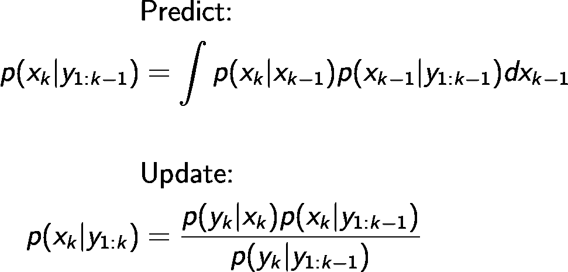
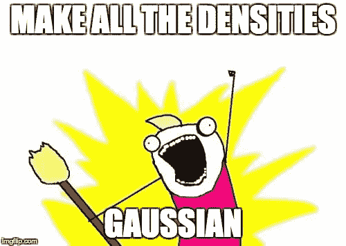
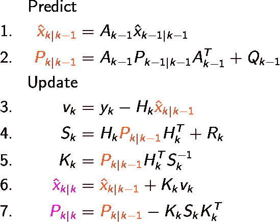
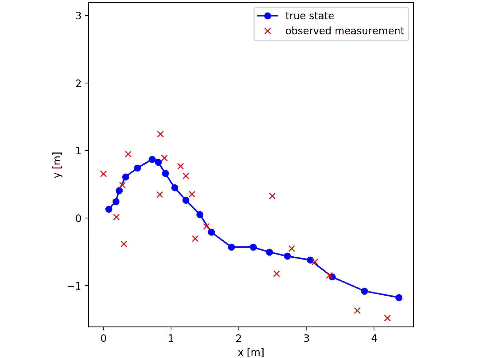

# WTF 是传感器融合？优秀的老式卡尔曼滤波器

> 原文：<https://towardsdatascience.com/wtf-is-sensor-fusion-part-2-the-good-old-kalman-filter-3642f321440?source=collection_archive---------0----------------------->


在本系列的前一篇文章中，我谈到了基本上用于所有传感器融合算法的两个方程:**预测**和**更新**方程。然而，我并没有展示任何实用的算法，使方程分析容易处理。因此，在这篇文章中，我将解释可能是最著名和最广为人知的算法——卡尔曼滤波器。

尽管它在很多方面是一个简单的算法，但仍然需要一些时间来建立对它实际工作方式的直觉。良好的直觉很重要，因为正确调整卡尔曼滤波器有时并不容易。

## 等等，这两个方程现在在哪里？

让我们快速总结一下传感器融合是怎么回事，包括**预测**和**更新**等式。为了做到这一点，我们将重温在本系列第 1 部分中首次出现的飞机示例[。如果你感到迷茫，我强烈建议你通读一遍。](https://medium.com/@cotra.marko/wtf-is-sensor-fusion-part-1-laying-the-mathematical-foundation-89e2d304e23e)

好吧。我们用雷达传感器来追踪一架飞机。我们有兴趣了解飞机的**状态** **x_k** ，其中 **k** 表示时间步长。状态包含了我们感兴趣评估的飞机的动态特性。例如，这可以是位置、速度、滚动、偏航等。

我们对时间步长之间的飞机动力学有一些了解，我们将其表示为**运动模型**。然而，模型中存在不确定性，这就是为什么我们将其视为概率分布


用文字表达，该模型说状态 **x_k** 是从 **x_k** 的可能值的分布中得出的，并且该分布取决于先前的状态 **x_{k-1}** 。我们也可以选择将运动模型表示为


这个等式说的是同样的事情，但是在这个公式中我们有一个确定性函数 **f()** 和一个随机变量 **q_{k-1}** 。因此，用文字表达，我们知道状态 **x_k** 是前一状态 **x_{k-1}** 和某个随机运动噪声****q _ { k-1 }**的函数，该噪声是随机的(即从某个分布中抽取)。**

**除了飞机的动态特性，我们还知道雷达的动态特性，我们可以用**测量模型**来表示。传感器并不完美，所以我们收到的测量结果中会有噪声 **y_k** 。因此，我们也可以将测量模型视为概率分布**

****

**用文字表达，该模型表示测量值 **y_k** 来自测量值 **y_k** 的可能值的分布，并且该分布取决于状态 **x_k** 。我们也可以选择将度量模型表达为**

****

**在这个公式中，我们有一个确定性测量模型 **h()** ，它接收当前状态 **x_k** 以及随机变量 **r_k** 。这表示测量值 **y_k** 是状态 **x_k** 以及一些随机的(即从一些分布中抽取的)**测量噪声** **r_k** 的函数。**

**我们正在寻找一种方法将这两种模型结合起来，这样当我们从雷达上观察测量结果时，我们就可以得出以下密度**

****

**这被称为整个状态的**后验**分布，并且可以被视为描述了对于 **x_k** 的一个似是而非的值的区域，给出了我们到目前为止观察到的所有值。**

**我们可以通过计算两个方程来表达这个密度，即**预测**和**更新**方程**

****

**预测方程使用来自前一时间步 **k-1** 的后验以及运动模型来预测当前状态 **x_k** 将会是什么。然后，通过使用贝叶斯定理将观察到的测量值 **y_k** 与测量模型和预测状态相结合，经由更新方程来更新该信念。然后我们得到后验分布！对于下一次测量，我们只需重复这些步骤，当前的后验概率就变成了先前的后验概率。**

## **好吧，我现在知道速度了。那么，什么是卡尔曼滤波器？**

**预测和更新方程提供了一种递归方式来计算我们接收到的每个测量的状态的后验。然而，如果我们看看这些方程，它们在实践中并不那么容易计算。**

**首先，我们需要以这样一种方式表达密度，即我们实际上可以求解方程(即，我们想要数值稳定的方程)。其次，如果我们能找到解析解就好了，因为这样我们就不必数值求解方程(这可能需要大量的计算)。这两者都很重要，尤其是当您考虑到许多传感器以数百或数千赫兹的速率提供测量时。由于我们不想丢弃测量值，我们需要找到一种方法来快速计算这两个方程。**

**这就是卡尔曼滤波器的用武之地。卡尔曼滤波器是围绕一个关键概念建立的**

****

**这是因为高斯密度有很多好的特性:**

1.  **如果我们从高斯函数中提取值并执行**线性**运算(即乘法和/或加法)，这些值仍将按照高斯函数分布。**
2.  **高斯密度的另一个好特性是它们是[自共轭的](https://en.wikipedia.org/wiki/Conjugate_prior)。这意味着如果我们有一个高斯**似然**和一个高斯**先验**，那么**后验**肯定也是高斯的。**
3.  **最后，高斯密度可以完全由它们的前两个矩来描述:**均值**和**方差。****

**如果我们看看预测和更新方程，你就有希望看到所有这些属性是如何派上用场的。通过使每个密度成为高斯型，每个方程都归结为寻找相应的均值和方差的表达式！**

**线性和高斯运动和测量模型可以表示为**

****

**就像以前一样，我们可以选择将这两个模型表示为函数，而不是密度**

****

**有了这些，我们可以重写预测和更新方程，其中所有的密度都是高斯型的**

****

**我们要寻找的是找到如何计算上面用橙色和洋红色标记的矩的方程:预测的**均值和协方差，以及更新的**均值和协方差。我将跳过推导，但我们最终得到的是******

****

**好了，我们现在有了一个解析解，可以计算每个时间步的状态 **x_k** 的后验分布！因为我们以高斯计算结束，所以 MMSE 或图是微不足道的，因为后验平均值充当两者。另一种看待这一切的方式如下**

> **“后验(洋红色)**均值**是状态的最优估计，后验(洋红色)**协方差**是估计的不确定性”。**

**在我们开始实际的例子之前，让我们简单地看一下每一行，并分析一下发生了什么。**

1.  **我们通过采用过去的后验平均值并将其乘以矩阵 **A_{k-1}** 来获得预测的平均值，这是有意义的，因为 **A_{k-1}** 描述了状态如何随时间演变。**
2.  **预测协方差以类似的方式计算，其中我们将过去的后验协方差乘以 **A_{k-1}** 两次，并加上 **Q_{k-1}** 。我们添加协方差 **Q_{k-1}** 因为我们在运动模型中有不确定性，所以它被添加到变换的协方差中。**
3.  ****v_k** 被称为新息，可以被看作是在将实际测量值与我们从测量模型中获得的预测测量值进行比较时获得的新信息的表示。**
4.  ****S_k** 表示预测的测量协方差。 **R_k** 表示测量模型中的测量不确定性，利用 **S_k** 我们将预测状态的不确定性与测量模型的不确定性结合起来。**
5.  ****K_k** 被称为卡尔曼增益，表示预测状态和协方差应该用从测量中获得的新信息调整多少。**
6.  **后验均值是通过采用预测的均值并用已经获得的新信息对其进行调整来计算的。如上所述， **K_k** 是一个比例因子，它决定了应当增加多少 **v_k** 。**
7.  **后验协方差是通过采用预测的协方差并用从测量中获得的信息对其进行调整来计算的。新的信息允许我们减少状态的不确定性，这就是为什么有一个负号。**

## **是的，数学很好，但我还是有点迷茫…**

**为了更好地理解这 7 行方程所代表的内容，在概念层面上想象一下卡尔曼滤波器中的情况是很有帮助的。**

**首先，我们可以想象我们有两个不同的平面(或维度):测量****平面**(红色，用 **Y 表示)**和状态****平面**(蓝色，用 **X 表示)。**状态 **x_k** 在状态平面中随时间演变。问题是我们不能以任何方式访问或*显式*观察状态平面，我们只能访问测量平面。测量平面是我们观察由状态引起的测量的地方。******

****我们无法确切知道状态平面中发生了什么(即，我们无法观察到状态的精确值)，但使用卡尔曼滤波器，我们可以将状态平面中的状态行为描述为高斯密度。****

********

****在卡尔曼滤波器中，我们从初始高斯开始，描述时间步长 **k-1** 的状态。这个初始高斯用黑点和圆圈表示(点表示平均值，圆圈是协方差矩阵的轮廓线)。我们使用运动模型来预测状态在时间步长 **k** 的位置，用蓝色的高斯图表示。然后，我们使用测量模型将预测状态(蓝高斯)从状态平面投影到测量平面。我们最终得到的是红高斯，它本质上描述了我们可以预期测量发生的地方。一旦观察到测量值(用绿色表示)，我们就使用红高斯来决定应该使用多少测量值来更新状态平面中的预测状态。在我们更新了预测的状态之后，我们以一个新的黑高斯结束，描述了在时间 **k.** 的状态的后验概率，然后对所有未来的时间步重复这个过程。****

## ****好的，酷，我如何在实践中使用它？****

****好了，让我们通过展示卡尔曼滤波器在代码中的样子来将所有这些付诸实践，并将其应用到一个玩具示例中。****

****在玩具示例中，我们将使用我之前提到的飞机示例。为了简单起见，**让我们假设飞机在恒定高度飞行**。因此，在这种情况下，我们可以选择在状态中包括 xy 位置和 xy 速度****

********

****飞机的运动可以用恒速模型来描述。CV 模型很好，因为它是一个实现起来简单的线性模型，同时它能很好地描述飞机的行为。简单地说，它假设飞机的下一个位置是其当前位置和当前速度的函数。假设速度是随机的(受附加高斯噪声的影响)，这是有意义的，因为我们不知道飞行员正在采取什么行动。在 1D，这个模型被表述为****

********

****参数 **T** 表示系统中使用的采样时间，而 **σ** 用作协方差矩阵的比例因子(即表示模型中有多少不确定性)。现在，协方差模型看起来如此时髦的原因是因为我们正在使用一个**离散化的** CV 模型(阅读 [this](http://webee.technion.ac.il/people/shimkin/Estimation09/ch8_target.pdf) 了解更多信息)。这一点很重要，因为我们选择的采样时间 **T** 会影响滤波器性能(我将在以后的文章中更深入地讨论这个话题)。****

****在我们的例子中，我们在 **x** 和 **y** 两个方向上都有运动，运动模型变成****

********

****每个方向的 1D 协方差分量**σ**分别标有 **x** 和 **y** 。这是因为两个方向不一定遭受相同数量的噪声。****

****好了，现在我们知道如何表达 A 和 Q 了。让我们继续测量模型。这个模型相当简单。我们假设我们在每个时间步测量飞机的位置，并且测量是随机的(服从加性高斯噪声)。这可以表示为****

********

****类似于之前我们使用λ作为测量协方差矩阵 **R_k** 的比例因子。****

****在为该系统实施卡尔曼滤波器之前，我们将使用这两个模型来生成运动和测量数据。我们稍后将使用这些数据来测试卡尔曼滤波器，看看它的效果如何。为此，我们需要一个可以模拟系统并创建所有模型参数的脚本(注意,@操作符与 numpy 中的 np.matmul 相同，因此 A @ B 与 np.matmul(A，B)相同)。****

****运行 simulate_model.py 后，我们得到了下面的图，说明了状态的位置分量(x 和 y)如何在 20 个时间步长(采样时间 T=1)内演变，以及观察到的测量值。现在请记住，我们正在模拟系统，这就是我们如何知道*真实状态*的。****

********

****现在让我们实现卡尔曼滤波器，这是一个简单的过程，因为滤波方程从数学转换成代码非常容易。****

****有了卡尔曼滤波器，我们现在可以运行它，看看它在我们的模拟数据上表现如何。为此，我们将编写一个脚本，将 kalman_filter.py 和 simulate_model.py 中的功能结合起来。****

****运行脚本后，我们得到了下面的图，它与之前的图相同，但增加了卡尔曼滤波器对 x 和 y 位置的估计。****

********

****仅通过观察该图，很明显卡尔曼滤波器给出了比仅使用原始测量更好的 x 和 y 位置估计。还可以数值分析卡尔曼滤波器优于仅使用测量值的性能。通过使用欧几里德距离作为 x 和 y 位置的误差度量，我们可以计算卡尔曼滤波器和测量的[均方根误差(RMSE)](https://en.wikipedia.org/wiki/Root_mean_square) 。对于这个 20 个时间步长的场景，每种方法的 RMSE 为****

```
**(20 time-step simulation)
RMSE Kalman Filter: **0.2917**
RMSE Measurements:  0.4441**
```

****卡尔曼滤波器的 RMSE 值比测量值低很多。由于 20 个时间步长相当短，所以让我们研究一下 RMSE 结果是否适用于更长时间的模拟，从而减少统计不确定性。****

```
**(100,000 time-step simulation)
RMSE Kalman Filter: **0.3162**
RMSE Measurements:  0.4241**
```

****就像之前的卡尔曼滤波器一样，这是一个比仅仅使用测量值更好的选择。****

****(比较只集中在位置状态，因为它们更容易绘制。但是不要忘记，使用我们选择的运动模型，我们也可以从卡尔曼滤波器中得到 x 和 y 方向的速度估计值！)****

****需要强调的是，玩具示例的目的是说明卡尔曼滤波器是如何工作的。在现实世界的应用**中，我们事先不知道模型** **参数**(**Q**和 **R** )，我们甚至可能不知道使用什么运动模型。在这种情况下，大量时间花费在调整滤波器参数和尝试不同的运动模型上。更糟糕的是，大多数时候我们最终处理的是非线性系统，高斯假设不成立。****

****但与此同时，正是这些类型的问题实际上是解决起来最有趣的！这就是卡尔曼滤波器更复杂的变体或扩展的用武之地——它们根据需要提供不同的方法和策略来解决所有或部分这些问题。****

****在本系列的下一篇文章中，我将探索一系列的 **sigma-point** **滤波器**，它们由几种不同的滤波器组成，能够在不同程度上处理**非线性**和**非高斯**模型。****

****感谢阅读！****