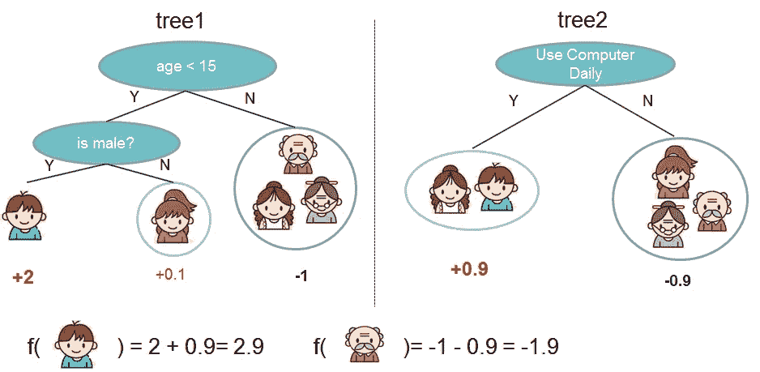

# XGBoost:每个人的王者之剑

> 原文：<https://towardsdatascience.com/xgboost-the-excalibur-for-everyone-8009bd015f1e?source=collection_archive---------8----------------------->


Photo by [Daniel Mayovskiy](https://unsplash.com/photos/ai6IRDJQMKw?utm_source=unsplash&utm_medium=referral&utm_content=creditCopyText) on [Unsplash](https://unsplash.com/search/photos/rocket?utm_source=unsplash&utm_medium=referral&utm_content=creditCopyText)

当我发现 XGBoost 算法时，我对它的能力有点怀疑，因为无论我在哪里读到它，每个人都在谈论它有多么伟大和神奇。在进一步挖掘 XGBoost 的“*魔法*”因素时，我发现它一直是许多 Kaggle 竞赛获胜者的基本元素，在某些情况下，人们将“ *only* 算法应用于他们的数据集。

自然的做法是从现有的代码样本中测试该算法，亲自看看它有多好。我在我自己的一个正在运行的项目中这样做了，我首先使用随机福里斯特回归器并计算它的平均绝对误差，然后我将相同的数据帧传递给我的 XGB 回归器并计算它的平均绝对误差[](https://en.wikipedia.org/wiki/Mean_absolute_error)*。结果大相径庭！(**比我之前的型号**好了近 20%)*

*在访问 XGBoost 的官方文档时，我发现甚至有一些参数可以进一步调整以获得更好的结果。这太神奇了！没有时间浪费，我快速阅读了文档，并为我的模型添加了一些参数。我得到了一些错误，无法理解这些参数中的大多数在做什么，留下了一些像 *n_estimators* 和 *learning_rate* 的错误，但我能够拟合我的模型，结果再次以更好的准确性打破了以前的记录。(*增长并不显著，但我猜不同型号之间会有所不同*)*

> *我将在这里分享我的一些发现，我相信这些发现会让您很好地了解如何在下一次分析中使用 XGBoost。*

## *一些灵感:*

> *陈天琦开发了 XGBoost，它最初是作为[分布式(深度)机器学习社区(DMLC)小组](http://dmlc.ml/)的一部分的一个研究项目。第一次发布是在 2014 年 3 月。*

*除了使用机器学习和数据分析之外，增强树的功能已经得到了极大的利用。值得一提的是，希格斯玻色子 T21 的发现有可能是通过使用增强的树木实现的。可以看一下这个发现相关的[论文。](http://proceedings.mlr.press/v42/chen14.pdf)*

## *Bagging 和 Boosting 的区别 XGBoost 是如何工作的*

*为了理解 XGBoost 是如何工作的，是什么让它变得更好，我们必须理解 Boosted 树与 Random Forrest 有什么不同。*

*随机福里斯特回归器中使用了装袋概念。Bagging 代表*Bootstrap aggregate*，这意味着选择一个随机样本**并替换**。Bagging 算法的基本步骤是从数据集生成 n 个样本(与决策树回归器中形成的单个树相反)，单独训练每个样本，并在最后对所有预测进行平均。需要注意的重要一点是装袋*减少了我们模型的方差*。*

*在我们的 XGBoost 回归器中使用了 Boosting 概念。在 Boosting 中，我们用来训练每个迷你树的随机样本被挑选出来*，并替换加权数据*。由于这个事实，我们可以将每个样本称为**弱学习者**。这些弱学习者中的每一个都基于其分类的准确性被分配一个权重。在这些弱学习者被训练之后，他们的估计的加权平均被用于最后的最终预测。所以我们的弱学习者结合在一起，形成强学习者。*

**

*Source: XGBoost*

**

*Source: XGBoost*

***XGBoost 代表极限梯度提升**。梯度推进是一种*集成方法*，它依次添加我们训练过的预测器，并为它们分配一个权重。然而，该方法不是在每次迭代后给分类器分配不同的权重，而是将新模型拟合到先前预测的新残差，然后在添加最新预测时最小化损失。*因此，最后，您使用梯度下降来更新您的模型，因此得名梯度推进。*回归和分类问题都支持这一点。具体来说，XGBoost 通过在目标函数中添加一个自定义正则项来实现决策树提升算法。*

> *一个好的方法是考虑一个项目组，每个人在一个领域比其他人更好，这些人可以组合在一起成为一个伟大的项目。所以，许多弱学习者成为强学习者。挺实用的！*

*使用目标函数(损失函数+罚函数)来实现该算法，其中添加了重要的正则化项(*罚函数，其将“增强”置于梯度增强中*)。*

*你可以在 [XGBoost 介绍页面](https://xgboost.readthedocs.io/en/latest/model.html)上阅读更多关于算法工作的内容。*

*[官方发表的陈天琦的论文。](https://arxiv.org/abs/1603.02754)*

*SauceCat 还写了一篇很棒的[帖子，深入探讨了算法背后的数学原理以及数据科学方面的代码](/boosting-algorithm-xgboost-4d9ec0207d)。*

## *代码中的 XGBoost*

*使用 XGBoost 回归器就像使用任何其他基于回归的方法一样，比如 Random Forrest。我们遵循相同的方法:*

*   *清理数据*
*   *选择重要的参数*
*   *制作培训和测试集*
*   *让模型适合您的训练集*
*   *根据您的测试数据评估您的模型*

*当然，还有在这之间你可能采取的每一步。*

*我们认为您已经有了训练和测试数据，并且在拟合模型之前已经执行了所需的步骤。如果您还没有，只需在 Pandas 中制作一个简单的数据框架，并使用 Scikit-Learn 的 [*train_test_split* 函数](http://scikit-learn.org/stable/modules/generated/sklearn.model_selection.train_test_split.html)将您的数据自动拆分为一个训练和测试集。*

```
*from xgboost import XGBRegressor #The library to be importedmodel = XGBRegressor()
model.fit(training_Set_X, training_Set_y, verbose=False)
predictions = model.predict(testing_Set_X)from sklearn.metrics import mean_absolute_error#Computing the MAE of our predictions
print("Mean Absolute Error : " + str(mean_absolute_error(predictions, testing_Set_y)))*
```

*使用 XGBRegressor 的一个更好的方法是利用可以传递给它的附加参数。你可以在下面的截图中看到参数是如何对我们预测的准确性产生巨大影响的。(*差异可能会更大或更小，这取决于您的数据集**

***XGBRegressor 提供了许多调整参数，可用于显著减少训练时间和准确性。***

****

*XGBoost 提供的另一个伟大特性是 *plot_importance* 函数，它可以提供我们的模型的特性及其重要性的图表。*

*这对于分析我们的模型和评估我们的特性是一个很好的补充。我们可能会选择放弃一些功能，以防它们对我们的模型没有意义。*

*请务必访问 [XGBoost 网站](http://xgboost.readthedocs.io/en/latest/)，因为它们提供了对特性和算法的简单易懂的解释，不会让读者被沉重的数学符号所迷惑。(*虽然我们看到的大多数与机器学习相关的符号都只是由求和符号组成，但这个符号有一些让人们害怕的东西。*)*

> *我希望这篇介绍足以让您开始使用 XGBoosting(这个名字肯定是 DataScience Block 上最酷的名字)。如果你一直在使用这个算法，请发表你的见解。我会试着更新这篇文章来介绍它的数学概念。*