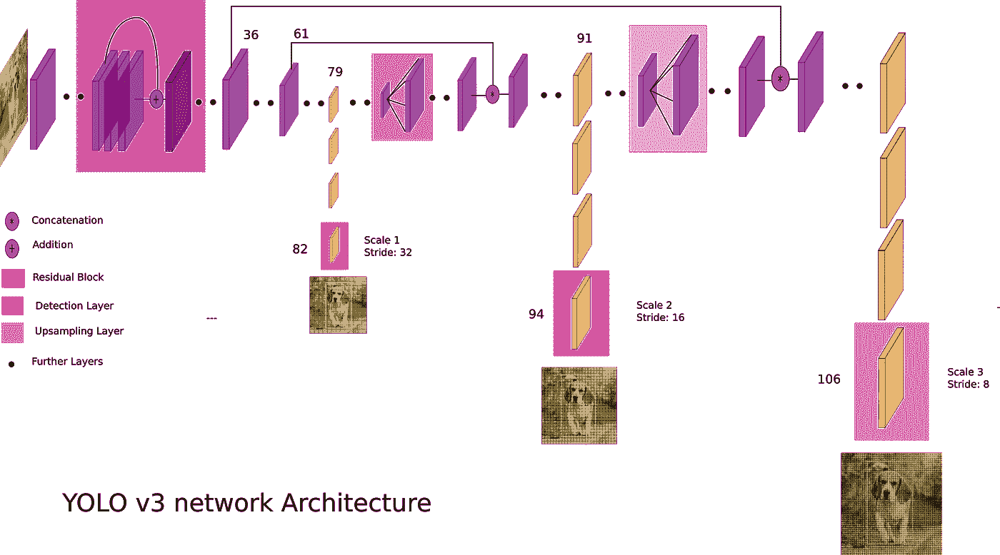
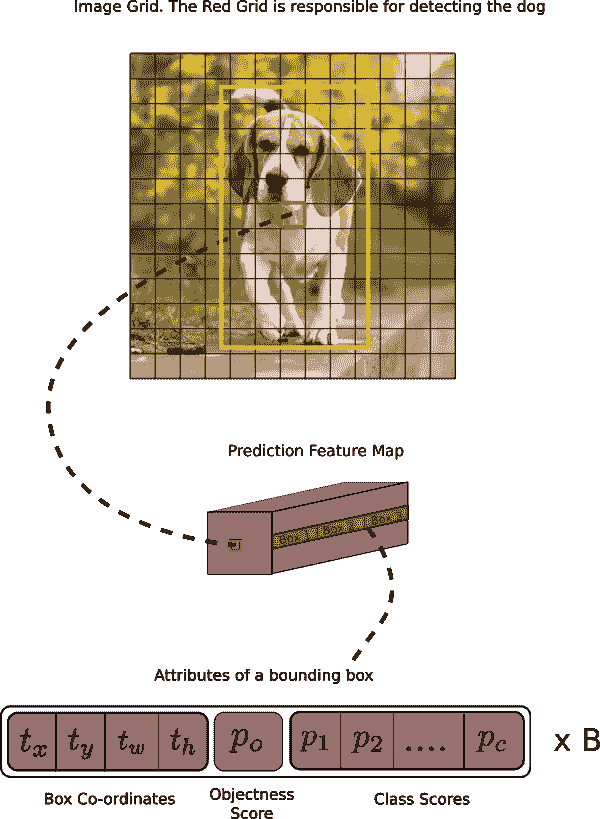
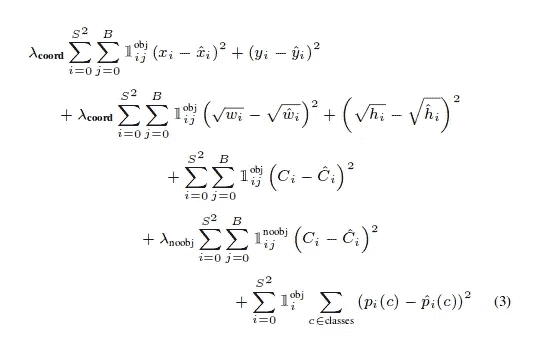
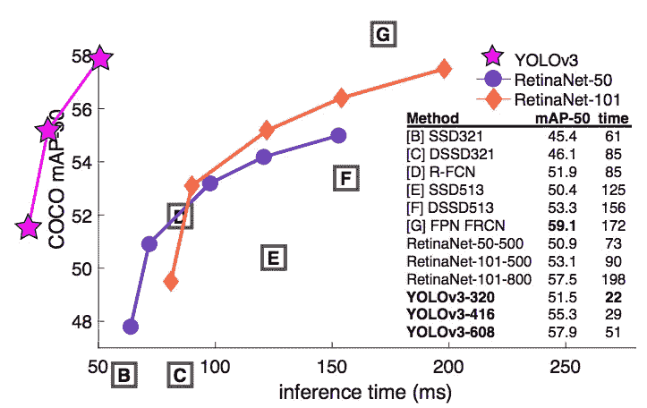
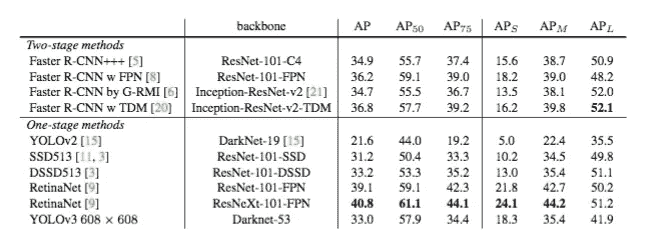
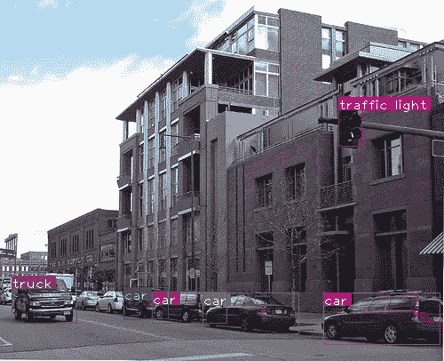
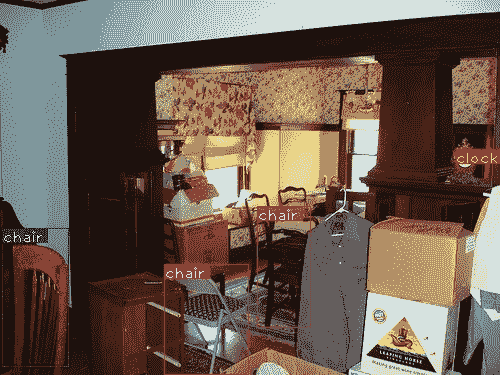
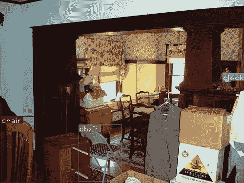
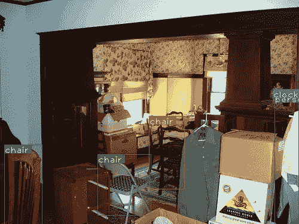

# YOLO v3 有什么新功能？

> 原文：<https://towardsdatascience.com/yolo-v3-object-detection-53fb7d3bfe6b?source=collection_archive---------0----------------------->


你只看一次，或 YOLO，是一个更快的对象检测算法。虽然它不再是最准确的对象检测算法，但当您需要实时检测时，它是一个非常好的选择，不会损失太多的准确性。

几周前，YOLO 的第三个版本出来了，这篇文章旨在解释 YOLO v3 中引入的变化。这不会是一个解释 YOLO 到底是什么的帖子。我想你知道 YOLO v2 是如何工作的。如果不是这样，我推荐你去看看以下由 Joseph Redmon *et all* 撰写的论文，了解一下 YOLO 是如何运作的。

1.  [YOLO v1](https://pjreddie.com/media/files/papers/yolo_1.pdf)
2.  [YOLO v2](https://pjreddie.com/media/files/papers/YOLO9000.pdf)
3.  一篇关于 YOLO 的好博文

# YOLO v3:更好，*不是*更快，更强

YOLO v2 论文的官方标题似乎是 YOLO 是一种基于牛奶的儿童健康饮料，而不是一种物体检测算法。它被命名为“YOLO9000:更好、更快、更强”。

对于当时的 YOLO 9000 是最快的，也是最准确的算法之一。然而，几年后，RetinaNet 等算法不再是最准确的，SSD 在准确性方面优于它。然而，它仍然是最快的。

但是在 YOLO v3 中，这种速度被用来换取准确性的提高。虽然早期版本在 Titan X 上运行速度为 45 FPS，但当前版本的速度约为 30 FPS。这与称为暗网的底层架构的复杂性增加有关。

# 暗网-53

YOLO v2 使用定制的深度架构 darknet-19，这是一个最初的 19 层网络，补充了 11 层用于对象检测。YOLO v2 采用 30 层架构，经常难以检测到小物体。这是由于图层对输入进行缩减采样时丢失了细粒度要素。为了补救这一点，YOLO v2 使用了一个身份映射，连接来自前一层的特征映射来捕获低级特征。

然而，YOLO v2 的架构仍然缺少一些最重要的元素，这些元素现在是大多数最先进的算法中的主要元素。没有残余块、没有跳过连接和没有上采样。YOLO v3 包含了所有这些。

首先，YOLO v3 使用了 Darknet 的一个变种，它最初在 Imagenet 上训练了 53 层网络。对于检测任务，在其上堆叠了另外 53 层，为我们提供了一个用于 YOLO v3 的 **106 层全卷积底层架构。这就是 YOLO v3 比 YOLO v2 慢的原因。这是 YOLO 建筑现在的样子。**



Ok, this diagram took a lot of time to make. I want a clap or ten for this!

# 三级检测

较新的架构拥有残余跳过连接和上采样。**v3 最显著的特点是在三个不同的尺度上进行检测。** YOLO 是一个完全卷积网络，其最终输出是通过在特征图上应用 1 x 1 内核生成的。在 YOLO v3 中，**通过在网络中的三个不同位置的三个不同大小的特征图上应用 1×1 检测核来完成检测。**

检测核的形状是 **1 x 1 x (B x (5 + C))。**这里 B 是特征图上的一个单元可以预测的边界框的数量，“5”是 4 个边界框属性和一个对象置信度，C 是类的数量。在 COCO 上训练的 YOLO v3 中，B = 3，C = 80，所以内核大小是 1×1×255。由该内核产生的特征图具有与先前特征图相同的高度和宽度，并且具有如上所述的沿着深度的检测属性。



Image credits: [https://blog.paperspace.com/how-to-implement-a-yolo-object-detector-in-pytorch/](https://blog.paperspace.com/how-to-implement-a-yolo-object-detector-in-pytorch/)

在我们进一步讨论之前，我想指出网络的**步距，或一个层被定义为它对输入进行下采样的比率。在下面的例子中，我假设我们有一个尺寸为 416 x 416 的输入图像。**

**YOLO v3 在三个尺度上进行预测，这三个尺度是通过将输入图像的维度分别下采样 32、16 和 8 而精确给出的。**

第一次检测由第 82 层进行。对于前 81 层，网络对图像进行下采样，使得第 81 层的步距为 32。如果我们有一个 416 x 416 的图像，那么得到的特征图的大小将是 13 x 13。这里使用 1×1 检测内核进行一次检测，得到 13×13×255 的检测特征图。

然后，来自层 79 的特征图在被 2x 上采样到 26×26 的维度之前经历几个卷积层。该特征图然后与来自层 61 的特征图深度连接。然后，组合的特征图再次经过几个 1×1 卷积层，以融合来自先前层的特征(61)。然后，由第 94 层进行第二次检测，产生 26×26×255 的检测特征图。

再次遵循类似的过程，其中来自层 91 的特征图在与来自层 36 的特征图深度连接之前经历几个卷积层。像以前一样，几个 1×1 卷积层接着融合来自前一层的信息(36)。我们在第 106 层制作最终的 3，产生大小为 52×52×255 的特征地图。

# 更擅长探测更小的物体

不同层的检测有助于解决检测小物体的问题，这是 YOLO v2 经常遇到的问题。与先前层连接的上采样层有助于保留有助于检测小对象的细粒度特征。

13 x 13 层负责检测大型物体，而 52 x 52 层检测较小物体，26 x 26 层检测中等物体。下面是不同图层在同一对象中拾取的不同对象的对比分析。

# 锚箱的选择

YOLO v3 总共使用 9 个锚箱。每个刻度三个。如果你在自己的数据集上训练 YOLO，你应该使用 K-Means 聚类来生成 9 个锚。

然后，按维度降序排列锚点。为第一个音阶指定三个最大的锚，为第二个音阶指定接下来的三个，为第三个音阶指定最后三个。

# 每个图像更多的边界框

对于相同大小的输入图像，YOLO v3 比 YOLO v2 预测更多的边界框。例如，在其 416 x 416 的原始分辨率下，YOLO v2 预测 13 x 13 x 5 = 845 个盒子。在每个网格单元，使用 5 个锚来检测 5 个盒子。

另一方面，YOLO v3 以 3 种不同的比例预测盒子。对于 416×416 的相同图像，预测的框的数量是 10，647。这意味着 **YOLO v3 预测的盒子数量是 YOLO v2 预测的 10 倍。你很容易想象为什么它比 YOLO v2 慢。在每个尺度上，每个网格可以使用 3 个锚点预测 3 个盒子。因为有三个秤，所以总共使用 9 个锚箱，每个秤使用 3 个。**

# 损失函数的变化

早些时候，YOLO v2 的损失函数是这样的。



Image credits: [https://pjreddie.com/media/files/papers/yolo_1.pdf](https://pjreddie.com/media/files/papers/yolo_1.pdf)

我知道这有点吓人，但请注意最后三项。其中，第一个惩罚负责预测对象的包围盒的对象性分数预测(这些的分数理想地应该是 1)，第二个惩罚没有对象的包围盒(分数理想地应该是 0)，最后一个惩罚预测对象的包围盒的类预测。

YOLO v2 中的最后三项是平方误差，而在 YOLO v3 中，它们被交叉熵误差项所取代。换句话说，**YOLO v3 中的对象置信度和类预测现在通过逻辑回归来预测。**

当我们训练检测器时，对于每个地面真值框，我们分配一个边界框，它的锚点与地面真值框有最大的重叠。

# 不要再对课程进行任何修改

YOLO v3 现在对图像中检测到的物体进行多标签分类。

在早期的 YOLO，作者们习惯于对类得分进行软最大化，并将得分最高的类作为包含在包围盒中的对象的类。这在 YOLO 版本 3 中已被修改。

Softmaxing 类基于这样的假设:类是互斥的，或者简单地说，如果一个对象属于一个类，那么它不能属于另一个类。这在 COCO 数据集上运行良好。

然而，当我们在数据集中有像 **Person** 和 **Women** 这样的类时，上面的假设就不成立了。这就是为什么《YOLO》的作者没有软化这些阶级的原因。相反，使用逻辑回归来预测每个类别分数，并且使用阈值来预测对象的多个标签。分数高于该阈值的类被分配到盒子。

# 标杆管理

在 **COCO mAP 50 基准测试中，YOLO v3 的性能与 RetinaNet 等其他先进检测器不相上下，但速度要快得多。**它也优于固态硬盘及其变体。这是报纸上的表演对比。



YOLO vs RetinaNet performance on COCO 50 Benchmark

但是，但是，但是，YOLO 在 COCO 基准测试中失利，IoU 值较高，用于拒绝检测。我不打算解释 COCO 基准是如何工作的，因为这超出了工作范围，但 COCO 50 基准中的 **50** 是预测的边界框与对象的地面真实框对齐程度的度量。这里的 50 相当于 0.5 IoU。如果预测和基本事实框之间的 IoU 小于 0.5，则该预测被分类为定位错误并被标记为假阳性。

在基准测试中，这个数字较高(比如 COCO 75)，盒子需要更好地对齐，以免被评估标准拒绝。这是 YOLO 被 RetinaNet 超越的地方，因为它的边界框没有 RetinaNet 对齐。这里有一个更广泛的基准测试的详细表格。



RetinaNet outperforms YOLO at COCO 75 benchmark. Notice, how RetinaNet is still better at the AP benchmark for small objects (APs)

# 做一些实验

您可以使用 Github [repo](https://github.com/ayooshkathuria/pytorch-yolo-v3) 中提供的代码在图像或视频上运行检测器。代码需要 PyTorch 0.3+，OpenCV 3，Python 3.5。设置 repo，您可以在它上面运行各种实验。

## 不同的尺度

这里看一下不同的检测层获得了什么。

```
python detect.py --scales 1 --images imgs/img3.jpg
```



Detection at scale 1, we see somewhat large objects are picked. But we don’t detect a few cars.

```
python detect.py --scales 2 --images imgs/img3.jpg
```


No detections at scale 2.

```
python detect.py --scales 3 --images imgs/img3.jpg
```


Detection at the largest scale (3). Look how only the small objects are picked up, which weren’t detected by scale 1.

## 不同的输入分辨率

```
python detect.py --reso 320 --images imgs/imgs4.jpg
```


Input resolution of the image: 320 x 320

```
python detect.py --reso 416 --images imgs/imgs4.jpg
```



Input resolution of the image: 416 x 416

```
python detect.py --reso 608 --images imgs/imgs4.jpg
```



Here, we detect one less chair than before

```
python detect.py --reso 960 --images imgs/imgs4.jpg 
```



Here, the detector picks up a false detection, the “Person” at the right

在我们的例子中，较大的输入分辨率帮助不大，但是它们可能有助于检测带有小物体的图像。另一方面，较大的输入分辨率会增加推理时间。这是一个超参数，需要根据应用进行调整。

您可以通过访问 repo 来试验其他指标，如批量大小、对象置信度和 NMS 阈值。自述文件中已经提到了一切。

# 从头开始实施 YOLO v3

如果你想在 PyTorch 中自己实现一个 YOLO v3 探测器，这里有一系列我在 Paperspace 上写的教程。现在，如果你想尝试本教程，我希望你对 PyTorch 有基本的了解。如果你想从 PyTorch 的初级用户过渡到中级用户，这篇教程正合适。

# 进一步阅读

1.  [YOLO v3:增量改进](https://pjreddie.com/media/files/papers/YOLOv3.pdf)
2.  [地图是怎么算出来的？](https://datascience.stackexchange.com/questions/25119/how-to-calculate-map-for-detection-task-for-the-pascal-voc-challenge)