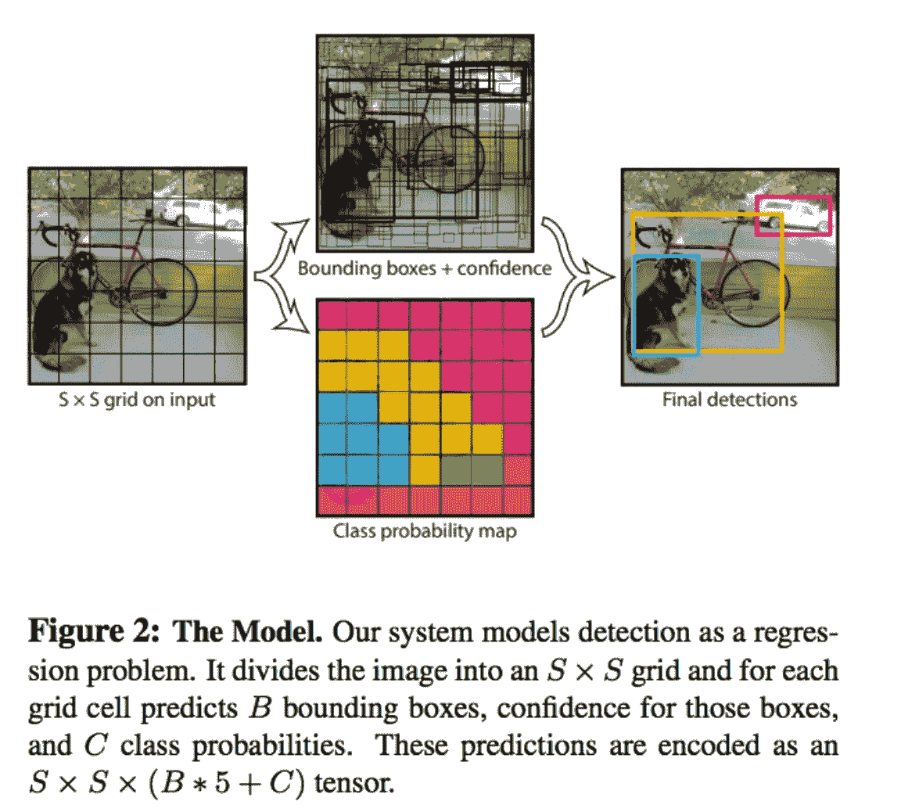

# YOLO——你只能看一次，实时物体检测解释道

> 原文：<https://towardsdatascience.com/yolo-you-only-look-once-real-time-object-detection-explained-492dc9230006?source=collection_archive---------0----------------------->

原始论文(CVPR 2016。OpenCV 人民选择奖)[https://arxiv.org/pdf/1506.02640v5.pdf](https://arxiv.org/pdf/1506.02640v5.pdf)

约洛夫 2:【https://arxiv.org/pdf/1612.08242v1.pdf】T2

最大优势:

*   速度(每秒 45 帧，比实时速度快)
*   网络理解一般化的对象表示(这允许他们在真实世界图像上训练网络，并且对艺术品的预测仍然相当准确)。
*   更快的版本(架构更小)—每秒 155 帧，但精度较低。
*   开源:【https://pjreddie.com/darknet/yolo/ 

## 高层次想法:

与其他区域建议分类网络(快速 RCNN)相比，Yolo 架构更像 FCNN(完全卷积神经网络),它对各种区域建议执行检测，并最终对图像中的各种区域执行多次预测，并使图像(nxn)通过 FCNN 一次，输出 is (mxm)预测。这种架构在 mxm 网格中分割输入图像，并为每个网格生成 2 个边界框和这些边界框的类概率。请注意，边界框很可能比网格本身大。来自纸张:

> 我们将对象检测重新定义为一个单一的回归问题，直接从图像像素到边界框坐标和类别概率。
> 
> 单个卷积网络同时预测多个边界框和这些框的类别概率。YOLO 在全图像上训练，直接优化检测性能。与传统的目标检测方法相比，这种统一的模型有几个优点。首先，YOLO 速度极快。因为我们把检测框架作为一个回归问题，所以我们不需要复杂的流水线。我们只是在测试时对新图像运行我们的神经网络来预测检测。我们的基础网络在 Titan X GPU 上以每秒 45 帧的速度运行，没有批处理，快速版本的运行速度超过 150 fps。这意味着我们可以实时处理流视频，延迟不到 25 毫秒。
> 
> 第二，YOLO 在做预测时会对图像进行全局推理。与基于滑动窗口和区域提议的技术不同，YOLO 在训练和测试期间看到整个图像，因此它隐式地编码了关于类及其外观的上下文信息。快速 R-CNN 是一种顶级的检测方法，它会将图像中的背景斑块误认为物体，因为它看不到更大的背景。与快速的 R-CNN 相比，YOLO 产生的背景错误不到一半。
> 
> 第三，YOLO 学习对象的概括表示。当在自然图像上训练和在艺术品上测试时，YOLO 远远超过 DPM 和 R-CNN 等顶级检测方法。由于 YOLO 是高度概括的，当应用于新的领域或意想不到的输入时，它不太可能崩溃。
> 
> 我们的网络使用整个图像的特征来预测每个边界框。它还可以同时预测图像中所有类别的所有边界框。这意味着我们的网络对整个图像和图像中的所有对象进行全局推理。YOLO 设计支持端到端训练和实时速度，同时保持较高的平均精度。
> 
> 我们的系统将输入图像划分为一个 S × S 网格。如果对象的中心落入网格单元，则该网格单元负责检测该对象。
> 
> 每个网格单元预测 B 边界框和这些框的置信度得分。这些置信度得分反映了模型对盒子包含对象的置信度，以及它认为盒子预测的准确性。形式上，我们将置信度定义为 Pr(对象)IOU。如果该单元中不存在任何对象，置信度得分应该为零。否则，我们希望置信度得分等于预测框和实际情况之间的交集(IOU)
> 
> 每个边界框由 5 个预测组成:x，y，w，h 和置信度。(x，y)坐标表示相对于网格单元边界的盒子中心。相对于整个图像预测宽度和高度。最后，置信度预测表示预测框和任何真实框之间的 IOU。每个网格单元还预测 C 条件类概率 Pr(Classi |Object)。这些概率取决于包含对象的网格单元。我们只预测每个网格单元的一组类别概率，而不考虑盒子 b 的数量。
> 
> 在测试时，我们将条件类概率和单个盒子置信度预测相乘，

```
Pr(Classi|Object)∗Pr(Object)∗IOU = Pr(Classi)∗IOU
```

> ，它为我们提供了每个盒子的特定于类的置信度得分。这些分数编码了该类出现在框中的概率以及预测的框与对象的匹配程度



## 网络架构和培训:

改变损失函数以获得更好的结果是很有趣的。有两件事很突出:

1.  在训练过程中，包含对象的盒子和不包含对象的盒子的置信度预测的不同权重。
2.  预测包围盒宽度和高度的平方根，以不同地惩罚小对象和大对象中的误差。

> 我们的网络有 24 个卷积层，后面是 2 个全连接层。我们简单地使用 1 × 1 缩减层，然后是 3 × 3 卷积层，而不是 GoogLeNet 使用的初始模块
> 
> 快速 YOLO 使用具有更少卷积层(9 层而不是 24 层)和更少过滤器的神经网络。除了网络的规模之外，YOLO 和 Fast YOLO 之间的所有培训和测试参数都是相同的。


> 我们优化了模型输出的平方和误差。我们使用平方和误差，因为它易于优化，但是它并不完全符合我们最大化平均精度的目标。它将定位误差与可能不理想的分类误差同等加权。此外，在每个图像中，许多网格单元不包含任何对象。这将这些单元的“置信度”分数推向零，通常会压倒包含对象的单元的梯度。这可能导致模型不稳定，导致培训在早期出现偏差。为了补救这一点，我们增加了边界框坐标预测的损失，并减少了不包含对象的框的置信度预测的损失。我们使用两个参数λcoord 和λnoobj 来实现这一点。我们设置λcoord = 5，λnoobj = .5。
> 
> 平方和误差同样对大盒子和小盒子中的误差进行加权。我们的误差度量应该反映大盒子中的小偏差不如小盒子中的小偏差重要。为了部分解决这个问题，我们预测边界框宽度和高度的平方根，而不是直接预测宽度和高度。
> 
> YOLO 预测每个网格单元有多个边界框。在训练时，我们只希望一个边界框预测器负责每个对象。我们分配一个预测器来“负责”预测一个对象，基于哪个预测具有最高的当前 IOU 和地面真实值。这导致边界框预测器之间的专门化。每个预测器在预测物体的特定大小、长宽比或类别方面变得更好，从而提高了整体回忆能力。

## YOLO 的局限性

> 由于每个格网单元只能预测两个框，并且只能有一个类，因此 YOLO 对边界框预测施加了很强的空间约束。这个空间约束限制了我们的模型可以预测的附近物体的数量。我们的模型处理成群出现的小物体，比如一群鸟。由于我们的模型学会了从数据中预测边界框，它很难推广到新的或不寻常的纵横比或配置的对象。我们的模型还使用相对粗糙的特征来预测边界框，因为我们的架构具有来自输入图像的多个下采样层。最后，当我们在近似检测性能的损失函数上训练时，我们的损失函数在小边界框和大边界框中对待错误是相同的。大盒子里的小错误通常是良性的，但小盒子里的小错误对 IOU 的影响要大得多。我们错误的主要来源是不正确的定位

# YOLO9000

约洛夫 2:[https://arxiv.org/pdf/1612.08242v1.pdf](https://arxiv.org/pdf/1612.08242v1.pdf)

> 与快速 R-CNN 相比，YOLO 的误差分析表明，YOLO 犯了大量的定位错误。此外，与基于区域提议的方法相比，YOLO 的召回率相对较低。因此，我们主要集中在提高召回和定位，同时保持分类的准确性。
> 
> 通过在 YOLO 的所有卷积层上添加批量标准化，我们在 mAP 上获得了超过 2%的改进。批处理规范化也有助于正则化模型。通过批量标准化，我们可以在不过度拟合的情况下从模型中移除漏失。
> 
> 对于 YOLOv2，我们首先在 ImageNet 上以全 448 × 448 分辨率对分类网络进行 10 个时期的微调。这使得网络有时间调整其滤波器，以便更好地处理更高分辨率的输入。然后，我们在检测时微调生成的网络。这个高分辨率的分类网络给我们增加了将近 4%的地图
> 
> 带锚盒的卷积。YOLO 使用卷积特征提取器上的全连接层直接预测边界框的坐标。预测偏移量而不是坐标简化了问题，并使网络更容易学习。我们从 YOLO 中移除完全连接的层，并使用锚盒来预测边界盒。使用锚盒，我们得到了一个小的准确性下降。YOLO 只预测了每张图片 98 个盒子，但是我们的模型预测了超过 1000 个锚盒。在没有锚盒的情况下，我们的中间模型得到 69.5 的 mAP，召回率为 81%。使用锚盒，我们的模型得到 69.2 的 mAP，召回率为 88%。即使 mAP 降低，但召回率的提高意味着我们的模型有更大的改进空间。
> 
> 精细的特征。这种改进的 YOLO 预测在 13 × 13 特征图上的探测。虽然这对于大型对象来说已经足够了，但是对于本地化较小的对象来说，更细粒度的特性可能会有所帮助。更快的 R-CNN 和 SSD 都在网络中的各种特征地图上运行他们的建议网络，以获得一系列分辨率。我们采取了一种不同的方法，简单地添加一个穿透层，以 26 × 26 的分辨率从早期的层中引入功能。通过将相邻要素堆叠到不同的通道而不是空间位置，直通层将高分辨率要素与低分辨率要素连接起来，类似于 ResNet 中的身份映射。这样就把 26 × 26 × 512 的特征图变成了 13 × 13 × 2048 的特征图，可以和原来的特征串接起来。我们的检测器运行在这个扩展的特征映射之上，因此它可以访问细粒度的特征。这带来了 1%的性能提升。
> 
> 在训练期间，我们混合来自检测和分类数据集的图像。当我们的网络看到标记为检测的图像时，我们可以基于完整的 YOLOv2 损失函数进行反向传播。当它看到分类图像时，我们只从体系结构的分类特定部分反向传播损失。
> 
> 等级分类。ImageNet 标签来自 WordNet，WordNet 是一个语言数据库，用于构建概念以及它们之间的关系[12]。在 WordNet 中，“诺福克梗”和“约克夏梗”都是“梗”的下位词，梗是“猎狗”的一种，梗是“狗”的一种，梗是“犬科动物”，等等。大多数分类方法假设标签是平面结构，但是对于组合数据集，结构正是我们所需要的。

官方网站:

[https://pjreddie.com/publications/](https://pjreddie.com/publications/)

CVPR 2016 的论文展示: