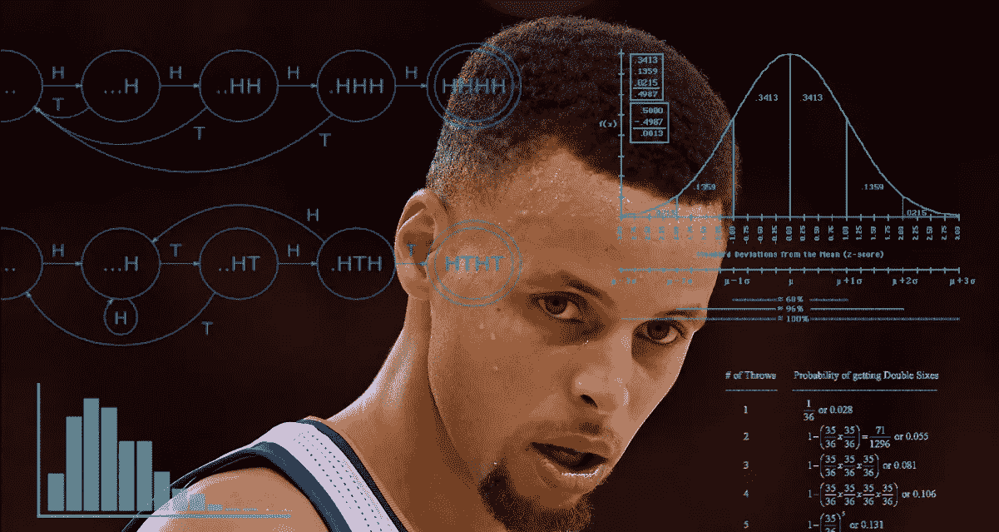

# 你不能编造这些东西…或者，你能吗？

> 原文：<https://towardsdatascience.com/you-cant-make-this-stuff-up-or-can-you-66a6d21ab7f1?source=collection_archive---------7----------------------->

[本文从[多线程](http://multithreaded.stitchfix.com/blog/2017/06/07/hot-hand-and-narrative-fallacy/)交叉发布，与 Joerg Fritz 合著]

2016 年 11 月 7 日，我们见证了篮球史上最伟大的时刻之一。金州勇士队的斯蒂芬·库里打破了一场比赛最多三分球的记录。但是，他做的不止这些。这是一种回归——库里一直在努力，就在一场比赛前，他和他的勇士队输给了湖人队。地位低下的湖人队——前一年在西部联盟中排名最后的球队。库里本人的三分球命中率为 10 投 0 中，以一个三分球结束了他连续 157 场比赛的 NBA 纪录。猜测随之而来。一些人开始质疑库里是否已经失去了他的风格。其他人认为，随着凯文·杜兰特(KD)的加入，球队的化学反应已经被打乱了。还有一些人认为这是防御；对手已经想出了如何防守库里曾经致命的一击。

但是在那个星期二的晚上，每个谣言都会被证明是假的。库里把他们一个个关了。每一发子弹都像雨点般落下，全世界都在敬畏地注视着。就好像每一个都是一个熟练的辩护律师的结案陈词。他精湛的投篮——有些从 26 英尺外——驳斥了任何“失球”的说法。他和 KD 流畅地编排他们的动作，让库里投篮得分。化学！有时库里有两个甚至三个防守者在他身上——这似乎让他变得更好，驳斥了他们已经找到如何防守他的理论。库里需要证明一些东西，他带来了一把大锤。当他投进当晚最后一个三分球时——这是一个打破记录的三分球——库里后退了几步，胜利地摇了摇头，然后指着人群，好像要结束他的案子。他回来了，比以前更好了。人群深信不疑，开始高呼“M-V-P，M-V-P”。这是一件美妙的事情——一连串的事件和情况汇集在一起，创造了体育史上最史诗般的时刻之一。你不能编造这种东西…

# 或者，可以吗？

对于我们所目睹的，有没有可能有另一种解释——一种远没有那么耸人听闻的解释？如果那天晚上我们真正看到的与复出或反驳批评者无关，相反，只不过是一个预期的，尽管很少的事件序列，会怎么样？如果那个戏剧性的故事完全是捏造的呢？在你嘘嘘哭泣[黛比·唐纳](https://www.youtube.com/watch?v=PcGwkyzmPmA)之前，让我们看看数据能告诉我们什么。

如果我们看看我们可能预期会发生什么——不一定是在这个特定的夜晚，而是应该在“某个”夜晚发生什么——那么我们看到的就不那么令人惊讶了。库里本场比赛当时的历史 3 分命中率为 *p* =44.4%。这意味着连续 17 次的*n*= 13 次或更多次三分球命中 *k* =13 次的概率是:

这是一个小概率。但是，如果有足够的试验，我们应该期待它会发生。到那时为止，库里在职业生涯中已经尝试了 3661 次三分球。在这么多的试验中，我们预计他有 7 个序列是一样好或更好的，这仅仅是随机的(他有 6 个，其他序列只是跨越 2 或 3 场比赛)。像“证明怀疑者是错的”或“挨拳头”这样的叙述对于解释这些事件是不必要的。

库里在之前的比赛中 10 投 0 中的糟糕表现又是怎么回事呢？这难道不是衰退的证据，并促使他决心“东山再起”吗？不太可能。如果是 11 分之一，我们会讲一个不同的故事吗？让我们假设我们会接受任何一串低于他正常命中率的 17 次投篮，就像接下来的 17 次异常投篮一样。他 17 投 3 中(或更差)紧接着 17 投 13 中(或更好)的可能性有多大？事实证明，在他职业生涯的那个时候，这种结果有几乎 35%的可能性发生。

如果我们用图形来看数据，我们会看到一些看起来更像随机过程的东西。下面我们绘制了自 2014/15 赛季开始以来，库里在所有常规赛中的 3 分命中率，尝试和制造。这个图表使得构建一个清晰的解释叙述变得更加困难。你会发现这两个“异常”的游戏吗？它们是 x 轴上的游戏 514 和 515。他们不会突然出现在你面前，成为“体育史上的史诗时刻”。

库里的表演无疑是一个奇观。说这是“预料之中的事情”，只是因为他有着非凡的 3 分命中率，以及他多次尝试的事实。但是轰动效应——对复出的叙述、对谣言的驳斥等等——是为了配合数据而创造的。这不是因果关系。库里打破记录并不是因为谣言和猜测——那是我们对那晚所见的解读。我们认为这不在正常的统计变化范围内。我们不能接受。相反，我们无意识地编造了一个故事，赋予事件以意义。

这种捏造的倾向不仅限于体育娱乐。我们在经营业务的过程中也深受其害。这种情况经常发生——即使是在最注重经验的公司里。当指标与历史趋势不同时，人们会迅速给出解释，尽管完全没有任何数据来支持他们的说法。“这是天气”，总有人会在回应业务量的意外增长时这样建议。也许，“这是新的广告活动；挺引人注目的”。甚至，“这是宏观经济；由于刚刚发布的就业报告，人们感到乐观。这些都是看似合理的解释，但没有数据支持。事实上，我们经常被启发去创造这样的故事，正是因为我们缺乏任何其他东西来解释这种变化。我们似乎不能接受无法解释的事情，所以我们说服自己在数据中看到不存在的模式。

这种从事件——甚至是随机事件——中创造意义的倾向是与生俱来的。科学作家迈克尔·舍默称之为模式化。这是数百万年来选择压力的结果，因为我们的祖先进化出了我们今天的大脑。模式化是我们古代狩猎采集祖先的一个偏好特征。谢默解释说，那些对草丛中的沙沙声做出反应就好像它是一个危险的捕食者的人比那些更漫不经心的同伴更有可能存活下来——即使沙沙声只是风。这是因为错误判断捕食者的代价(即这只是风)并不多。然而，不回应的代价是毁灭性的——当它真的是掠食者时，却相信它是风。是生命的代价，是传递自己基因的能力！因此，当犯第一类错误的成本低于犯第二类错误的成本时，模式化特征将在人群中变得普遍[1]。在我们狩猎采集的时代，这肯定是为了生存，因此我们天生倾向于赋予事件意义。

这就是为什么当我们目睹的事件得不到解释时，我们会如此不安。这与纳西姆·尼古拉斯·塔勒布在他的书《黑天鹅》中描述的现象相同。塔勒布创造了“叙事谬误”这个术语，指的是我们在没有解释的情况下观察一系列事实的有限能力。“我们寻求解释，甚至到了我们会制造它们的地步”，他写道。无论是商业指标的突然上升，还是某人 17 个三分球中的 13 个，我们都要求一个解释！我们不能忍受让它无法解释或将其归因于随机变化。即使是已知的随机过程——比如扔硬币——我们也会编造故事来解释结果(例如，“连续三次都是正面朝上”)。见《赌徒的谬误》)。

模式化是我们与生俱来的，因为在我们狩猎采集的时代，它很好地服务了我们。然而，今天，它可能是完全危险的。虽然编造一个故事来解释我们的体育娱乐可能是无害的(除了充满激情的赌徒)，但它在商业决策中可能是极其重要的。它会导致非理性、糟糕的决策和偏见。更糟糕的是，这给了我们理解的错觉。而且，故事是会传染的——它们在整个组织中传播得非常快，增加了基于错误信念做出决策的危险。我们甚至可以满怀信心地做到这一点，并与我们的同行保持一致。

我们必须保护自己。模式化是我们的大脑不知道什么对我们有益的众多特征之一。我们对暴食、贪婪、欲望等有着相似的偏好——每一个都是曾经让我们受益的遗迹，但现在我们必须发展策略来减轻它们。幸运的是，我们可以做一些事情来抵御自己编造潜在虚假故事的本能冲动。

*   首先，只要有可能，尽可能多地依靠设计良好的随机对照试验(RCT，又名 A|B 检验)进行测量、因果关系推断和决策。RCT 通过强制对抽样方差的有效估计进行数据评估，而不是通过我们有偏见的直觉，使我们免受犯第一类错误(当某事真的是假时，相信它是真的)的内在诱惑
*   接下来，花时间建模并了解你的业务。影响你业务的因素会随着时间的推移而变化。客户和库存的构成可能会变化，营销活动的有无可能会改变，甚至运营约束也可能会改变并影响您的业务指标。开发模型来捕捉每个因素引起的变化是一个很好的实践(我们以前写过这个)。见[此处](http://multithreaded.stitchfix.com/blog/2016/03/23/debunking-narrative-fallacies/)。虽然一个模型不会总是给你一个真实的因果关系，但它远比单独使用我们的直觉更严格。此外，它为分析变化提供了一个原则性的框架，这在许多方面都是有帮助的:它可以提供对对立因素的可见性，这些因素可能相互抵消，从而给出稳定的表象。它还可以提供关于自然变化程度的见解。当一些无法解释的现象发生时，它可以提供一个上限，说明有多少变化是由它引起的。
*   最后，当我们的直觉驱使我们看到不存在的模式时，我们必须发展一种纪律。如果我们发现自己在没有任何证据支持的情况下创造故事，特别是当我们因为没有数据支持而创造故事时，那么我们必须非常怀疑自己的动机。知道自己什么时候最容易受到这种伤害。越是不确定，越是绝望，我们就越有可能抓住似是而非的故事不放。

回到体育。11 月 7 日，除了斯蒂芬·库里进行随机变异的例行演示之外，还有什么别的吗？不太可能。库里本人在接受采访时，没有提到复出或需要证明什么。他只是说他“需要继续拍摄”。尽管如此，我们还是更喜欢故事。它提升了体验。这和我们去拉斯维加斯，吃不健康的快餐，玩显灵板，听从幸运饼干的建议，亲吻巧言石，偶尔纵情饮酒是一个道理。它们是满足原始欲望的愉快经历(至少在当下)。我们知道这对我们不好。但是，我们有权偶尔沉溺于自己的恶习。它让生活变得更加愉快。当然，在商业环境中，我们需要抑制自己的欲望。

# 附言

这篇博文有一个递归的特性，模式被引用来解释为什么我们有解释我们经历的事件的本能冲动。我们完全有可能不由自主地被模式化提供的解释所驱使。唉，我们不知道该相信谁了——当然不是我们自己！

# 参考资料和进一步阅读

1.  舍莫，迈克尔。[模式性:在无意义的噪音中寻找有意义的模式。](https://www.scientificamerican.com/article/patternicity-finding-meaningful-patterns/)《科学美国人》。新名词，2008 年 12 月 1 日。
2.  Tversky，a .和 Kahneman，d .对大数定律的信念。心理学通报，1971 年，第 76 卷，第 2 期。105–110.
3.  [维基百科上的赌徒谬误](https://en.wikipedia.org/wiki/Gambler%27s_fallacy)
4.  [维基百科上的热手谬论](https://en.wikipedia.org/wiki/Hot-hand_fallacy)
5.  《篮球中的辣手:关于随机序列的错误认知》，《认知心理学》17，295–314(1985)。
6.  塔勒布纳西姆。极不可能事件的影响。伦敦:艾伦巷，2011 年。打印。
7.  刘易斯，迈克尔。改变我们想法的友谊。纽约:诺顿出版社，2017 年。打印。
8.  卡尼曼博士(2015 年)。思考，忽快忽慢。纽约:法勒，斯特劳斯和吉鲁。
9.  纽约州哈拉里(2016 年)。智人:人类简史。安大略省多伦多市:信号，麦克莱兰和斯图尔特。
10.  米勒、约书亚·本雅明和桑尤尔乔、亚当，惊讶于赌徒和热手的谬论？大数定律的一个真理(2016 . 11 . 15)。IGIER 工作文件№552。可在 [SSRN](https://ssrn.com/abstract=2627354) 或[土井](http://dx.doi.org/10.2139/ssrn.2627354)买到