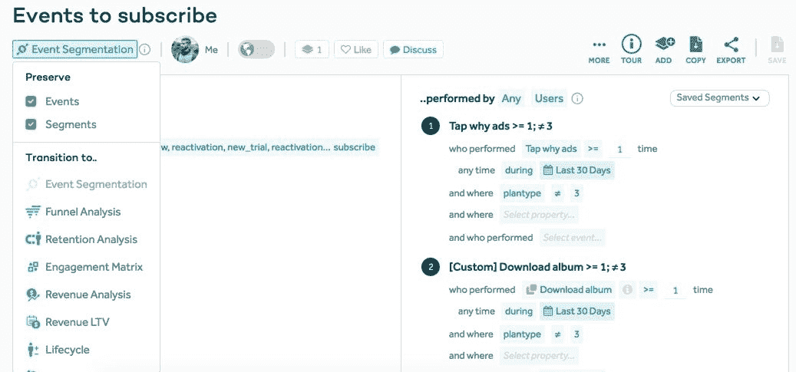
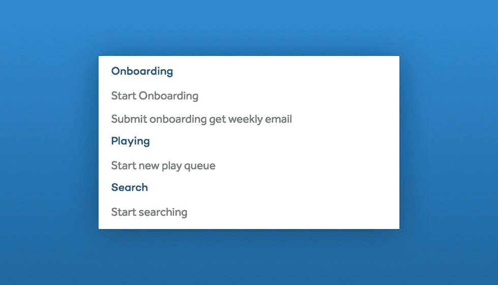
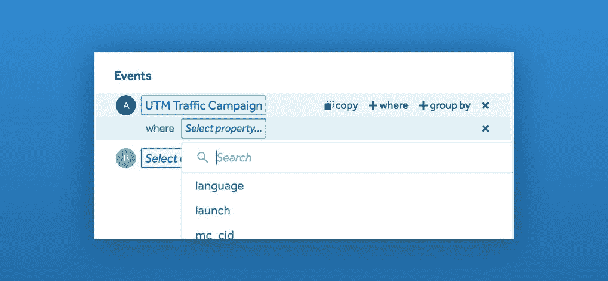
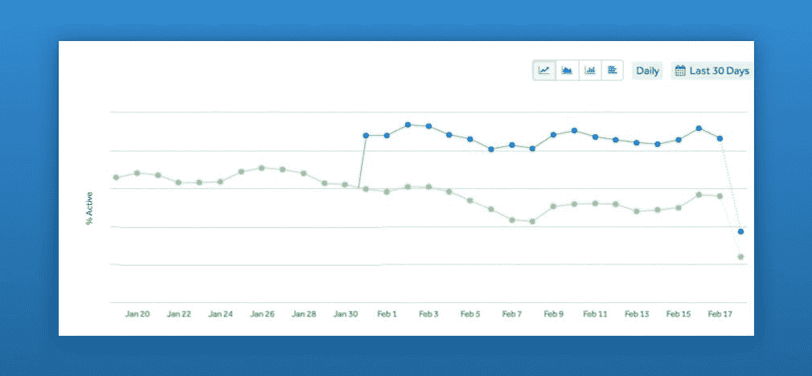
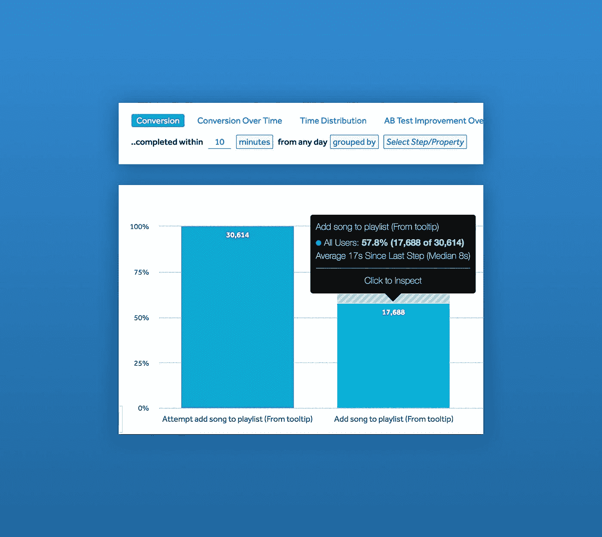
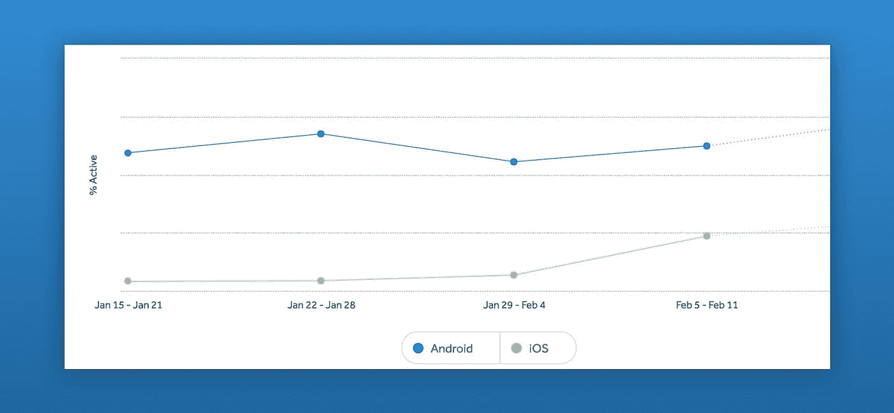
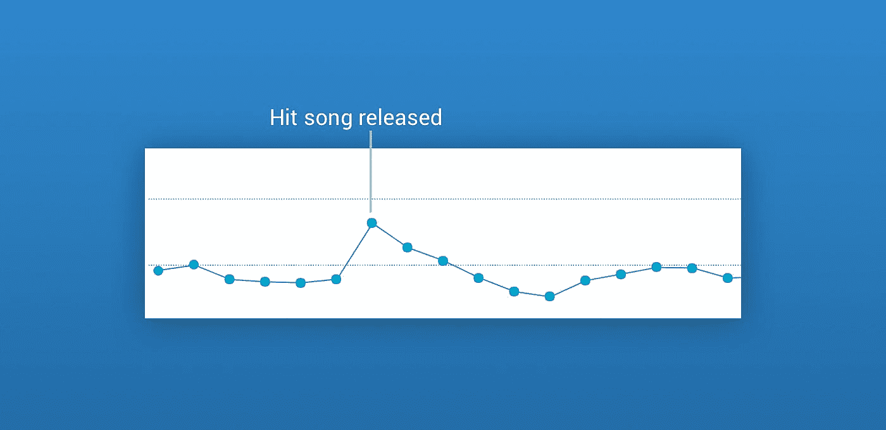
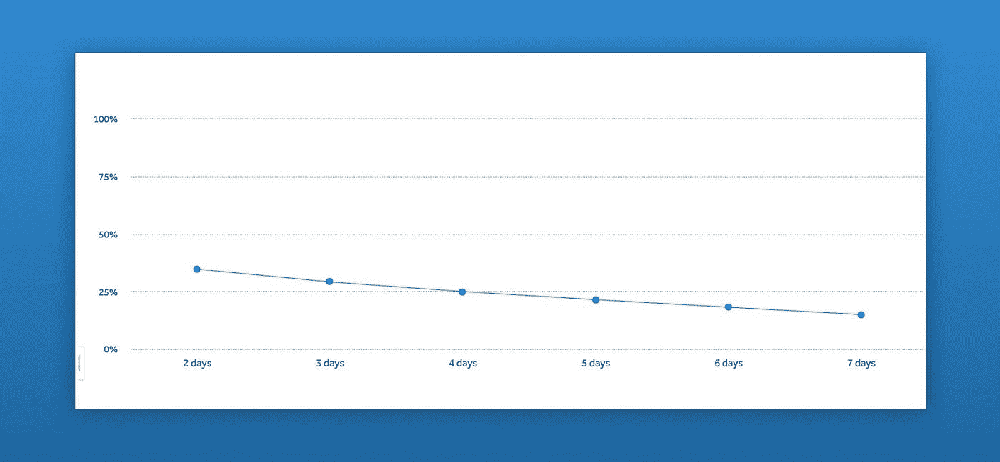
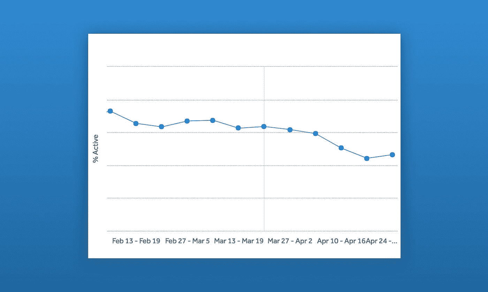

# 你的应用分析太乐观了

> 原文：<https://towardsdatascience.com/your-app-analytics-are-too-optimistic-49c719f790e1?source=collection_archive---------10----------------------->

## 最新的应用程序更新显示参与度增加？那是错误的。

你为过去一个月完全接受的新功能感到自豪，并等待苹果批准更新，这样你就可以深入分析并为下一次迭代做准备。应用程序获得批准，许多用户下载了它，指标开始进来。40%的用户尝试了你的新功能，完成率达到了惊人的 80%。一个月后，只有 20%的用户尝试了该功能，完成率下降到 40%。你责怪那些尝试过该功能但没有再次使用的用户，所以你重新分析了整个月，以考虑早期用户。指针不动了。发生了什么事？

这是我在为 Anghami 发布的每个功能更新中都遇到的问题，Anghami 是中东领先的音乐流媒体服务，目前拥有超过 6000 万用户。对于每次更新，我们都确保设置了适当的分析事件。一旦发布，我会在 Amplitude 上对用户行为进行深入分析，这是一个很好的应用分析平台，可以很容易地快速获得可行的答案。在解决功能更新难题之前，正确设置分析事件非常重要。

# 设计适当的分析事件

一个新的特性通常有一定的事件流，在某些情况下可能会导致不同的事件流。为每一步发送一个事件是至关重要的，这样您就可以在以后使用漏斗或路径查找工具进行分析时识别出问题所在。

不要忘记发送一个额外的事件来表明该特性已经打开，这样漏斗就可以提供有用的信息。了解用户如何达到这个功能也很有帮助。用户通常有多种方式来访问您的功能，并且通常会测试多个文本副本，因此了解哪个来源最有效非常重要。

我们最近将跟踪范围扩大到了外部来源，如广告、社交媒体、电子邮件和推送通知。这样我们可以从一个地方分析整个生命周期。

事件通常与屏幕视图相关联，但是用户经常在不切换视图的情况下执行关键行为。例如，点击一个按钮进行应用内购买，会显示第三方警告，而不会切换视图。用户可以在这里取消支付，并保持在同一视图中。但是比较有多少用户选择购买和有多少用户实际购买是很重要的(当然，这应该是另一个事件)。这就是为什么在这里点击购买按钮本身应该是一个事件，即使用户最终没有购买。。

# 用户群之间的不公平比较

找出一个增强是好是坏包括比较段。在我的分析经验中，细分市场之间的不公平比较就像房间里穿着隐身衣的大象——很难意识到两个细分市场之间的比较是否公平。

回到本文最初的问题:为什么用户对新特性的参与在第一天和第一个月之间表现出非常不一致的结果？问题是，在新功能发布当天尝试新功能的用户会立即更新应用程序，这些用户不是你的典型用户。他们是高度参与的用户，每天打开你的应用程序，并有足够的好奇心来浏览应用程序。本质上，查看一天的范围会使你的结果偏向最活跃的用户。然而，在一个月的时间里，有许多新的或一次性的应用程序用户，因此与日常用户相比，高度参与的用户在每月用户中所占的比例要小得多。这就是为什么与一整月相比，在功能发布后的第一天，参与度指标会有很大变化。

绿线是以前的版本，蓝线是新版本，可以更容易地将歌曲添加到播放列表中。请注意绿线是如何减少的，因为它代表参与度较低的用户。时间会证明蓝线是否能够维持下去。

那意味着你需要等一个月吗？为了得到最准确的结果，是的。但是实际上你不会等一个月才开始下一个迭代，所以你需要找到一个同样投入的观众来比较。可能是一群用户在同一天更新了以前的版本，或者在我们的例子中，用户播放了同样多的歌曲。这样，更新版本的用户与之前版本的用户之间的比较将是公平的，因为你不会偏向更活跃的用户。

不公平的比较不仅仅发生在应用更新上。另一个例子是我们做的一个测试，当用户看到订阅屏幕 5 次后，我们发送一条短信要求他们订阅。为了分析发送短信的影响，我们必须与另一个没有接收到任何信息的部分进行比较，即控制部分。如果控制段是随机的，那么文本消息段当然会有更高的转化率，因为它专注于已经看过订阅屏幕 5 次的高度参与的用户。这是一个不公平的比较，可以通过与也看过订阅屏幕 5 次，但没有收到任何消息的用户进行比较来解决。

分析时不要只关注转化率。还有其他维度需要考虑，比如转换时间。此外，确保将漏斗设置为较短的持续时间，以便事件序列不会分散到几天内。也就是说，有时候你想把事件分散开来，看看某个限制是否影响了用户以后的购买决定。

# 我看到的结果有多有效？

一旦结果出现，一旦获胜部分显而易见，人们就会兴奋起来。但有一个小小的担心，来自应用程序的事件数据并不完全正确，或者你创建的复杂图表在某些地方是错误的。

有一个非常快速的方法来验证事件数据:将您正在验证的独特事件按平台进行细分，并检查这些数字是否与您的用户的平台分布成比例。切换到“活跃%”，这样振幅会自动计算平台的百分比——您应该在这里得到类似的百分比。然后比较用户发送事件的平均次数，确保两个平台不会相差太远。这些步骤至少足以指出某个地方是否存在数据收集问题。

iOS is doing something wrong here. But we fixed it and it’s converging again.

很难验证您的图形设置是否正确，但以下技巧应该可以做到:

**平台分布:**你比较的细分市场是在同一个平台分布吗？如果一个细分市场主要包括 iOS，而另一个主要包括 Android 和 Web，结果将会产生误导。甚至版本也很重要，所以一个只包含最新 iOS 版本的细分市场不能与另一个包含所有 iOS 用户的细分市场相比较。

**新用户与现有用户:**不要将新用户与现有用户进行比较，除非你真的在比较新用户与现有用户的行为。

**参与度更高的用户或技术用户:**确保一个细分市场不会偏向参与度更高的用户。对发烧友用户的细分(比如说，他们改变了均衡器设置)不能与普通观众相比。

**每个细分市场的规模:**确保每个细分市场的用户数量是合理的——一个拥有 5 万用户的细分市场与 200 个用户相比是不可行的。

**巨大进步:**您的细分市场对比是否显示出巨大进步？有可疑之处。你做的一个小的改变有 50%的改进是一个错误的信号。

**每周 vs 每日:**每周的窗口可以修正轻微的变化，但过多的每日波动不是一件好事，尤其是如果它是一个大的用户池。设置一个每日窗口，并验证所有日期的趋势是否相同。一致的趋势令人放心，但如果每天都有大量波动，那就有理由担心了。

# 数据看起来很奇怪

所以你验证了数据并意识到有猫腻。这些解决方案适用于大多数情况:

**外部因素:**营销团队是否发起了你不知道的活动？运营商是否向您的某个市场发送了群发短信？这些可能是图中出现无法解释的峰值的原因。这里一个很好的起点是按国家细分，因为大多数外部因素一次只影响一个国家。然后你可以问团队类似“1 月 11 日埃及发生了什么？”

The surge in liking songs on a particular day was due to a huge hit song being released

**数字仍然很低:**发布已经有几天了，数字太低，还不能下结论，但是你还是需要做点什么。切换到日视图，看看趋势是否一致。

**稍有错误的数据:**有一些小错误可以在事件发送后被纠正。如果一个应用程序发送了错误的事件名称，或者事件属性在平台之间不一致，那么振幅自定义事件可以通过重命名事件来轻松纠正这些问题。因此，即使没有应用程序更新，您仍然可以整体分析。

**真正错误的数据:**结果中有一些非常奇怪的东西，你甚至不能确定来源。此时，您可以让后端团队参与进来。他们通常有需要分析的数据，您可以直接从数据库中查询这些数据进行验证。但是，为了与您创建的图形进行正确的比较，backend 可以将这些事件转发给 Amplitude。一旦完成，找到罪魁祸首就变得容易多了。

# 长期思考

在像昂哈密这样快速发展的创业公司，我们不能等待很长时间才采取行动。好的一面是，我们不需要这么做，而且我们已经通过使用上面的技巧发布新功能时的分析，受益于大量可操作的见解。也就是说，两个月后再来检查并验证事情是否仍在正轨上是非常重要的。

当 2 个月过去了，仅仅看用户进入和完成特性漏斗的百分比是不够的。漏斗转换和流失有什么关系？也许这个新特性提供了很好的指标，但是引起了不必要的变动。客户流失既可能与产品特性有关，也可能与产品的传播方式有关。

Stickiness of a feature: users coming back the next day and using that feature again, measured over a month

试过这个功能的用户回来了吗？最初的漏斗可以显示非常好的指标，但大多数功能只有在引起粘性时才是成功的(多次使用该功能)。

A feature that’s dying off

撇开入职不谈，两个月后再来检查的一个最重要的原因是新鲜感的消退。引入一个功能，甚至改变一个组件，都会在那一刻增加用户的参与度，只是因为它对用户来说是新的。一项功能或变化只有在用户持续参与两个月后才是可持续的。但不要因此而放慢脚步，因为我提到的所有方法都可以帮助你，从设计分析事件到在发布时验证数据。