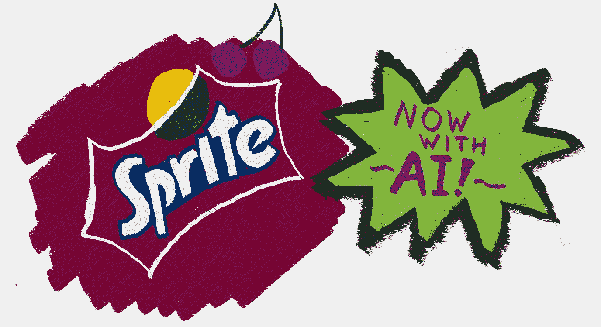
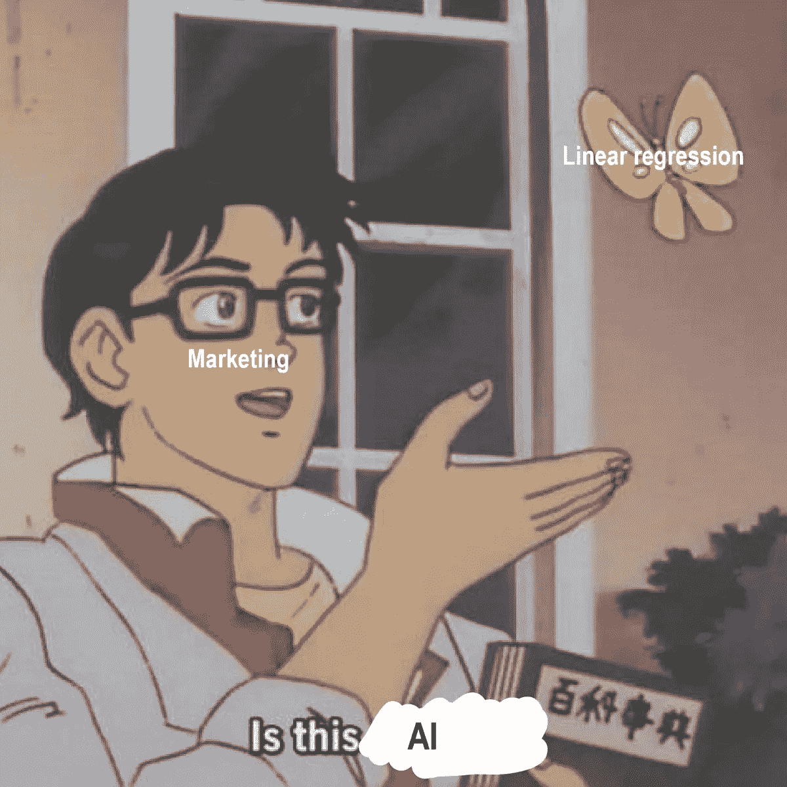

# 你太依赖数据了

> 原文：<https://towardsdatascience.com/youre-relying-on-data-too-much-250d4edc70c3?source=collection_archive---------5----------------------->

## 让决策变得更糟，而不是更好

当你在经营一家企业时，你的工作可以归结为做出一系列重要决策:是否应该推出新产品？一个部门该不该解散？是否应该开展营销活动？每个决定都有风险和回报——你会赚很多钱还是花光它们？人们很容易相信在灾难的宇宙中只有一个正确的选择，而高管的工作就是找到那个选择。

每一本畅销的管理杂志都会告诉你，21 世纪闪闪发光的救世主是数据。充足的数据会让你不做出任何错误的选择。存储关于客户、产品和营销的数据。然后雇佣一些聪明的数据科学家，你很快就会从错误中解脱出来。谷歌“数据驱动的决策”，你会发现数百篇关于你如何没有收集足够的数据，监控足够的 KPI，或让足够多的数据科学家进行足够多的分析的管理文章。

科学债务是大卫·罗宾逊创造的一个术语，它敦促企业决定哪些分析是重要的，应该立即关注，哪些领域的研究可以推迟到以后。在这里，你的债务就是知识。这一概念允许公司预先讨论他们的数据科学优先事项。每个公司都应该积极考虑他们的科学债务。

在我与许多企业合作的这些年里，我确实看到一些公司陷入了没有充分利用数据的情况。然而，与我看到的相反问题的次数相比，这些事件就相形见绌了:*过度依赖数据到了有害程度的公司。做出好的决策需要数据，这种想法是有害的。*

> 更多的数据和分析有助于更好的决策，这种想法从根本上说是错误的。

想想最近的一个故事，关于[可口可乐如何利用人工智能创造新的汽水口味](https://www.forbes.com/sites/bernardmarr/2017/09/18/the-amazing-ways-coca-cola-uses-artificial-intelligence-ai-and-big-data-to-drive-success/#f52780378d2f)。在完成公关后，很明显可口可乐利用他们的自由式风味机数据看到人们经常选择添加樱桃的雪碧。有了这些知识，可口可乐在商店里推出了樱桃雪碧作为自己的汽水系列。忽略“我们聚合了数据，Cherry Sprite 很受欢迎，所以我们推出了它”这一事实是有史以来声称某些东西是人工智能的最恶劣的例子，这也是数据如何伤害决策的一个很好的例子。

想想看，虽然樱桃雪碧是一种前所未有的新口味，但极其相似的口味*樱桃 7UP* 已经存在了三十年！“人工智能”结合来自数百万消费者的数据，创造了一种味道，这种味道可能是一位可口可乐高管走过杂货店过道时想出来的，“我们应该复制它。”与在数据基础设施上投资数百万不同，窃取创意是免费的。

如果一位可口可乐高管可以在过去三十年的任何时候制造出这种解渴剂，为什么樱桃雪碧直到涉及大数据后才上市？据我所见，当人们含蓄地知道一个想法是好的，但他们不能让其他人加入时，这些情况就会发生。多年来，可能有数百名可口可乐高管认为樱桃雪碧是一个好主意，但他们从来没有达到推出该产品所需的临界质量。只有当一个人得到自由式数据时，这个人才能让公司相信这种味道是好的。

This cold boy was quenching thirsts before AI was even trendy.

这并不是说数据对决策很重要，而是说如果你只用数据做决策，那么你的机会就会受到限制。如果可口可乐早十年推出樱桃雪碧，他们会多赚多少钱？有多少汽水口味是人们会喜欢的，但永远不会推出，因为它们不存在于自由式机器中？通过限制自己只做那些有足够数据的决策，你大大降低了公司可接受的解决方案集。通常，公司能够做出的最具创新性的改变是那些事先没有任何可能数据的改变。

但是真正的问题是:即使你有好的数据，你的分析也总是包括假设。如果这些假设是错误的，你的分析会给出一个糟糕的结果。这些糟糕的结果会导致组织做出比不使用数据更糟糕的事情。如果一家公司试图推出一种新产品，他们可能会分析类似的现有产品来预测投资回报。但是，假设哪些产品是相似的会极大地改变分析，而且没有办法知道哪些产品会有相似的表现。新产品的行为可能与任何现有产品都不一样，通过分析，你误导了公司对将要发生的事情的认识。作为数据科学家，我们应该希望平均来说我们的方向是正确的，但这是不可能知道的。数据不能取代人类的直觉，也不能消除风险。

当数据与其他因素一起用于决策时，有缺陷的分析就不是问题了。其他因素弥补了这一点，组织将做出强有力的决策。当数据对于决策是必要的时候，有缺陷的分析是一个大问题。高管们让糟糕的假设成为过去，因为这是他们推出想法的唯一途径。这就围绕着“我们用数据来支持我们所有的决策”这一听起来很积极的想法产生了非常消极的企业文化。

要点不是数据不好，你不应该想用它。相反，数据和分析应该与其他决策工具一起使用，如市场研究、以前的经验和概念验证试验。将分析视为只会做出更好决策的东西，你就冒着创造一种环境的风险，在这种环境中，你的可能性受到限制。不要把数据当作真理的唯一来源，否则你将会等上几十年去尝试另一种新的汽水口味。

如果你想要一大堆帮助你在数据科学领域发展职业生涯的方法，看看我和艾米丽·罗宾逊写的书: [*在数据科学领域建立职业生涯*](http://bestbook.cool) 。我们将带您了解成为数据科学家所需的技能，找到您的第一份工作，然后晋升到高级职位。

